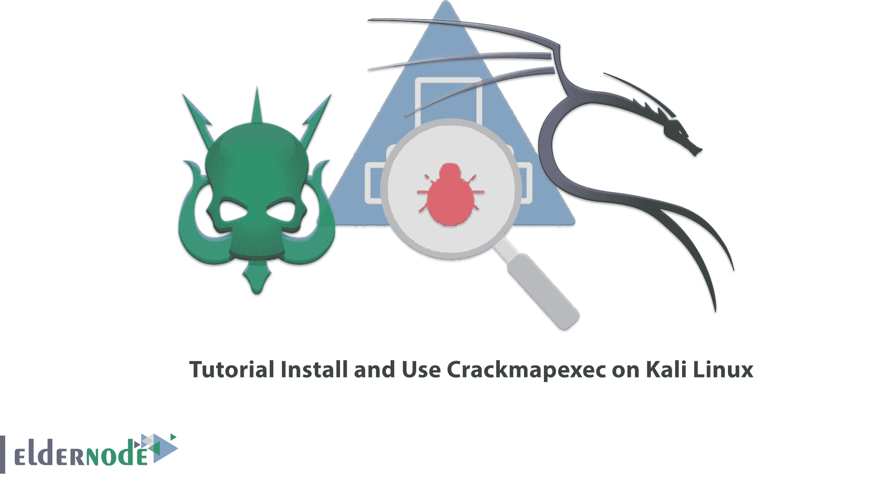

# 教程在 Kali Linux 上安装和使用 Crackmapexec

> 原文：<https://blog.eldernode.com/install-and-use-crackmapexec-on-kali-linux/>



如果您正在寻找一个用于攻击目的的工具，评估帐户权限，找到可能的错误配置，并模拟攻击场景，Crackmapexec 是您的好选择。在本教程中，我们将介绍 Crackmapexec 您还将学习如何在 Kali Linux 上安装和使用 Crackmapexec。你可以查看 [Eldernode](https://eldernode.com/) 网站上提供的套装来购买 [**Linux VPS**](https://eldernode.com/linux-vps/) 服务器。

## **如何在 Kali Linux 上安装使用 Crackmapexec**

### **Crackmapexec**简介

Crackmapexec 是一个开发后工具，用于自动评估大型活动目录网络的安全性。Crackmapexec 利用内部活动目录协议来实现其功能，使其能够规避大多数端点保护/IDS/IPS 解决方案。需要注意的是，Crackmapexec 使用的是 Impacket 库和 PowerSploit 工具包。

### **Crackmapexec**的特点

1 –>中小企业股份。

2–>删除 NTDS.dit。

3->统计注册用户。

4 –>执行 psexec 风格的攻击

5 –>使用 Powershell 将 Mimikatz/Shellcode/DLL 自动注入内存。

在这篇来自 [Kali Linux 培训](https://blog.eldernode.com/tag/kali-linux/)系列的文章的续篇中，我们打算教你如何在 Kali Linux 上安装如何安装 Crackmapexec。

## **在 Kali Linux 上安装 Crackmapexec**

您可以使用以下命令在 Kali Linux 上安装 Crackmapexec:

```
apt install crackmapexec
```

### **如何在 Kali Linux 上使用 Crackmapexec**

我们来回顾一下如何在 Kali Linux 上运行 Crackmapexec 的不同工具。

在第一步中，您可以运行以下命令来**在 Kali Linux 上使用 Cmedb** :

```
cmedb -h
```

然后，可以使用下面的命令**在 Kali Linux 上使用 Crackmapexec** :

```
crackmapexec -h
```

## **常见问题**

[sp _ easy agreement]

## 结论

在本文中，您了解了 Crackmapexec，这是一个用于自动评估大型 Active Directory 网络安全性的后期开发工具。您还学习了如何安装 Crackmapexec 以及如何在 Kali Linux 上运行不同的 Crackmapexec 工具。