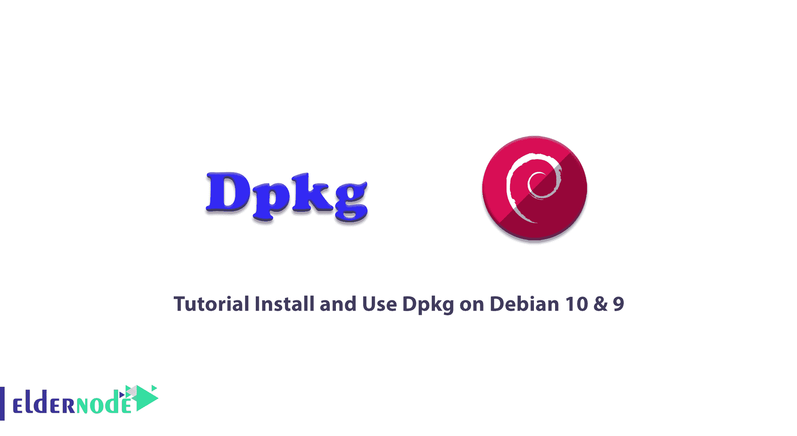

# 教程在 Debian 10 & 9 - Eldernode 博客上安装和使用 Dpkg

> 原文：<https://blog.eldernode.com/install-and-use-dpkg-on-debian/>



Dpkg 是 Linux 操作系统和基于 Debian 的发行版上的一个包管理命令。本软件用于更好的软件包管理、安装、删除，并提供相关信息。deb 套餐。它是通过命令行参数控制的。动作参数告诉 dpkg 做什么，选项以某种方式控制动作的行为。此外，dpkg 维护一些关于可用包的有用信息。本文将介绍**教程在 Debian 10 & 9 上安装和使用 dpkg。**如果你准备购买自己的 [Linux VPS](https://eldernode.com/linux-vps/) ，请访问 [Eldernode](https://eldernode.com/) 的可用软件包，购买最好的。

为了让本教程更好地发挥作用，请考虑以下**先决条件**:

拥有 sudo 权限的非 root 用户。

要进行设置，请按照 Debian 10 的[初始设置进行。](https://blog.eldernode.com/initial-setup-with-debian-10/)

## **如何在 Debian 10 和 Debian 9 上设置和使用 dpkg**

像 Ubuntu 和 Linux Mint 一样，Debian 也使用 dpkg 包管理器来管理包。默认情况下，Dpkg 安装在 Debian 上，派生程序用于安装、构建和删除。deb 套餐。dpkg 是 Debian 软件包管理的最底层工具。这是一个非常强大的工具，应该小心使用。

### **套餐信息**

dpkg 维护的信息分为三类:

**状态**、**选择状态**、**标志**。

然而，这些值会随着 **dselect** 而改变。让我们看看任何头衔对他们来说意味着什么。

**包装状态:**

未安装:软件包未安装在您的系统上。

配置文件:只有包的配置文件存在于系统中。

半安装:软件包的安装已经开始，但由于某种原因没有完成。

解包:包被解包，但没有配置。

半配置:包被解包，配置已经开始，但由于某种原因尚未完成。

等待触发器:该包等待另一个包进行触发器处理。

触发器-待定:包已被触发。

已安装:软件包被正确地解包和配置。

**套餐选择状态**

install:选择软件包进行安装。

保留:标记为保留的包裹不被 dpkg 处理，除非使用选项-force-hold 强制处理。

卸载:选择要卸载的软件包。

清除:选择要清除的软件包。

**包装标志**

ok:标记为 ok 的包处于已知状态，但可能需要进一步处理。

reinstreq:标记为 reinstreq 的软件包已损坏，需要重新安装。除非使用选项–force-remove-reinstreq 强制执行，否则无法删除这些软件包。

### **如何查看已安装包列表**

如果您希望在开始安装之前列出系统上已安装的软件包，请使用以下命令查看已安装软件包的长列表:

```
dpkg --list
```

## **在 Debian Linux 上安装使用 Dpkg**

如果您使用一个使用 *apt* 的包，它首先创建一个所有依赖项的列表，并从存储库中下载它。

如果你使用旧的 *apt-get* 版本，首先将你的 deb 文件移动到 */var/cache/apt/archives/* 目录。这样，它会自动下载它的依赖项。然后，安装 *gdebi* 并打开你的。deb 文件使用它。它将安装您的。deb 包及其所有依赖项。

**注意**:如果 deb 需要的依赖项在包索引中不存在，所有这些方法都不能满足软件依赖项。因为 PT 维护包索引，包索引是在 */etc/apt/sources.list* 文件和 */etc/apt/sources.list.d* 目录中定义的 repo 中可用的数据库。

### **如何安装。deb 包使用 DPkg**

安装。deb 包，您只需要键入 dpkg，后跟-install 或-i 选项和。deb 文件名。

```
sudo dpkg --install [.deb file]
```

**注意**:您必须从与。deb 包驻留。但是如果您从另一个服务器上运行它，请记住提到。deb 文件。

```
sudo dpkg --install [path/to/.deb file]
```

因为 dpkg 命令只安装没有任何依赖关系的指定软件包，所以当您安装需要一些依赖关系的软件包时，可能会遇到错误。还因为 dpkg 不安装这个包，使它处于未配置和损坏的状态。

```
dpkg: error processing package
```

在终端中运行以下命令来解决此错误:

```
sudo apt -f install
```

这样，您可以使用这个命令来修复损坏的包，并安装所需的依赖项(假设它们在系统存储库中可用)。

### **如何验证包安装**

您可以使用 Dpkg 轻松验证软件包安装**。你也可以通过 Debian dash 菜单搜索来验证软件包的安装。当您看到它在那里可用时，您可以确保软件包安装。然而，正如我们提到的，dpkg 可以让您验证包的安装。为此，键入带-status 或-s 选项的 dpkg 来验证软件包安装:**

```
dpkg --status [package-name]
```

### **如何移除已安装的软件包**

任何时候你决定卸载已安装的软件包，你都可以使用 dpkg 命令删除它**。提及已安装的软件包名称，而不是提及。deb 软件包名称，用于安装软件包并轻松删除已安装的软件包。因此，要找出确切的包名，请键入:**

```
dpkg –l | grep keyword
```

**注意**:关键字是任何与包名相关的词。

例如，对于 Skype 软件包，您可以键入 *skype* ，命令如下所示:

```
dpkg –l | grep skype
```

这样，您可以使用下面的语法删除软件包。当您找到已安装软件包的确切名称时，请使用-remove 或-r 选项。

```
sudo dpkg --remove [package file]
```

*举例:*

```
sudo dpkg --remove skypeforlinux
```

**注**:如你所见，你可以简单地键入 Skype 安装包的名称，而不是键入“skypeforlinux-64.deb”

## **如何手动使用 dpkg**

有一个非常简单的方法来安装你已经下载的单个软件包，那就是 dpkg -i 命令，它是 dpkg-install 的缩写。

当您下载软件包 icewm_0.8.12-1.deb 并希望安装它时，首先以 root 用户身份登录，然后键入:

```
dpkg -i icewm_0.8.12-1.deb
```

这样，将安装 icewm 0 . 8 . 12 版。dpkg 将升级您的旧版本，以避免同时安装两个版本。

要删除软件包，您有两种选择。首先是:

```
dpkg -r icewm
```

这将删除 icewm 包(-r 是–remove 的缩写)

**注意**:虽然您只为–remove 提供了“icewm ”,但–install 需要整个。deb 文件名。

–remove 会将软件包的配置文件保留在您的系统上。配置文件定义为您可能编辑过的任何文件，以便为您的系统或您的首选项定制程序。这样，如果您以后重新安装该软件包，您就不必再次设置所有内容。但是，您可能也想删除配置文件，所以 dpkg 还提供了一个–purge 选项。dpkg-purge icewm 将永久删除与 icewm 包相关的所有文件

## 结论

在本文中，您了解了如何在 Debian 9 & 10 上安装和使用 Dpkg。现在，您可以查看已安装软件包的列表，在安装时验证软件包，并在不再需要时删除软件包。最后，您看到了手动使用 dpkg 的方法。

Debian 包管理由几层组成。您将能够在非常糟糕的情况下使用 dpkg，例如在没有网络连接的情况下无法启动系统，因为它是一个非常低级的打包工具。最底层由 dpkg 和相关程序组成。