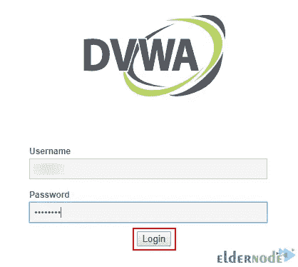

# 在 Windows 10 上安装和使用 DVWA 的两种方法

> 原文：<https://blog.eldernode.com/install-and-use-dvwa-on-windows-10/>


在开始进入安全或渗透测试领域时，人们不容易找到他们想要的测试和学习漏洞的目标。为此，您可以在实验室环境中使用特殊的内容管理系统。DVWA 可以说是最著名的 CMS 之一。本文将教你在 Windows 10 上安装和使用 DVWA 的两种方法。如果你打算购买一台 [Windows VPS](https://eldernode.com/windows-vps/) 服务器，你可以查看 [Eldernode](https://eldernode.com/) 网站上提供的套装。

## **如何在 Windows VPS 上设置 DVWA**

### **DVWA 简介？**

DVWA 代表 Damn Vulnerable Web App，是一个免费开源的易受攻击的 Web 应用程序，使用 PHP 编写，使用 MySQL 数据库。这个内容管理系统有易受攻击的部分，帮助在黑客和安全领域工作的人测试他们的技能，并学习新的黑客和安全技巧。它内部有不同类型的漏洞，这些漏洞分为不同的级别。事实上，DVWA 为安全专业人员测试他们的技能和工具提供了一个法律环境，并帮助 web 开发人员更好地理解 web 应用程序进程的安全性。

## **1-在 Windows 10 上安装 XAMPP**

你需要 XAMPP 在 Windows 10 上安装 DVWA。为此，请前往 [XAMPP](https://www.apachefriends.org/) 官网，选择[**XAMPP for Windows 10**](https://blog.eldernode.com/configure-xampp-on-windows-10/)开始下载:


下载完成后，进入**下载**文件夹，双击下载的文件将其打开。

然后按照安装说明进行安装。

安装过程结束后，打开 XAMPP 控制面板，启动 Apache 和 MySQL 服务:


## **2-在 Windows 10 上安装 DVWA**

是时候在你的 Windows 操作系统上下载 DVWA 了。首先去 **DVWA 官网**下载。

因此，**提取**下载的文件，并将其移动到 XAMPP 文件夹内的 htdocs 文件夹中。

DVWA config 文件夹中有一个 **config.inc.php.dist** 文件，你应该将文件类型转换为 [PHP](https://blog.eldernode.com/update-php-version-in-xampp/) 。

然后用记事本打开 config.inc.php 文件，找到下面一行:

```
$DVWA[‘db_password’]=’[[email protected]](/cdn-cgi/l/email-protection)’;
```

移除[【邮件保护】](/cdn-cgi/l/email-protection)并使其空白，如下图所示:

```
$DVWA[‘db_password’]=’’;
```


现在，打开您的 web 浏览器，转到以下 URL:

```
localhost/dvwa
```

您应该会看到下面的屏幕。点击**创建/重置数据库**:


将出现 DVWA 登录页面。提供您的**用户名**和**密码**:



DVWA 欢迎屏幕:


**如何在 Windows 10 上使用 DVWA**

要在 Windows 10 上开始使用 DVWA，请登录到 DVWA 默认页面并选择 **DVWA 安全**选项卡。

## 选择您的安全级别，然后点击**提交**:


就是这样！

结论

DVWA 是一个 web 应用程序，具有不同严重级别的安全漏洞，并且具有用户友好的界面。在这篇文章中，我们通过两种方式教你如何在 Windows 10 上安装和使用 DVWA。我希望这个教程对你有用，并能帮助你在 Windows 10 上安装 DVWA。如果你面临任何问题或者有任何疑问，可以在评论区联系我们。

That’s it!

## Conclusion

DVWA is a web application that has security vulnerabilities with different severity levels and also has a user-friendly interface. In this article, we taught you how to install and use DVWA on Windows 10 in 2 ways. I hope you found this tutorial useful and that it helps you to install DVWA on Windows 10\. If you face any problems or have any questions, you can contact us in the Comments section.