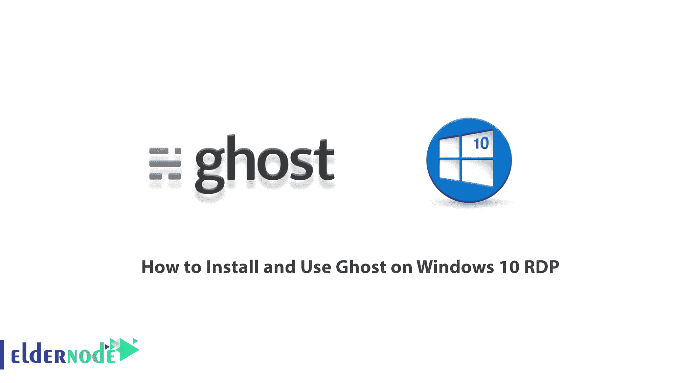
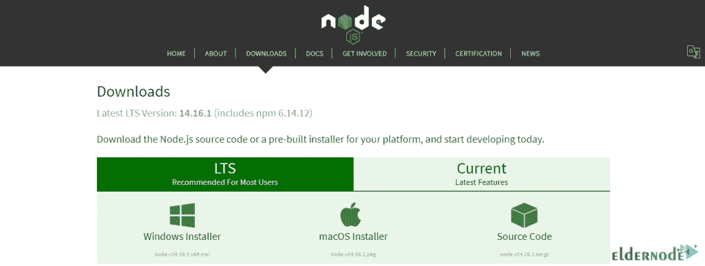

# 如何在 Windows 10 上安装和使用 Ghost RDP-elder node 博客

> 原文：<https://blog.eldernode.com/install-and-use-ghost-on-windows-10/>



Ghost 是一个构建在节点上的开源发布平台。JS 技术栈。这个工具是一个新的免费博客平台，有一个非常简单和容易的界面。需要注意的是，Ghost 的重点是发布。Ghost 声称博客平台很简单，但不幸的是，开始与 Ghost 合作的第一步并不简单。Ghost 安装步骤有点复杂，可能会让一些用户感到困惑。为此，我们打算教你**如何在 Windows 10 RDP** 上安装和使用 Ghost。如果你需要购买一台 [Windows VPS](https://eldernode.com/windows-vps/) 服务器，你可以访问 [Eldernode](https://eldernode.com/) 提供的软件包。

## **教程在 Windows 10 上安装和使用 Ghost RDP**

Ghost 是一个面向开发者的开源网站构建和发布平台。需要注意的是，使用 Ghost，集成没有任何限制。另一方面，开发者可以访问该平台的 API，允许他们创建自己喜欢的应用程序或服务的自定义连接。Ghost 为用户提供了创建和发布内容的简单工具。在下一节中，我们将介绍 Ghost 的特性和优点。然后我们会教你如何在 [Windows 10 RDP](https://eldernode.com/windows-10-rdp/) 上安装 Ghost。

### **的特点和优点**幽灵****

**在本节中，我们将介绍一些 Ghost 特性。这些功能包括:**

**1.内容编辑器**

**2.内容管理**

**3.预定职位**

**4.车把主题**

**5.主题市场**

**6.自定义域**

**7.自动备份**

**8.基于角色的权限**

**9.SEO 优化**

**10.捐款**

**11.原生 Ghost 应用**

***以下是 Ghost 的一些好处:***

****1。一般控制****

**使用 Ghost，开发人员和网站所有者可以完全控制设计和集成。因为用户可以访问代码，所以他们可以根据自己的规范创建博客和网站。有趣的是，Ghost 为开发人员提供了对 API 和相关资源的访问。通过这样做，开发人员可以将他们的平台和网站与第三方服务和解决方案集成，以便轻松传输数据。**

****2。现代出版工具****

**Ghost 包括一个简单的文本编辑器和快速格式化工具。这个编辑器使作者只关注他们的文本。他们还可以确保他们的内容可以通过实时预览阅读。此外，Ghost 还为作者提供了后期编程的工具。这样你就可以写一篇文章，并计划以后发表。**

****3。优化内容****

**Ghost 内置了 SEO 工具。这些工具允许开发者和作者确保像谷歌这样的搜索引擎索引他们的网站。此外，ghost 确保显示每个页面和帖子，而不管被访问页面的大小。这使得网站访问者更容易访问和享受网站内容。**

****4。专业主题****

**鬼有主题市场。在这里，用户可以找到现成的主题，他们可以照原样使用。用户也可以为自己定制和创建这些主题。**

****5。无障碍支持团队****

**通过 Slack 很容易联系到 Ghost 支持团队，有问题的用户可以很容易地访问消息平台并获得他们的问题的答案。**

### ****在 Windows 10 上安装 Ghost 的先决条件 RDP****

**在我们进入如何在 Windows 10 RDP 上安装 Ghost 之前，我们需要解释一下安装这个程序的先决条件。您必须首先安装并准备这些必备组件。**

**_ 支持的版本 [Node.js](https://blog.eldernode.com/install-node-js-on-windows/)**

**_ 由 [yarn](https://blog.eldernode.com/install-yarn-on-windows/) 或 npm 来管理包**

**_ 您机器上的一个干净的空目录**

### ****如何在 Windows 10 上安装 node . js****

**在安装 Ghost 之前，需要在 [Windows](https://blog.eldernode.com/tag/windows/) 上安装 Node.js。所以第一步，你需要访问 [Node.js 网站](https://nodejs.org/en/download/)。然后点击 **Windows Installer** 开始下载 Node.js**

****

**然后去你下载文件的地方。双击它，在打开的窗口中点击**运行**。**

**然后点击**下一步**继续安装过程。**

**下一步是确认许可协议，点击**我接受……**，然后点击**下一步**。**

**下一步，可以指定安装路径，点击**下一步**。**

**该向导将允许您选择要在安装中包含或删除的组件。同样，除非您有特殊需要，否则单击**下一个**接受默认设置。**

**点击**安装**开始在系统上安装 Node.js。**

**最后，点击 **Finish** 成功完成安装过程。**

**您可以打开命令提示符或 [PowerShell](https://blog.eldernode.com/get-help-command-in-powershell/) 来**验证**安装并输入以下命令:**

```
`node –v`
```

## ****在 Windows 10 上安装 Ghost RDP****

**在本节中，我们将教您如何在本地安装，以便在您的计算机上运行 Ghost。请注意，在本地运行 Ghost 是获得您自己版本的运行软件的最简单方法。要在 Windows 10 RDP 上安装 Ghost，只需按照以下步骤操作。**

**首先，您需要安装 Ghost-CLI。 **Ghost-CLI** 是一个命令行工具，可帮助您快速、轻松地安装和配置 Ghost。npm 模块可以与 **npm** 或 **yarn** 一起安装在本地机器上，这取决于您的偏好。**

```
`npm install [[email protected]](/cdn-cgi/l/email-protection) -g`
```

**现在，您可以使用以下命令来查看可用命令的列表:**

```
`ghost help`
```

**现在我们来到**幽灵安装**阶段。在这一步中您必须将 cd 放入一个空目录并运行 install 命令:**

```
`ghost install local`
```

**一旦您成功安装了 Ghost，您现在就可以使用以下网址**访问您的新网站**。通过输入这些地址，您可以访问 Ghost Admin。**

```
`http://localhost:2368`
```

```
`http://localhost:2368/ghost`
```

*****注:***SQLite3 数据库是自动设置的，位于 **/content/data/** 。同样，日志只进入**标准输出**。**

### ****如何在 Windows 10 上使用 Ghost RDP****

**在你按照说明成功安装了 Ghost 之后，现在我们来看看如何使用它。重要的一点是 Ghost 是在一个单独的后台进程中运行的。因此，它仍然在运行，直到您停止它或重新启动计算机。因此，要使用 Ghost，您需要熟悉以下命令:**

****1。幽灵停止:**停止幽灵**

****2。ghost 启动:**启动 Ghost**

****3。ghost 日志:**查看日志**

****4。ghost ls:** 列出所有正在运行的 ghost 博客**

****_ ghost help:** 查看可用命令列表**

## **结论**

**Ghost 是一个基于现代 Node.js 技术的专业开源发布平台。Ghost 是为需要力量、灵活性和性能的团队设计的。在本文中，我们试图教你如何在 Windows 10 RDP 上安装和使用 Ghost。**