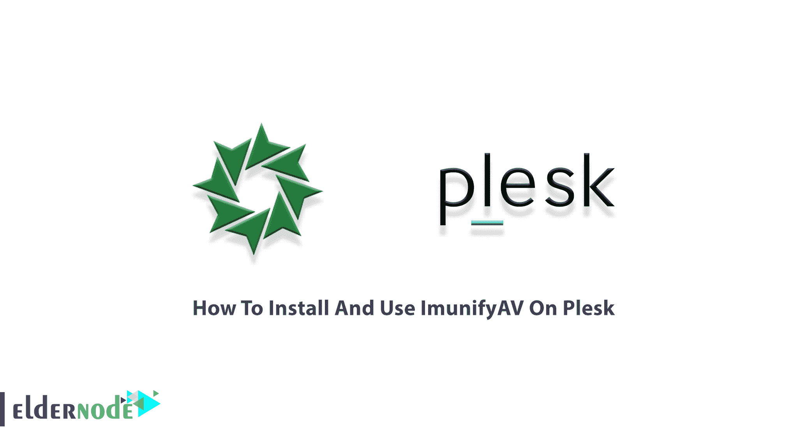
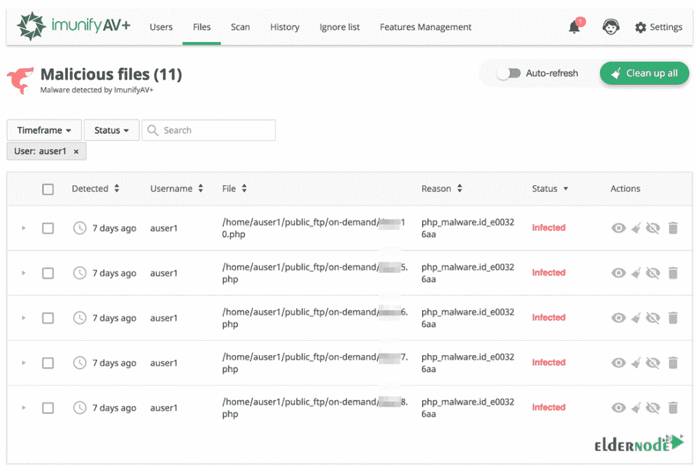
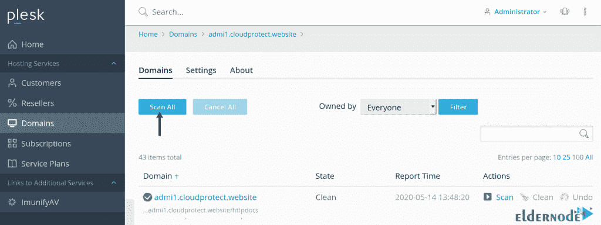
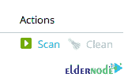
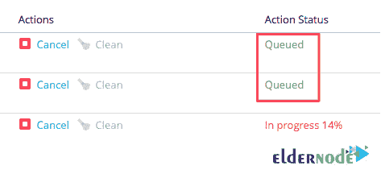
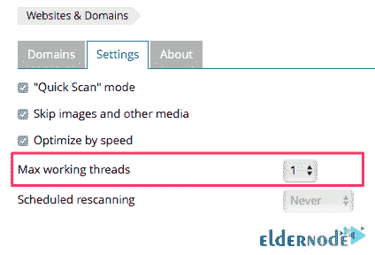
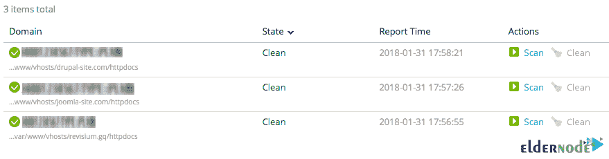
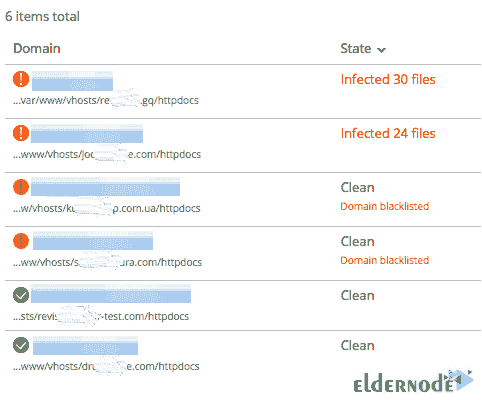
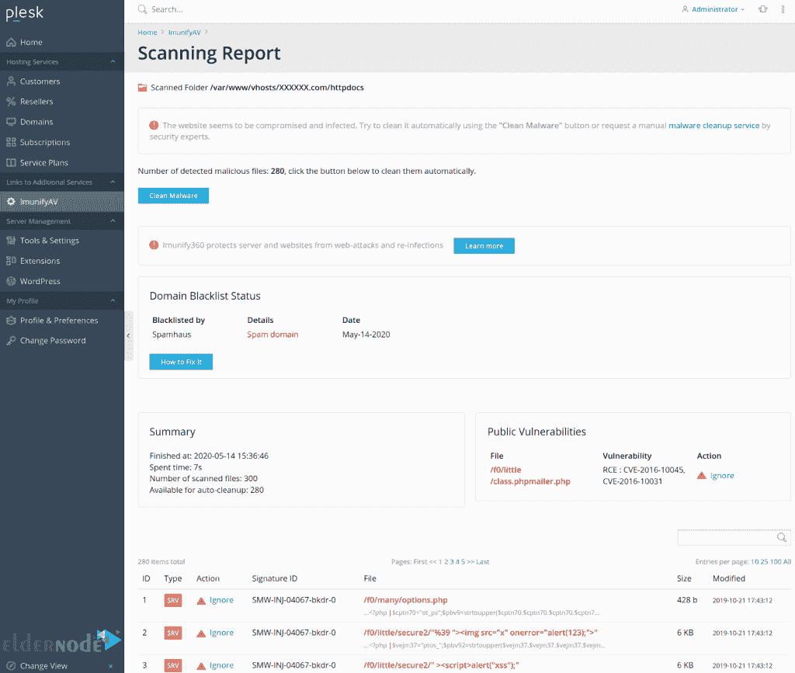

# 如何在 Plesk - Eldernode 博客上安装和使用 ImunifyAV

> 原文：<https://blog.eldernode.com/install-and-use-imunifyav-on-plesk/>



ImunifyAV 是一款智能防病毒和安全监控工具，可帮助网站远离恶意软件。由于 ImunifyAV 会在您的服务器上扫描恶意软件，您将体验到额外的安全性。ImunifyAV 一旦识别出危险行为，就会立刻清理。这似乎是一个理想的解决方案，可以帮助您减少客户指责您网站被黑的支持电话。在本文中，您将学习如何在 Plesk 上安装和使用 ImunifyAV。在 [Eldernode](https://eldernode.com/) 上找到您认为合适的 **[VPS 托管](https://eldernode.com/vps-hosting/)** 计划，并以最优惠的价格和支持进行购买。

## **教程在 Plesk** 上安装使用 ImunifyAV

之前给大家介绍过 [ImunifyAV](https://www.imunify360.com/) 。它是一款高度先进的杀毒和[安全](https://blog.eldernode.com/tag/security/)监控工具。要扫描文件和监控黑名单状态，您可以使用没有试用期和扫描限制的免费版本。在高级版和共享托管版中，您将拥有无限数量的域名。使用 ImunifyAV，您可以为客户提供全面、自动化的安全保护，以抵御病毒、广告软件、间谍软件、特洛伊木马和蠕虫。ImunifyAV 将安装在您的操作系统上，即使您没有安装特殊的控制面板。如果您没有安装任何控制面板，如 [DirectAdmin](https://blog.eldernode.com/tag/directadmin/) 和 [Cpanel](https://blog.eldernode.com/tag/cpanel/) ，ImunifyAV 的管理面板中将会添加一些部分，您可以通过这些部分以图形方式管理该工具。

### **ImunifyAV 特性:**

ImunifyAV 有免费和高级(ImunifyAV+)版本。这款安全监控工具的主要功能如下:

1-检测任何类型的恶意文件，包括后门程序、网络外壳、病毒、黑客工具、“blackhat SEO”脚本、钓鱼网页等。

2-监测信誉和黑名单状态的领域对十几个安全供应商，包括谷歌 SB，Yandex SB，迈克菲，ESET，卡巴斯基。

3-支持 [WordPress](https://blog.eldernode.com/tag/wordpress/) ，Joomla！、Magento、Drupal、MODx、Bitrix 等基于 PHP 的 CMS 和静态 HTML 网站。

4-一键式自动恶意软件清除、预定和按需网站扫描以及详细报告。

5- UI 流程针对每台服务器数百个用户和数千个域的安全监控进行了优化。

6-不同订阅的防病毒程序的可配置访问权限。

### **在 Plesk** 上安装 ImunifyAV 的先决条件

为了让本教程更好地工作，请考虑以下先决条件:

_ 以具有 Sudo 权限的非根用户或具有根级别权限的经销商帐户登录 WebHost Manager。

_ RAM: 1GB

_ 硬盘:20GB 可用磁盘空间

## **如何在 Plesk 上安装 ImunifyAV【完整】**

ImunifyAV 是一个用于 Linux 服务器的恶意软件扫描器。与 ClamAV cPanel 插件类似，ImunifyAV 允许 WebHost Manager 和 cPanel 用户扫描文件和管理发现的恶意软件。所以，为了用 ImunifyAV 扫描你的网站，你需要安装它。请注意，Imunify 360 在 Plesk 17.0 及更高版本上受支持，因此，Plesk 12.5 不受支持。让我们通过本指南的步骤来回顾一下在 [Plesk](https://blog.eldernode.com/tag/plesk/) 上安装 Imunify 的过程。

***安装注意事项* :** 由于 Plesk 不支持这样的配置，您建议不要同时使用 firewalld 和 Plesk 防火墙。在服务器上运行以下命令来**禁用防火墙**:

```
systemctl disable firewalld
```

Plesk 一次只支持一个规则集。因此，如果在 Imunify360 安装期间安装了任何 mod_security 规则集，Imunify 360 将不会安装自己的规则集。使用以下命令检查是否安装了 Imunify360 规则集:

```
plesk sbin modsecurity_ctl -L --enabled
```

如果输出为“自定义”Imunify360 规则集已安装，如果显示“tortix ”,则表示未安装。

这样，您可以运行以下命令来删除现有的规则集并安装 Imunify360 规则集:

```
plesk sbin modsecurity_ctl --disable-all-rules --ruleset tortix
```

```
plesk sbin modsecurity_ctl --uninstall --ruleset tortix
```

```
plesk sbin modsecurity_ctl -L --enabled
```

```
imunify360-agent install-vendors
```

***注意* :** 另外，您需要检查是否在您的 Plesk Web 应用防火墙界面的设置选项卡上禁用了更新规则集选项。

要在控制面板上免费安装 ImunifyAV ,请运行:

```
wget https://repo.imunify360.cloudlinux.com/defence360/imav-deploy.sh
```

然后，使用以下命令**运行**安装 shell 脚本:

```
bash imav-deploy.sh
```

此外，您可以使用下面的命令**更新 ImunifyAV** :

```
yum update imunify-antivirus
```

### **ImunifyAV 主机接口**

单击主菜单中的 ImunifyAV 后，您将看到以下选项卡:

–用户

–文件

–扫描

–历史

–忽略列表

–功能管理

–设置

–升级




### **如何在 Plesk** 上使用 ImunifyAV

## 要了解如何在 Plesk 上开始使用 ImunifyAV，请遵循以下路径。安装完扩展后，打开**域**选项卡，点击右侧的**扫描所有**:



当您单击**设置**选项卡时，将扫描病毒、后门、网络外壳、黑客脚本、钓鱼网页和其他恶意软件的完整网站列表。网站扫描过程取决于指定的并发扫描线程数(1、2 或 4)。

此外，要检查单个网站的恶意软件和黑名单状态，您可以单击特定网站旁边的**扫描**按钮。



防病毒扩展将扫描任务排队，并根据配置的资源限制运行它们。这样，可以防止在扫描该组网站期间服务器资源过载。



由于默认设置在扫描速度方面可能不是可选的，您需要在开始前检查**设置**选项卡，并手动调整以下参数以设置最佳值，从而获得更好的性能:



一旦扫描过程完成，您可以检查您的网站的感染状态。如果报告中的所有内容都是绿色的，这意味着您的网站既没有受到危害，也没有被感染并被列入黑名单:



但是，如果“**红色警报**显示在该域旁边，则意味着该特定网站已受损并被感染。点击**查看报告**按钮，查看详细内容。

您可能还会在域名和域名黑名单通知旁边看到一些“**橙色警报**”。这意味着该域名在搜索引擎或防病毒服务的黑名单上。再次查看黑名单状态详情，需要点击**查看报告**按钮。



但是，在任何情况下，当您单击**查看报告**时，它会向您显示检测到的恶意软件列表和域黑名单状态。



**如何在 Plesk**T5 上卸载 **ImunifyAV**

### 如果您希望停止并卸载 ImunifyAV，只需运行以下命令:

运筹学

```
systemctl stop imunify-antivirus
```

但如果已经移除了 ***imav-deploy.sh*** 安装脚本，则需要重新下载才能卸载该程序:

```
service imunify-antivirus stop
```

然后，您可以通过运行以下命令来卸载 ImunifyAV:

```
wget https://repo.imunify360.cloudlinux.com/defence360/imav-deploy.sh
```

结论

```
bash imav-deploy.sh --uninstall
```

## ImunifyAV 监控服务器日志，以提供服务器安全性的出色可见性。这样，网络和 HTTP 级别的暴力攻击、端口扫描和许多其他攻击都将被阻止。在防病毒软件的高级版本中，您需要激活许可证密钥。然后，您可以使用清除恶意软件按钮自动清除恶意软件。在本文中，我们试图一步一步地教您如何在 Plesk 上安装和使用 ImunifyAV。

ImunifyAV monitors server logs to provide excellent visibility of server security. In this way, Brute-force attacks at both network and HTTP levels, Port scanning, and many others attacks will be stopped. In the Premium version of the Antivirus, you need to activate a license key. Then, you can clean the malware automatically using the Clean Malware button. In this article, we tried to teach you to step by step How To Install And Use ImunifyAV On Plesk.