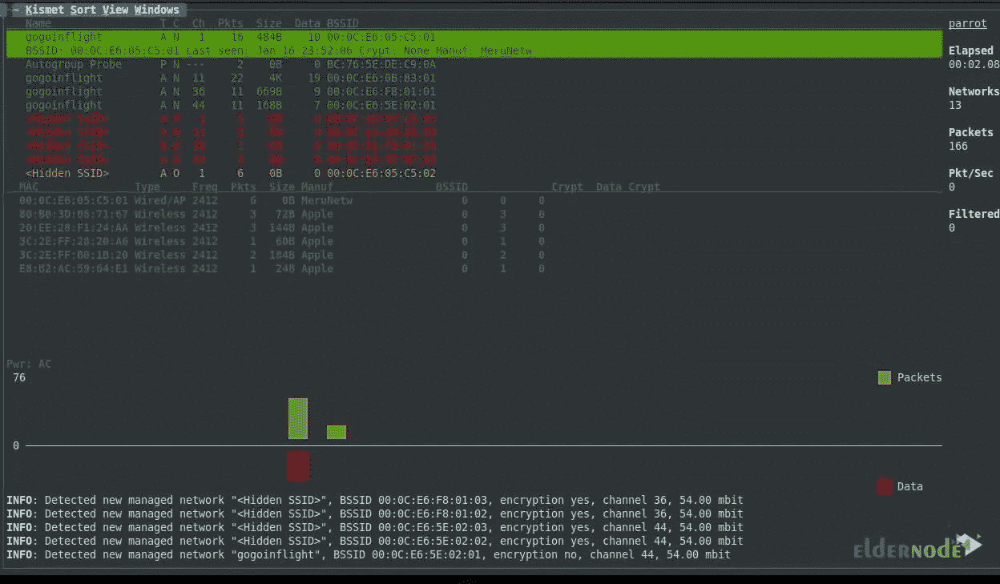
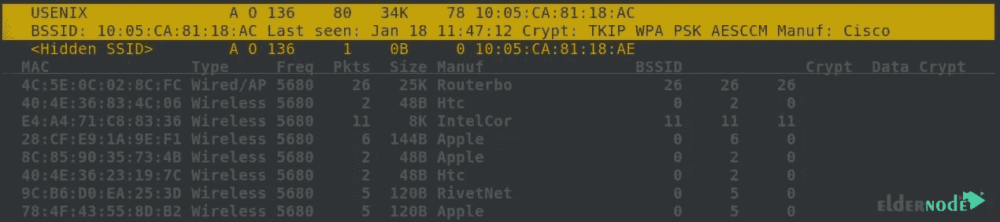
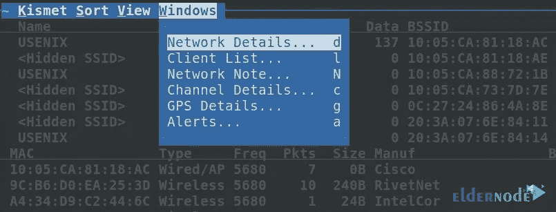

# 如何在 Kali Linux 上安装和使用 Kismet

> 原文：<https://blog.eldernode.com/install-and-use-kismet-on-kali-linux/>


Kismet 是一个无线网络跟踪器、嗅探器和入侵检测系统。您可以将它与任何支持 RFMON 或 Raw 监控模式的网卡一起使用。在本文中，我们将教您如何在 Kali Linux 上安装和使用 Kismet。需要注意的是，如果你想购买一台 [Linux VPS](https://eldernode.com/linux-vps/) ，你可以访问ٍEldernode 网站上展示的计划。

## **教程在 Kali VPS 上安装使用 Kismet**

在这篇来自 [Kali Linux](https://blog.eldernode.com/tag/kali-linux/) 培训系列的文章中，请继续关注我们关于如何在 Kali Linux 上安装和使用 Kismet 的介绍和培训。

### **Kali Linux 上的 Kismet 是什么？**

正如文章开头提到的，Kismet 是一个无线网络检测器、跟踪和入侵检测系统。它可以与任何支持原始监控(rfmon)模式的无线卡配合使用，并可以侦听 802.11a、802.11b、802.11g 和 802.11n 流量。它还可以检测隐藏的网络，并自动删除身份验证和连接到它们。有趣的是知道 Kismet 可以用来检测无线网络中的入侵，识别隐藏的无线网络。使用 Kismet 的另一个好处是可以找到无线接入点的位置并修复无线网络问题。

## **在 Kali Linux 上安装 Kismet**

要安装 Kismet 工具，您必须按顺序执行以下步骤。第一步，需要通过运行以下命令来更新系统:

```
sudo apt-get update
```

然后，您可以使用以下命令**安装所需的依赖项**:

```
sudo apt install build-essential git libwebsockets-dev pkg-config zlib1g-dev libnl-3-dev libnl-genl-3-dev libcap-dev libpcap-dev libnm-dev libdw-dev libsqlite3-dev libprotobuf-dev libprotobuf-c-dev protobuf-compiler protobuf-c-compiler libsensors4-dev libusb-1.0-0-dev
```

```
sudo apt install python3 python3-setuptools python3-protobuf python3-requests python3-numpy python3-serial python3-usb python3-dev python3-websockets librtlsdr0 libubertooth-dev libbtbb-dev
```

在下一步中，您需要使用以下命令**安装 Python 包**:

```
sudo apt-get install python python3-setuptools python3-protobuf python3-requests
```

```
sudo apt-get install librtlsdr0 python3-usb python3-paho-mqtt
```

现在是时候使用以下命令**安装 libusb** 了:

```
sudo apt-get install libusb-1.0-0-dev
```

最后，使用以下命令**克隆 Kismet repo** :

```
git clone --recursive https://github.com/kismetwireless/kismet.git
```

```
~/kismet $ ./configure
```

```
make -j$(nproc)
```

```
sudo make suidinstall
```

### **如何在 Kali Linux 上启动 Kismet**

在前面的小节中成功安装了 Kismet 之后，现在可以使用下面的命令将自己添加到 Kismet 组中。请注意将“您的用户名”替换为您的真实用户名:

```
sudo usermod -a -G kismet **YourUsername**
```

现在，您需要将无线网卡连接到计算机。您可以使用以下命令之一来查找您的卡:

```
ip a
```

```
ifconfig
```

***注:*** 我们建议您将无线网卡命名为“ **wlan1** ”或“ **wlan0** ”。

使用以下命令将卡置于监控模式:

```
sudo airmon-ng start **YourCardName**
```

为了识别卡是否处于无线监控模式，在运行上述命令后，将在卡名的末尾添加一个“mon”。所以，如果你的卡以前被命名为“wlan0”，那么它现在将被命名为“wlan0mon”。

现在可以通过运行以下命令来启动 Kismet 了:

```
kismet -c **YourCardNameMon**
```

运行上面的命令将启动 Kismet。要进入主屏幕，按下**选项卡**键，然后按下**回车**关闭控制台视图。

### **如何在 Kali Linux 上使用 Kismet**

运行 Kismet 后，您可以看到您所在范围内所有 Wi-Fi 设备的列表:



如下图所示，您可以根据名称、信号强度和其他特征对这些网络进行分类。要选择您想要的网络之一，请单击它。这样，您将看到无线客户端列表:



选择网络后，您可以从菜单中选择“**窗口**选项，然后点击“**客户端列表**以获得更多关于客户端的信息:



### **如何隐藏 Kismet 列表中的设备**

我们建议您在不需要客户端设备(包括智能手机)时关闭 Wi-Fi 设置。重要的是，你的 Wi-Fi 卡可以在任何地方跟踪你。有趣的是，即使你没有连接 Wi-Fi，这也是事实。

## 结束语

在本文的开始，我们试图向您介绍 Kali Linux 中的 Kismet 工具。然后我们教你如何在 Kali Linux 上安装和使用 Kismet。在最后一部分，我们还讲述了 Kismet 处理设备识别的解决方案。如果你有任何问题，可以在评论区和我们分享。