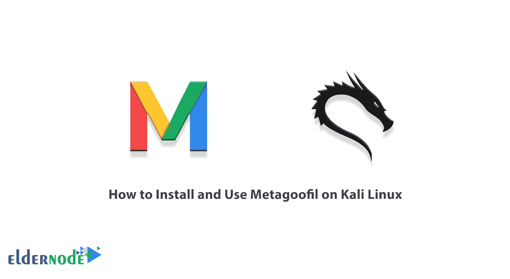

# 如何在 Kali Linux - Eldernode 博客上安装和使用 Metagoofil

> 原文：<https://blog.eldernode.com/install-and-use-metagoofil-on-kali/>



入侵测试工具在黑客攻击和安全测试中非常有用。这就是为什么你需要熟悉它们，这样你才能得到想要的结果。Metagoofil 是一个收集信息的工具，用于通过谷歌搜索引擎在网站上查找重要文件。通过这个工具，你可以找到并下载 Excel、Word、PDF 等。目标站点的文件。在本文中，我们将教你如何在 Kali Linux 上安装和使用 Metagoofil。如果你想买一个 [**Linux VPS**](https://eldernode.com/linux-vps/) 服务器，你可以在 [Eldernode](https://eldernode.com/) 看到可用的软件包。

## **教程在 Kali Linux 上安装使用 metagoufil**

### **meta goufil**简介

许多网站存储文档、图像、音频等。，或者把它们供用户使用，或者想出售一个文件。这些文件可以使用 Metagoofil 工具提取。为此，您可以在搜索时定义不同类型的限制，以便在最快的时间内获得想要的结果。

Metagoofil 可以提取的文件扩展名为 pdf、doc、Xls、ppt、ODP、ods、Docx、dxlsx 和 pptx。

这些信息可能很有用，因为你可以获得并使用有效的用户名，即用于[暴力](https://blog.eldernode.com/ftp-configuration-to-prevent-brute-force-attacks-on-windows-server-2012/)密码攻击(VPN、FTP、web 应用)的用户名。该工具还提取文档的“路径”，从中可以获得共享资源名、服务器名等等。

## **在 Kali Linux 上安装 metagoufil**

在这一节中，我们将向您展示如何在 [Kali Linux](https://blog.eldernode.com/install-and-configure-kali-linux-on-vps/) 上安装 Metagoofil。为此，只需遵循以下步骤。

如果您使用的是最新版本的 [Kali Linux](https://blog.eldernode.com/tag/kali-linux/) ，Metagoofil 可能不可用。因此，您必须使用以下命令安装它，以搜索任何组织的敏感数据:

```
apt-get update
```

```
apt-get install metagoofil
```

安装后，只需在 Linux 终端中运行以下命令来运行该工具:

```
metagoofil
```

***注意:*** 你需要 Python 版本 2 才能运行这个工具。下载该工具后，进入所需的文件夹，并使用以下命令运行它:

```
python metagoofil
```

***注意，这个工具没有图形版本。***

### **如何在 Kali Linux 上使用 meta goufil**

您可以使用如下的 **-h** 开关查看刀具开关指南:

```
metagoofil -h
```

您也可以通过以下命令使用该工具:

**-d:** 要搜索的域

**-t:** 要下载的文件类型(pdf、doc、Xls、ppt、ODP、ods、Docx、xlsx、pptx)

**-l:** 搜索结果的限制(默认为 200)

**-h:** 处理目录中的文档(使用“是”进行本地分析)

**-n:** 下载文件的限制

**-o:** 工作目录(保存下载文件的位置)

**-f:** 输出文件

要了解如何使用该工具，请注意以下命令:

```
metagoofil -d site.com -t xlsx -l 50 -n 25 -o /home
```

通过查看以下示例，您可以了解如何使用该工具:

**例 1:**

```
metagoofil.py -d apple.com -t doc,pdf -l 200 -n 50 -o applefiles -f results.html
```

**例 2:**

```
metagoofil.py -h yes -o applefiles -f results.html (local dir analysis)
```

## 结论

使用 Metagoofil 工具非常简单易用。这个工具默认安装在 Kali Linux 上，可以在 OSINT 工具类别中找到。在本文中，我们试图通过示例教您如何在 Kali Linux 上安装和使用 Metagoofil。