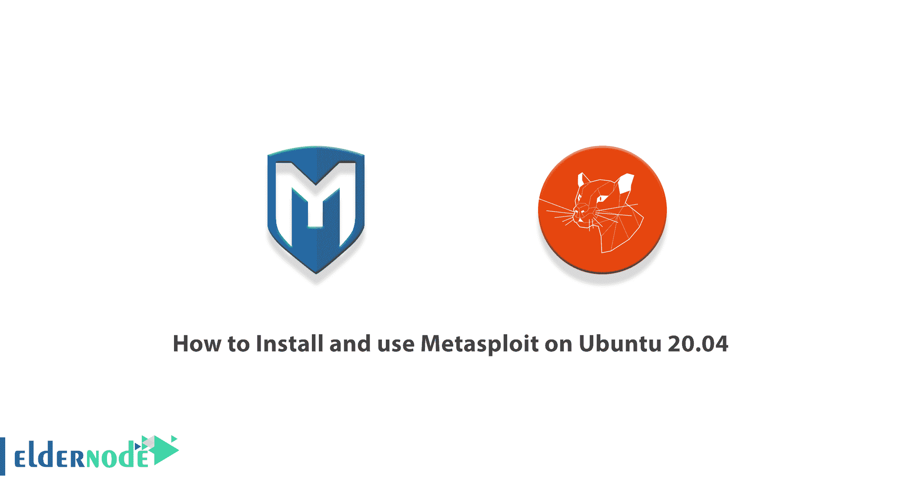
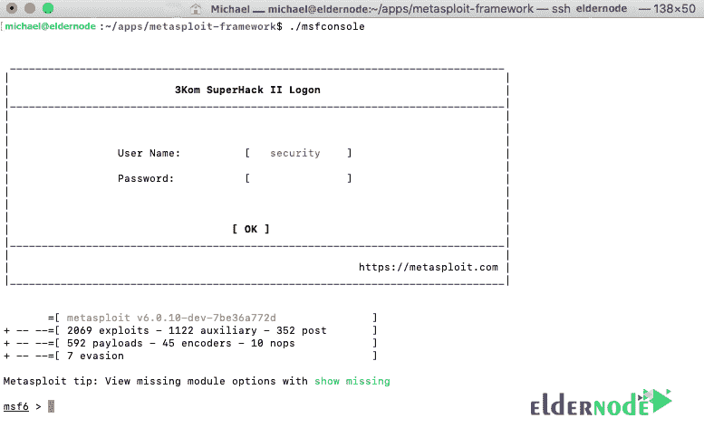

# 如何在 Ubuntu 20.04 - Eldernode 博客上安装和使用 Metasploit

> 原文：<https://blog.eldernode.com/install-and-use-metasploit-on-ubuntu/>



Metasploit 框架是一个开源项目，为漏洞研究和代码开发提供公共资源，允许安全专业人员检测对其网络的入侵并识别威胁和漏洞。使用 Metasploit 时一定要小心，因为扫描不适合您的网络或环境在某些情况下可能是非法的。在本文中，我们将教你如何在 Ubuntu 20.04 上安装和使用 Metasploit。需要注意的是，如果你想购买一台 **[Ubuntu VPS](https://eldernode.com/ubuntu-vps/)** 服务器，你可以访问 [Eldernode](https://eldernode.com/) 中提供的软件包。

## **教程在 Ubuntu 20.04 上安装使用 Metasploit**

Metasploit 是一个开源框架，专门为黑客、安全研究人员和其他网络安全积极分子编写。您可以使用这个框架来利用各种系统、网络和软件中的漏洞。默认情况下，这个框架有许多漏洞，但是除此之外，您可以创建自己的漏洞并添加到其中。

在下一节中，我们将教你如何在 [Ubuntu](https://blog.eldernode.com/tag/ubuntu/) 20.04 上安装 Metasploit。请加入我们。

### **模块类型在**

**1- Payload:** 该模块用于执行连接目标系统等操作，或者执行安装服务等任务。使用系统后的下一步是运行有效负载。最著名的是有效载荷 Metasploit Meterpreter。

**2-辅助:**辅助模块是执行特定任务的一种特殊类型的模块。诸如数据收集、数据库指纹识别、网络扫描以找到特定服务以及普查之类的任务是辅助模块的常见功能。

**3-编码器:**编码器用于加密有效载荷和攻击向量，以防止防病毒软件和防火墙的检测。

4- NOPS: 它们稳定有效载荷的性能。

**5-利用:**这是一段用于在受害系统上运行并利用漏洞的代码。

## **在 Ubuntu 20.04 上安装 Metasploit | Ubuntu 18.04**

在本节中，我们想讨论如何在 Ubuntu 20.04 上安装 Metasploit。鉴于 Metasploit 是用 ruby 制作的，所以需要一些依赖项。您必须首先使用以下命令安装所需的依赖项:

```
apt install -y build-essential zlib1g zlib1g-dev libpq-dev libpcap-dev libsqlite3-dev ruby ruby-dev
```

***注意:*** 安装依赖项可能需要几分钟时间。

第二步是在 apps 的主目录中使用以下命令安装 Metasploit:

```
mkdir ~/apps
```

```
cd ~/apps
```

接下来，您需要使用以下命令来克隆 repo，以便在 **msfupdate** 失败时更容易获取更新:

```
git clone https://github.com/rapid7/metasploit-framework.git
```

成功完成上述步骤后，您可以使用以下命令最终**安装 Metasploit** :

```
cd metasploit-framework/
```

```
sudo gem install bundler
```

```
bundle install
```

### **如何在 Ubuntu 20.04 上使用 Metasploit**

成功安装 Metasploit 后，可以从 Metasploit-frame 目录中的命令行运行 Metasploit 了:

```
./msfconsole
```

如果你已经正确地做了所有的事情， **msf6** 控制台将显示如下。



下一步是**配置系统**进行更新。您可以为此设置一些 GIT 变量。为此，您必须首先使用以下命令设置**您的名字**:

```
git config --global user.name "NAME HERE"
```

您还必须使用以下命令设置您的电子邮件:

```
git config --global user.email "[[email protected]](/cdn-cgi/l/email-protection)"
```

现在，您应该使用以下命令从 Metasploit-framework 目录中运行更新:

```
. /msfupdate
```

请注意，您需要做的最后一件事是将更新设置为 Cron，因此您不需要经常运行 msfupdate:

```
crontab -e
```

在最后一步中，您必须使用您最喜欢的编辑器添加以下行:

```
0 1 * * * /home/$name/apps/metasploit-framework/msfupdate > /dev/null 2>&amp;1
```

***注意:*** 在上面的命令中你要用你的用户名替换 **$** 的名字。

## 结论

Metasploit 是一个非常强大的框架，具有许多特性。该工具是 Rapid7 社区努力的结果。使用 Metasploit，您可以执行预先识别的攻击，如无密码受害者日志记录、网络摄像头黑客攻击、web 服务器黑客攻击、电子邮件服务器黑客攻击等。在这个框架下，你可以生成你的漏洞并私下使用。在本文中，我们试图教你如何在 Ubuntu 20.04 上安装和使用 Metasploit。