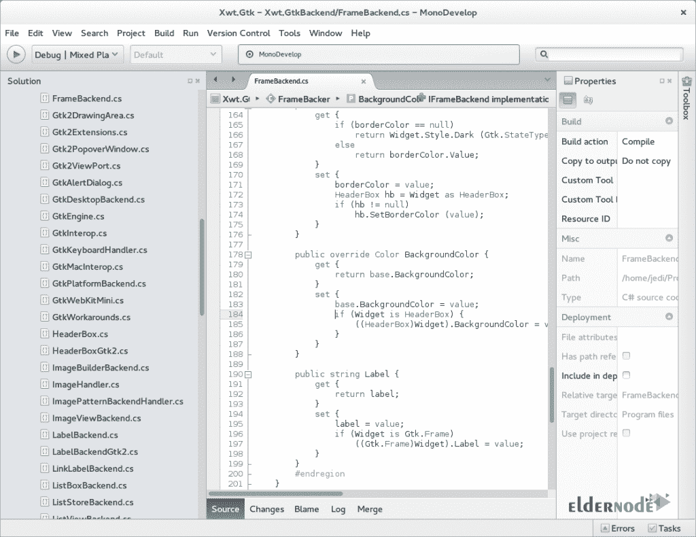
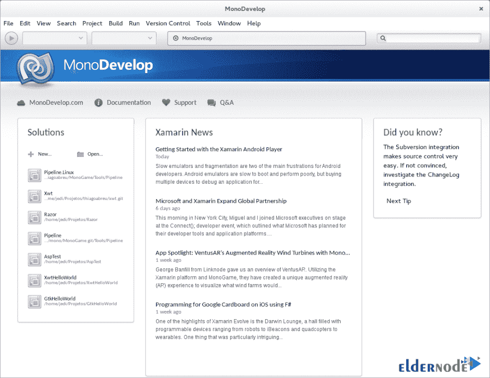

# 如何在 Windows - Eldernode 博客上安装和使用 MonoDevelop

> 原文：<https://blog.eldernode.com/install-and-use-monodevelop-on-windows/>

MonoDevelop 被称为 Xamarin Studio，是一个用于 Linux、macOS 和 Windows 的开源集成开发环境。它的主要焦点是开发使用 Mono 和。NET 框架。应该注意的是，MonoDevelop 集成了与 NetBeans 和 Microsoft Visual Studio 类似的功能，例如自动代码完成、源代码控制、图形用户界面(GUI)和 Web 设计器。在本文中，我们将一步一步地教你如何在 Windows 服务器上安装和使用 MonoDevelop。如果你想买一台 **[Windows VPS](https://eldernode.com/windows-vps/)** 服务器，你可以在 [Eldernode](https://eldernode.com/) 看到可用的软件包。

## **教程在 Windows 上安装使用 MonoDevelop**

MonoDevelop 是用于。NET 平台，其功能可与 Microsoft Visual Studio 相媲美。在下一节中，我们将介绍 MonoDevelop。然后我们会教你如何在 [Windows](https://blog.eldernode.com/tag/windows/) 上安装 MonoDevelop。我们还将在最后一步解释如何使用 MonoDevelop。请继续关注本文的其余部分。

### **MonoDevelop**简介

如前所述，MonoDevelop 可以在 Windows 上使用。MonoDevelop 是用于。NET 平台，其功能可与 Microsoft Visual Studio 相媲美。MonoDevelop 的一些功能包括:

1_ 多平台 IDE 和用户项目

2_ 多语言(C#、F#、Visual Basic。NET、C/C++、Vala、JavaScript、TypeScript)

3 _ c#、Visual Basic、Boo、Java (IKVM)和 C/C++的项目模板

4_ 对 C#、代码模板、代码折叠的代码完成支持

5_ 可定制的窗口布局、用户定义的按键绑定、外部工具

6_ 用于调试单声道和本机应用程序的集成调试器

7_ 集成编译器(最高支持 C# 6.0)

8_ GTK#可视化设计器以图形化方式构建 GTK#用户界面

9_ 在 XSP (Mono webserver)上提供代码完成支持和测试的 ASP.NET web 项目。

10_ 源代码控制、makefile 集成、单元测试、打包和部署、本地化

### **在 Windows 上安装 MonoDevelop 的先决条件**

_ 使用安装 Visual Studio 2017。NET 桌面和。NET 核心工作负载和 F#可选组件(注意，默认情况下 F#是禁用的，因此需要在 VS 安装程序中启用它)。

_ 为 Windows 安装[Git](https://gitforwindows.org/)

_ 确保您有。NET Framework 4.7.1 引用程序集(4.7.1 目标包)

_ 安装 [Gtk#安装工具](https://www.mono-project.com/download/stable/)。

_ 安装[单声道库包](https://files.xamarin.com/~jeremie/MonoLibraries.msi)

_ 安装 [GNU Gettext 工具](http://gnuwin32.sourceforge.net/packages/gettext.htm)

## **在 Windows 上安装 MonoDevelop(VPS 服务器)**

在这一节，我们将教你如何在 Windows 上安装 MonoDevelop。为此，只需按顺序执行以下步骤。

第一步是打开一个你最喜欢的浏览器。然后你需要[下载 MonoDevelo](https://www.monodevelop.com/download/) p 安装文件。

如下图所示，您可以根据您的系统规格选择其中一个版本，然后点击下载。

下载 MonoDevelop 后，转到下载文件的位置。然后双击**。exe** 文件来执行安装步骤。在打开的窗口中，点击**运行**。

勾选**我接受条款……**并点击**安装**开始安装过程。

*

最后，点击**完成**完成 MonoDevelop 安装。

你会看到 MonoDevelop 图标出现在你的桌面上。你可以点击图标来运行你的窗口中的应用程序。

### **如何在 Windows 上使用 MonoDevelop**

现在您已经根据说明成功安装了 MonoDevelop，现在您可以访问它了。在下图中，您可以看到【MonoDevelop 主窗口:

MonoDevelop 的另一个用途是**集成调试器**，如下图所示:

你可以在 MonoDevelop 中看到另一个特性，**插件管理器**，如下图所示:

下面你可以看到 MonoDevelop 的其他功能，分别是 **NuGet Manager** 、**欢迎页面、**和 **GUI 设计器**:

*

*

## 结论

MonoDevelop 是一个用于 Windows、Linux 和 macOS 的 Mono/C#集成开发环境。当你输入 C#和 VB 程序时，它可以分析它们，并且能够提供方法的上下文完成。在本文中，我们试图在全面介绍 MonoDevelop 之后，教你如何在 Windows 上安装和使用 MonoDevelop。