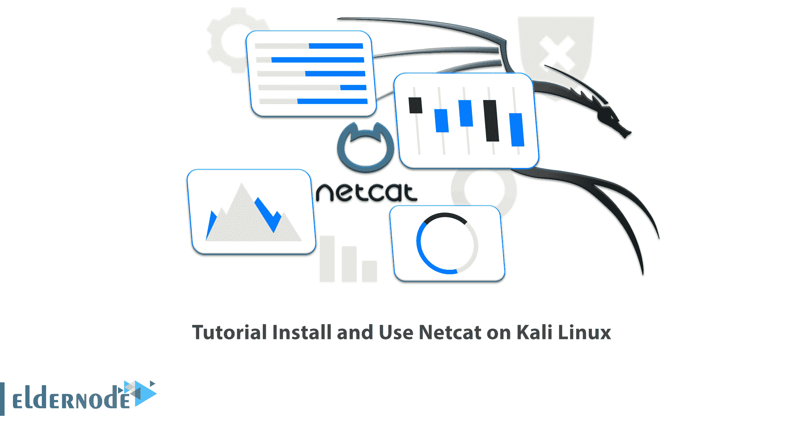

# 教程在 Kali Linux 上安装和使用 Netcat-Netcat 是什么？

> 原文：<https://blog.eldernode.com/install-and-use-netcat-on-kali-linux/>



Netcat 是一个非常通用的工具，允许您通过 TCP/IP 网络连接到远程主机。它有许多用途，包括连接到服务器进行文件传输、网页浏览，甚至是 IRC 聊天。一些用户正在寻找一种既能用于攻击又能用于安全的工具。Netcat 是 Kali Linux 工具中的一个，可以在这个领域帮助用户。先简单介绍一下 Netcat，然后你会学到**如何在 Kali Linux** 上安装和使用 Netcat。如果想购买一台 [**Linux VPS**](https://eldernode.com/linux-vps/) 服务器，可以访问 [Eldernode](https://eldernode.com/) 网站，选择自己喜欢的包。

## **如何在 Kali Linux 2022 上安装 Netcat**

您可能以前听说过 netcat，但不知道它是做什么的，也不知道为什么您会需要它。我们将在这里解释一切，以便您今天就可以开始使用它！

## **Netcat**简介

Netcat 是一个使用 TCP 和 UDP 连接在网络上读写数据的实用程序。由于其独特的设计，Netcat 是一个可以被其他程序和脚本轻松驱动的后端工具。这个工具也用于调试和网络探索，因为它可以建立您需要的连接，并且有几个有趣的内置功能。

## 什么是 Netcat？

Netcat(网络连接工具包)是一个命令行实用程序，用于在通过网络连接的两台计算机之间传输文件。它经常被用作 FTP 的替代品，因为它比 FTP 快得多。

### **Netcat**的用例

**1—>****连接服务器**:与 IP 地址的服务器连接。

**2—>****两个用户聊天的可能性**:为此，我们需要两个设备，一个发起方比如 Kali Linux 机器，一个监听方比如 Windows 10 机器。

**3—>****创建后门**:你可以用 Netcat 创建后门，这样你就可以随时回它。

**4—>****详细模式**:该模式产生大量信息，可以使用 **-v** 参数触发。

**5—>****将输出保存到桌面**:保存 Netcat 输出，以便记录保存，更好的可读性和将来参考。

**6—>****文件传输** : Netcat 可以用来在两个设备之间传输文件。

在这篇来自 [Kali Linux 培训](https://blog.eldernode.com/tag/kali-linux/)系列的文章的续篇中，我们打算一步一步地教你如何在 Kali Linux 上安装和使用 Netcat。

## **在 Kali Linux 上安装 Netcat**

您可以使用下面的命令在 [Kali Linux](https://blog.eldernode.com/introduction-kali-linux-server-and-its-applications/) 上**安装 Netcat** :

```
sudo apt install netcat-traditional
```

## **如何在 Kali Linux 服务器上使用 Netcat**

运行以下命令开始使用 Netcat:

```
nc.traditional -h
```

## 结论

在本文中，我们介绍了 Netcat，它使用 TCP 和 UDP 连接在网络上读写数据。我们还回顾了 Netcat 的使用案例，您了解了如何在 Kali Linux 上安装和使用 Netcat。