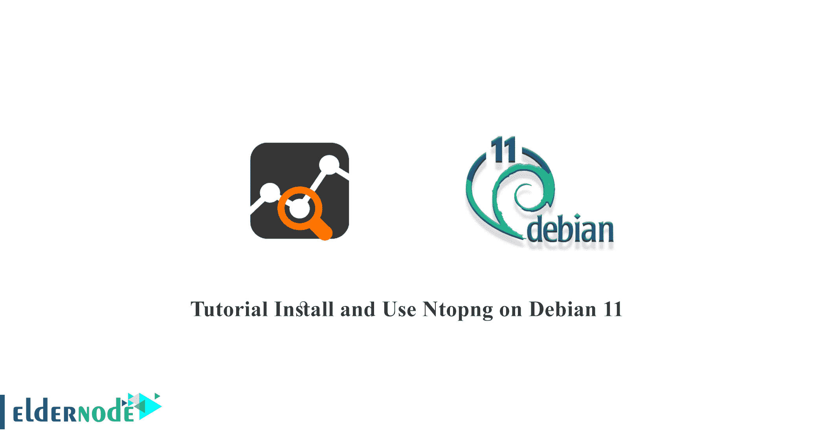
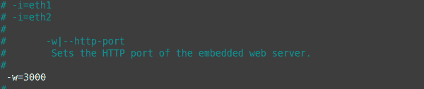

# Debian 11 - Eldernode 博客上的教程安装和使用 Ntopng

> 原文：<https://blog.eldernode.com/install-and-use-ntopng-on-debian-11/>



Ntopng 是一个免费的、开源的、非常有用的监控工具，可以实时监控网络流量。这是基于 libpcap 的原始 ntop 版本的高性能、低资源的下一代版本。Ntopng 是多平台的，可以在每个 Unix、MacOSX 和 Windows 平台上运行。ntopng 负责监控和报告各种协议，包括 TCP、UDP、ICMP、DLC、IPX、ARP、Netbios、Decnet 等。在本文中，我们将教你如何在 Debian 11 上安装和使用 Ntopng。如果你想购买一台 [**Linux VPS**](https://eldernode.com/linux-vps/) 服务器，你可以访问 [Eldernode](https://eldernode.com/) 中的软件包。

## **如何在 Debian Linux 上安装使用 nto png**

由于在计算机网络中分析数据信息可能是一项困难的任务，使用必要的工具可以使它变得更容易。ntopng 让您快速方便地分析网络流量，但也检查其他事情。

### nto png 简介

简单地说，Ntopng 是一个基于 web 的应用程序，允许您监控网络流量。该程序有一个开源社区资源，它是在 GPLv3 许可证下发布的，可以免费使用，在本节中被视为参考。

### Ntopng 特性包括:

*   IP 地址的地理定位
*   分析流量并按来源/目的地进行分类
*   显示网络流量和 IPv4 / IPv6 主机
*   按协议类型报告和排序 IP 协议使用情况
*   以 RRD 格式存储交通统计数据

## **如何在 Debian 11 | Debian 10** 上安装 Ntopng

这是安装 Ntopng 最有效、最安全的方式。此外，如果更新了，您可以通过将它添加到存储库中来从 APT 下载它。

然后，加载一个 DEB 包来添加和配置 Ntopng 存储库。

```
cd /tmp
```

```
wget http://apt.ntop.org/buster/all/apt-ntop.deb
```

然后开始安装 GPG 以正确添加水箱:

```
sudo apt install gpg
```

在此步骤中，安装下载的软件包以添加储罐:

```
sudo dpkg -i apt-ntop.deb
```

现在，已经添加了存储库，我们需要刷新 APT 包源:

```
sudo apt update
```

最后，使用以下命令安装 ntopng 及其一些模块:

```
sudo apt install pfring-dkms nprobe ntopng n2disk cento
```

要使用 web 界面，您需要进行一些预先配置。例如，指定运行时端口。为此，只需编辑应用程序配置文件:

```
sudo nano /etc/ntopng/ntopng.conf
```

 

根据上图， -w 值指定了 web 接口使用的端口。可以自定义，但是记得在防火墙打开。此外，通过创建新文件，您可以指定网络 IP 地址的范围。也是默认或活动的网络接口。

```
sudo nano /etc/ntopng/ntopng.start/
```

然后，通过重新启动服务，应用必要的更改:

```
sudo systemctl restart ntopng
```

现在，打开你的网络浏览器，进入**HTTP://your-server:[port]**，你会看到登录页面。

```
Username: admin
```

```
password: admin
```

恭喜你！你在 [Debian](https://blog.eldernode.com/tag/debian/) 11 中安装了 Ntopng。

## 结论

在本文中，我们试图教大家如何在 Debian 11 上安装和使用 Ntopng。Ntopng 是高级网络监控领域的领导者。在社交版本的帮助下，我们可能会在服务器上安装它来帮助我们监控网络行为。使用它在 Debian 中的存储库，我们能够安装它而没有大的复杂性。