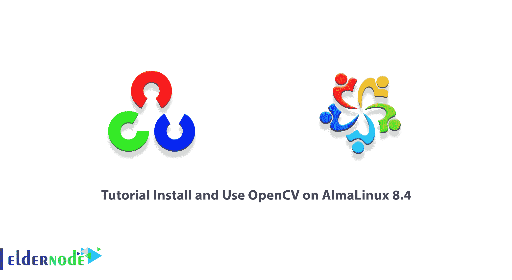

# 教程在 AlmaLinux 8.4 上安装和使用 OpenCV-elder node 博客

> 原文：<https://blog.eldernode.com/install-and-use-opencv-on-almalinux/>



OpenCV，即开放式计算机视觉库，是一个图像处理和机器学习编程库的集合。本系列更侧重于实时图像处理。最初由英特尔开发和支持，现在由 Willow Garage 和 Itseez 提供支持。OpenCV 是一个多平台库，受 Windows、Linux、Mac OS、iOS 和 Android 操作系统支持。它还有一个 C、C ++、Python、Java 和 MATLAB 语言的编程接口。在本文中，我们将一步一步地教你如何在 AlmaLinux 8.4 上安装和使用 OpenCV。如果你想购买一台 [**Linux VPS**](https://eldernode.com/linux-vps/) 服务器，你可以访问 [Eldernode](https://eldernode.com/) 中的软件包。

## **如何在 AlmaLinux 上配置 OpenCV**

### **OpenCV**简介

OpenCV 是一个用于计算机视觉的开源库。OpenCV 设计的目的是处理任务，特别是对于实时应用。OpenCV 也可以与多核处理器一起工作。

如果您希望在英特尔架构上获得更多自动化优化，您可以购买英特尔集成性能原语库(IPPs ),其中包括许多算法领域的低级优化例程。如果安装了库，OpenCV 会在运行时自动应用适当的 IPP。

OpenCV 的目标之一是提供一个易于使用的计算机视觉基础设施，以便人们可以快速构建他们相对复杂的视觉程序。OpenCV 库包括 500 多个函数，涉及各种视觉主题，从工厂产品审查到医学成像、安全、用户界面、摄像机调谐、机器人和双目视觉。

因为计算机视觉和机器学习之间一直有着密切的关系，OpenCV 还包括一个 MLL(机器学习库)。这个子库侧重于统计模式识别和分类。

OpenCV 的应用包括以下内容:

1.图像过滤器

2.人脸识别系统

3.运动检测

4.人机交互

5.移动机器人

6.理解运动

7.物体识别

8.划分和诊断

9.立体深度视觉:来自两个相机的深度感知

10.运动结构(SFM)

11.运动跟踪

12.增强现实

## **在 AlmaLinux 8.4 上安装 OpenCV**

在前一节中完全熟悉 OpenCV 及其功能后，我们现在想讨论如何在 AlmaLinux 8.4 上安装 OpenCV。为此，您必须按顺序执行以下步骤。

第一步，您必须使用以下命令**更新系统**:

```
sudo dnf update
```

```
sudo dnf install epel-release
```

```
sudo dnf install opencv opencv-devel opencv-python
```

然后，您可以通过执行以下命令来安装必要的工具和依赖项:

```
sudo dnf install git gcc gcc-c++ cmake3 qt5-qtbase-devel python3 python3-devel python3-pip cmake python3-devel python3-numpy gtk2-devel libpng-devel jasper-devel openexr-devel libwebp-devel libjpeg-turbo-devel libtiff-devel tbb-devel libv4l-devel eigen3-devel freeglut-devel mesa-libGL mesa-libGL-devel boost boost-thread boost-devel gstreamer1-plugins-base
```

现在是时候使用以下命令克隆 **OpenCV contrib** 和 **OpenCV 仓库**了:

```
mkdir -p ~/opencv_build && cd ~/opencv_build
```

```
git clone https ://github.com/opencv/opencv.git
```

```
git clone https ://github.com/opencv/opencv_contrib.git
```

### **如何在 AlmaLinux 8.4 上配置使用 OpenCV**

在上一节中，您能够成功安装 OpenCV。现在我们想教你如何在 [AlmaLinux 8.4](https://blog.eldernode.com/install-and-use-almalinux/) 上配置和使用 OpenCV。为此，使用下面的命令**创建一个临时目录**并转到该列表:

```
cd ~/opencv_build/opencv && mkdir build && cd build
```

现在是使用命令配置 OpenCV 构建的时候了:

```
cmake3 -D CMAKE_BUILD_TYPE=RELEASE \
```

```
-D CMAKE_INSTALL_PREFIX=/usr/local \
```

```
-D INSTALL_C_EXAMPLES=ON \
```

```
-D INSTALL_PYTHON_EXAMPLES=ON \
```

```
-D OPENCV_GENERATE_PKGCONFIG=ON \
```

```
-D OPENCV_EXTRA_MODULES_PATH=~/opencv_build/opencv_contrib/modules \
```

```
-D BUILD_EXAMPLES=ON ..
```

最后，您可以使用以下命令开始编译过程:

```
make -j8
```

```
sudo make install
```

注意下面重要的一点。您必须使用以下命令在 **/usr/share/pkgconfig** 目录中创建一个 symlink opencv4.pc 文件。然后，您需要运行 **ldconfig** 来恢复库缓存。

```
sudo ln -s /usr/local/lib64/pkgconfig/opencv4.pc /usr/share/pkgconfig/ sudo ldconfig
```

现在，您可以通过检查已安装的 OpenCV 版本，使用以下命令安装 OpenCV:

```
pkg-config --modversion openc
```

在最后一步中，您可以使用以下命令来启用 Python cv2 模块:

```
python3 -c "import cv2; print(cv2.__version__)"
```

## 结论

如前所述，OpenCV 库算法使用 SSE、AVX、TBB、IPP、CUDA 和 OpenCL 进行优化和并行化。它还有一个机器学习部分，用于对数据进行聚类和分类。在本文中，我们试图向您介绍如何在 AlmaLinux 8.4 上安装和使用 OpenCV。