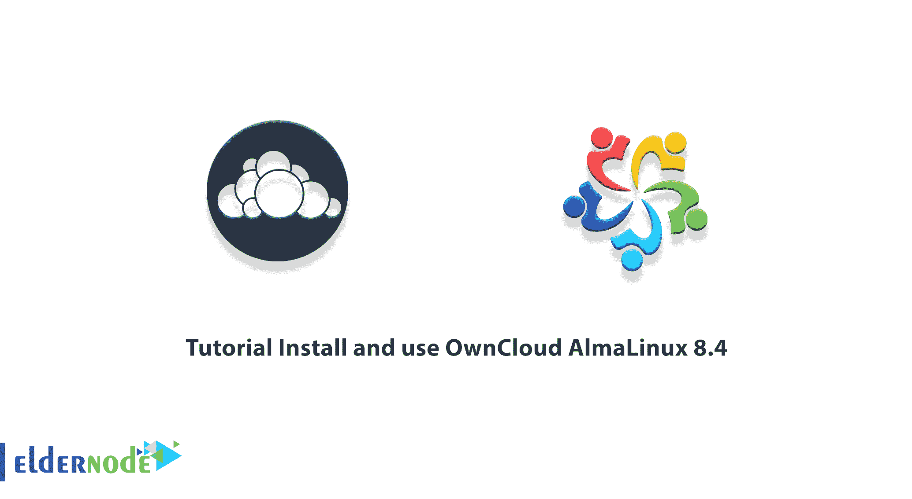
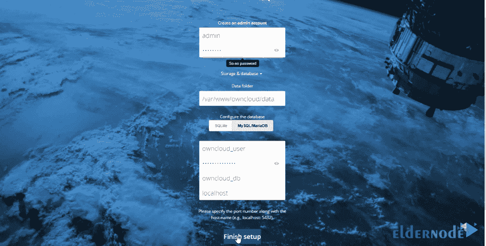
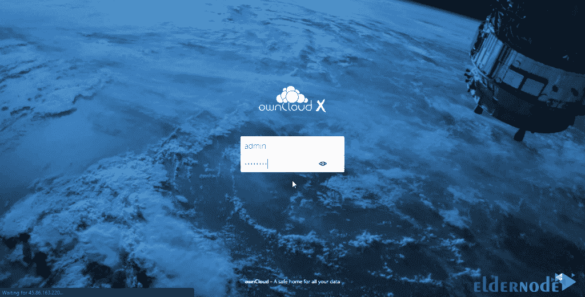
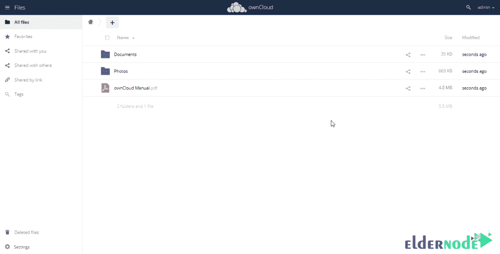

# 教程安装和使用 OwnCloud AlmaLinux 8.4 - Eldernode 博客

> 原文：<https://blog.eldernode.com/install-and-use-owncloud-almalinux-8-4/>



您可能是拥有大量信息的用户之一，并且不希望这些信息进入服务器。还有，你不愿意付费。所以你在寻找一个切实可行的解决方案。OwnCloud 是一个开源、完全免费的平台，其服务和功能类似于 Dropbox 和数据存储服务。它将信息存储在云上，你可以随时访问这些文件。在本文中，我们将教你如何在 AlmaLinux 8.4 上安装和使用 OwnCloud。如果你想买一个 [**Linux VPS**](https://eldernode.com/linux-vps/) 服务器，你可以在 [Eldernode](https://eldernode.com/) 看到可用的软件包。

## **如何设置 OwnCloud AlmaLinux 8.4**

### **own cloud 简介**

OwnCloud 是一个用 PHP，javascript 编写的开源 web 应用。该工具用于在手机、电脑、平板电脑、笔记本电脑等之间同步文件。

OwnCloud 客户端软件也可用于 [Linux](https://blog.eldernode.com/tag/linux/) 、 [Windows](https://blog.eldernode.com/tag/windows/) 、Android、iOS、Mac 和 BlackBerry 操作系统，通过它你可以轻松连接到你的个人云存储。您还可以同步文件、通过 web 访问文件或与其他人共享文件。

需要注意的是，该应用的服务器端安装软件可以安装在 Mac、Android、Windows、Linux 操作系统上。也可以使用 Mysql、MariaDB、PostgreSQL、SQLite 和 Oracle 数据库。

跟随我们在本文中学习如何在 [AlmaLinux](https://blog.eldernode.com/install-and-use-almalinux/) 8.4 上安装和使用 OwnCloud。

## **安装 OwnCloud AlmaLinux 8.4 的先决条件**

要在 AlmaLinux 上安装 OwnCloud，需要先**安装 LAMP** 。因此，有必要按顺序执行以下步骤。

### **如何安装 Apache Web 服务器**

首先，我们从安装 Apache Web 服务器开始。为此，您可以使用以下命令:

```
yum install httpd httpd-tools
```

然后您需要使用以下三个命令**启用 Apache** ，**启动 Web 服务器**，最后**检查状态**:

```
systemctl enable httpd
```

```
systemctl start httpd
```

```
systemctl status httpd
```

下一步是编辑您的**防火墙规则**，以允许您的 web 服务器上的 HTTP 和 HTTPS 请求。为此，您可以使用以下命令:

```
firewall-cmd --permanent --zone=public --add-service=http
```

```
firewall-cmd --permanent --zone=public --add-service=https
```

```
firewall-cmd --reload
```

最后，**重启 Apache Web 服务器**以完成安装:

```
systemctl restart httpd
```

### **如何在服务器上安装 PHP**

要在 AlmaLinux 上安装 PHP，可以使用以下命令:

```
yum install -y php-mysqlnd php-dom php-simplexml php-xml php-xmlreader php-curl php-exif php-ftp php-gd php-iconv php-json php-mbstring php-posix php-sockets php-tokenizer
```

然后**通过运行以下命令重启 web 服务器**:

```
systemctl restart httpd
```

### **如何安装 MariaDB 服务器**

在开始之前要记住的一点是，安装 MariaDB 包括几个步骤。要安装 MariaDB ，您必须首先运行以下命令:

```
yum install mariadb-server mariadb
```

然后你需要使用以下三个命令**启用 Maria db**,**启动 MariaDB** ，最后**确认状态**:

```
systemctl enable mariadb
```

```
systemctl start mariadb
```

```
systemctl status mariadb
```

完成上述步骤后，您现在应该使用以下命令**保护您的 MariaDB** 安装:

```
mysql_secure_installation
```

注意，对于 OwnCloud 集成，您需要使用以下命令**安装额外的 PHP 模块**:

```
yum install php-curl php-gd php-intl php-json php-ldap php-mbstring php-mysqlnd php-xml php-zip php-opcache
```

然后，您必须在下一步中为 OwnCloud 创建一个数据库。首先，运行以下命令**进入 MariaDB 数据库**:

```
mysql -u root -p
```

现在，您需要使用以下命令**为 OwnCloud 创建一个数据库**:

```
CREATE DATABASE owncloud_db;
```

下一步是**创建用户**和**授权 nextcloud-db 数据库**。在下面的命令中，你必须用你想要的密码替换【T4 输入密码】这里的:

```
GRANT ALL ON owncloud_db.* TO 'owncloud_user'@'localhost' IDENTIFIED BY 'Enter-A-Password-Here';
```

最后，通过运行以下命令，**清除特权**并退出 MariaDB 数据库:

```
FLUSH PRIVILEGES;
```

```
EXIT;
```

## **安装 OwnCloud AlmaLinux 8.4**

在安装了一节中描述的必要先决条件之后，我们现在想教您如何在 AlmaLinux 8.4 上安装 OwnCloud。为此，只需遵循以下步骤。

您必须首先使用以下命令**下载 OwnCloud** :

```
wget https://download.owncloud.org/community/owncloud-complete-20201216.tar.bz2
```

下载完文件后，您现在应该将它解压缩到 **/var/www/** :

```
tar -jxf owncloud-complete-20201216.tar.bz2 -C /var/www/
```

现在您需要使用下面的命令来启用 Apache Web 服务器权限。这是访问 OwnCloud 文件所必需的。

```
chown -R apache: /var/www/owncloud
```

通过运行以下命令为 Apache Web 服务器的 OwnCloud 创建一个配置文件:

```
Vi /etc/httpd/conf.d/owncloud.conf
```

将以下命令添加到配置文件中:

```
Alias /owncloud "/var/www/owncloud/"    <Directory /var/www/owncloud/>  Options +FollowSymlinks  AllowOverride All    <IfModule mod_dav.c>  Dav off  </IfModule>    SetEnv HOME /var/www/owncloud  SetEnv HTTP_HOME /var/www/owncloud    </Directory>
```

对配置文件进行更改后，**保存**并退出。然后**重启 apache Web 服务器**:

```
systemctl restart httpd
```

您可以使用以下命令来检查 Web 服务器的状态:

```
systemctl status httpd
```

请注意，您应该使用以下命令检查 SELinux 是否已启用并正在运行:

```
sestatus
```

如果启用了 SELinux，您必须允许 Apache Web 服务器写入 OwnCloud 目录:

```
setsebool -P httpd_unified 1
```

### **如何使用 OwnCloud AlmaLinux 8.4**

在上一节中，您看到了如何在 AlmaLinux 8.4 上安装 OwnCloud。现在我们想教你如何在 AlmaLinux 8.4 上完成任务和使用 OwnCloud。

在浏览器中打开 OwnCloud:

```
http://server-ip/owncloud
```

在打开的页面上，输入用户名**和密码**创建账户，如下图所示。然后点击**存储和数据库**，选择 **MySQL/MariaDB** 。您还需要填写所有的数据库信息，即数据库用户、密码和数据库名称。最后，点击**完成设置**按钮完成设置。



在下一步中，输入您之前设置的用于访问的用户名**和密码**，如下所示:



成功登录后，您可以选择在不同的操作系统上安装自己的云应用程序。您可以在下图中看到仪表板:



## 结论

OwnCloud 最重要的好处之一是它是免费和开源的。它还让您能够控制您需要的敏感信息。在本文中，我们试图教你如何在 AlmaLinux 8.4 上安装和使用 OwnCloud。