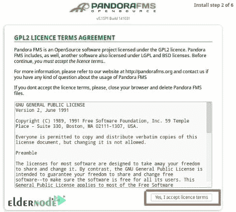
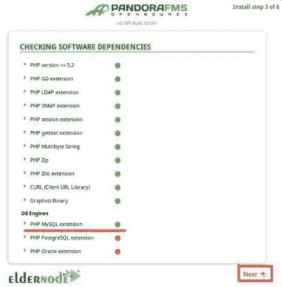
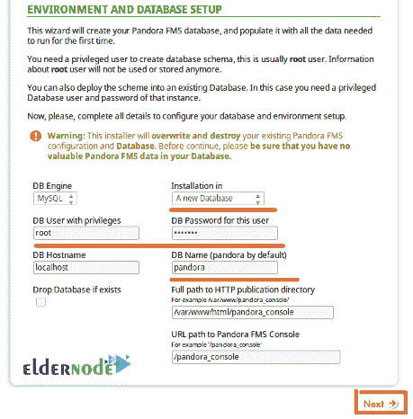
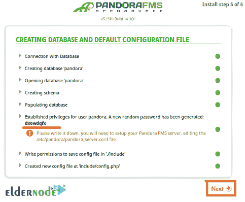
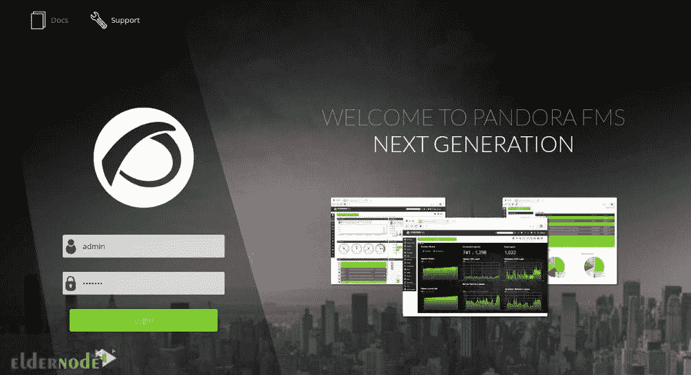

# 如何在 Centos 8 - Eldernode 博客上安装和使用 Pandora FMS

> 原文：<https://blog.eldernode.com/install-and-use-pandora-fms-on-centos-8/>


作为管理员、工程师或技术人员，您应该能够观察您的系统和应用程序，并检查它们的元素状态。Pandora FMS 是一款开源的全功能监控软件。使用 Pandora 可以查看你的网络基础设施，检测你的网站的接口和损坏。此外，您可以用一种易于阅读的图形布局将关键信息呈现给经理。有开源和企业两个版本。如果您正在为您的企业寻找一个功能齐全的监控和管理平台，无疑企业版更有用。但是，请通过这篇文章来了解如何在 Centos 8 上安装和使用 Pandora FMS。此外，如果您需要购买完全托管的 VPS，请在 [Eldernode](https://eldernode.com/) 订购您认为价格和支持最优惠的 **[CentOS VPS](https://eldernode.com/centos-vps/)** 。

## **教程在 Centos 8** 上安装使用潘多拉 FMS

您可能需要控制所有的 IT 基础架构。潘多拉的网络应用程序可以帮助你监控多个操作系统。下面，您将回顾一下 Pandora 在 [CentOS](https://blog.eldernode.com/tag/centos/) 8 上的安装过程。潘多拉**F**flexible**M**monitoring**S**系统由潘多拉 FMS 服务器、潘多拉 FMS 代理、潘多拉 FMS Web 管理系统和潘多拉数据库四部分组成。Pandora FMS 使用 TCP、UDP、ICMP、SNMP 和 HTTP 协议和代理从客户端系统收集指标。它是跨平台的，支持 [Windows](https://blog.eldernode.com/tag/windows/) 和 [Linux](https://blog.eldernode.com/tag/linux/) 操作系统。

### **CentOS 8**上安装使用 **潘多拉 FMS 的先决条件**

为了让本教程更好地工作，请考虑以下先决条件:

_ 拥有 Sudo 权限的非 root 用户。

_ 要进行设置，请遵循 CentOS 8 上的[初始服务器设置。](https://blog.eldernode.com/initial-set-up-centos-8/)

_ 至少 2GB 内存

_ 在独立服务器上安装 MySQL，并安装 Percona XTraDB 而不是标准 MySQL。

要查看附加要求，请查看下表中不同安装的最低建议。如果 80%的模块都有历史数据，平均采样时间为 5 分钟，可以用它的信息进行检查。但是，这些建议是针对安装在同一数据库服务器、服务器和控制台中的环境而指定的。


### **在 CentOS 8 | CentOS 7**T3 上安装 Pandora FMS 服务器

让我们浏览一下本指南的步骤，并了解如何在 CentOS 8 上安装和使用 Pandora FMS。

*第一步:*

首先，运行以下命令**用最新的可用软件包更新您的系统**:

```
dnf update -y
```

*第二步:*

由于 Pandora FMS 运行在 web 服务器上，所以它使用 MariaDB 作为数据库后端。因此，您必须**在您的系统中安装 Apache 和 MariaDB 服务器**。要安装它们，请键入:

```
dnf install httpd mariadb-server -y
```

要在安装后启动 Apache 和 MariaDB 服务,请使用以下命令:

```
systemctl start httpd
```

```
systemctl start mariadb
```

```
systemctl enable httpd
```

```
systemctl enable mariadb
```

*第三步:*

在这一步中，您可以使用下面的命令来设置 **MariaDB root 密码**:

```
mysql_secure_installation
```

然后，您将被提示回答以下问题。回答他们并继续:


然后，要登录到 MariaDB，请运行以下命令:

```
mysql -u root -p
```

因此，您可以提供您的 root 密码，并为 Pandora FMS 创建一个数据库和用户。因此，键入:

```
CREATE DATABASE pandora;
```

```
GRANT ALL PRIVILEGES ON pandora.* to [[email protected]](/cdn-cgi/l/email-protection)'localhost' IDENTIFIED BY 'password';
```

现在，使用下面的命令退出 MariaDB:

```
FLUSH PRIVILEGES;
```

```
EXIT;
```

*第四步:*

由于 CentOS 默认存储库中没有 Pandora，要将其安装在 CentOS 服务器上，您必须将 **Pandora 存储库**添加到您的系统中。使用以下命令创建 Pandora repo:

```
nano /etc/yum.repos.d/pandorafms.repo
```

然后添加以下几行:

```
[artica_pandorafms]
```

```
name=CentOS6 - PandoraFMS official repo
```

```
baseurl=http://firefly.artica.es/centos7
```

```
gpgcheck=0
```

```
enabled=1
```

完成后，您可以**保存**并关闭文件。运行以下命令安装 Pandora FMS:

```
dnf install pandorafms_console -y
```

接下来，给 pandora 目录适当的权限和所有权:

```
chown -R apache:apache /var/www/html/pandora_console/
```

```
chmod -R 775 /var/www/html/pandora_console/
```

然后，**重启**Apache 服务以应用更改:

```
systemctl restart httpd
```

### **如何在 CentOS 8** 上安装潘多拉 FMS 代理

在 UNIX 环境中，还必须安装以下软件:

```
Perl 5.8 or above
```

需要安装以下依赖项:

```
perl-YAML-Tiny-1.73-2
```

```
perl-Sys-Syslog
```

```
unzip
```

现在，您可以使用以下命令来安装依赖项:

```
yum install dnf-plugins-core -y
```

```
yum config-manager --set-enabled powertools -y
```

```
yum install -y perl-YAML-Tiny perl-Sys-Syslog unzip
```

最后，要安装代理，请键入:

```
yum install -y http://firefly.artica.es/pandorafms/latest/RHEL_CentOS/pandorafms_agent_unix-7.0NG.noarch.rpm
```

### **如何在 CentOS 8** 上访问 **潘多拉 FMS**

要访问 Pandor FMS web 界面，打开您的 web 浏览器并输入 URL**http://your-server-IP/Pandora _ console**。

## **如何用潘多拉 FMS** 监控 CentOS 8

当您成功通过在 CentOS 8 上安装 Pandora FMS 的所有必要步骤后，您就可以开始使用该软件了。

1-使用上述 URL 后，您可以查看以下屏幕:


2-要查看许可协议页面，请单击是，我接受许可条款。



3-现在，接受**许可协议**。然后，您可以看到下面的页面:



4-现在，点击**下一个**按钮。如果您已经安装了所有的**依赖项**，您可以看到如下页面:



5-在这一部分，您必须提供您的 root 用户名、MariaDB root 密码、数据库名称和应用程序路径，然后点击**下一步**按钮。如果你能看到下面的页面，那么到目前为止你已经完成了。



6-再次点击**下一个**按钮查看以下页面。


7-接下来，打开您的终端并删除 install.php 文件:

```
rm -rf /var/www/html/pandora_console/install.php
```

现在，您必须编辑**config.php**文件并定义您的数据库细节:

```
nano /var/www/html/pandora_console/include/config.php
```

此时，根据您的数据库设置更改以下行:

```
// Begin of automatic config file
```

```
$config["dbtype"] = "mysql"; //DB type (mysql, postgresql...in future others)
```

```
$config["mysqli"] = true;
```

```
$config["dbname"]="pandora"; // MySQL DataBase name
```

```
$config["dbuser"]="pandora"; // DB User
```

```
$config["dbpass"]="password"; // DB Password
```

```
$config["dbhost"]="localhost"; // DB Host
```

现在，你可以**保存**并关闭文件，进入 Pandora web 安装屏幕。点击**点击这里进入你的** **潘多拉 FMS 控制台**。因此，将显示潘多拉登录页面。



9-在最后一步，你只需要提供默认用户 admin 和密码 pandora，然后点击**登录**按钮。您应该会在下一页看到 Pandora FMS 仪表板:


### **如何卸载 CentOS 8 上的潘多拉**

当您决定删除该程序时，您只需运行以下命令:

```
yum remove pandorafms_console pandorafms_server
```

如果安装了 MySQL，但不再需要，也可以使用相同的命令将其删除:

```
yum remove Percona-Server*
```

## 结论

在本文中，您学习了如何在 CentOS 8 上安装和使用 Pandora FMS。要从 pandora dashboard 开始监控，请在客户端系统上安装代理软件包。所有用户与 Pandora FMS 的交互都是通过 WEB 控制台完成的。该控制台允许通过浏览器访问，而无需安装繁重的应用程序，允许从任何计算机进行管理，只要所述软件受 HTML5 支持。使用潘多拉 FMS 几天后，请到 [Eldernode 社区](https://community.eldernode.com/)让你的朋友了解你的经历。