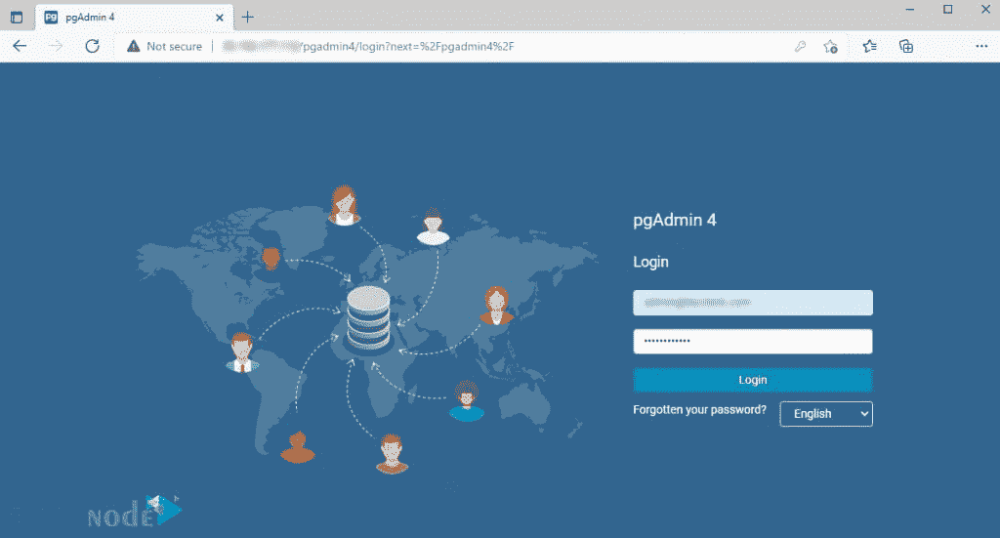
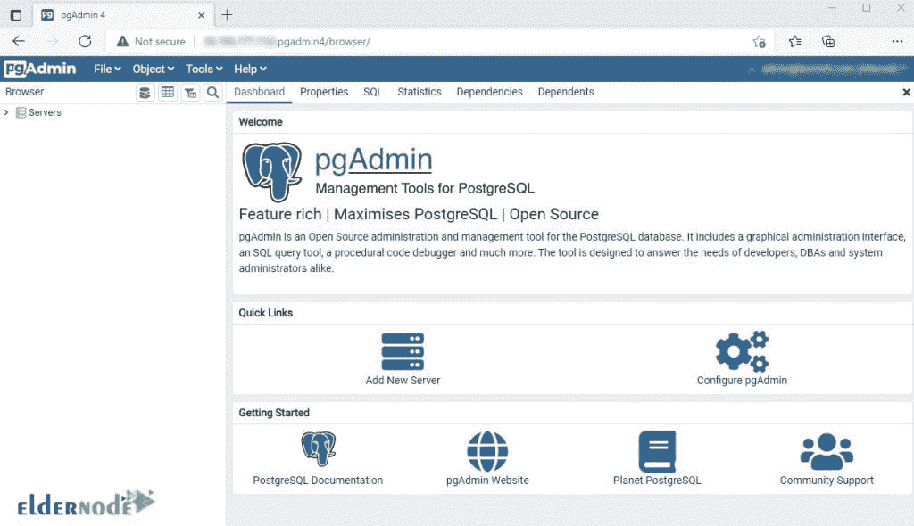
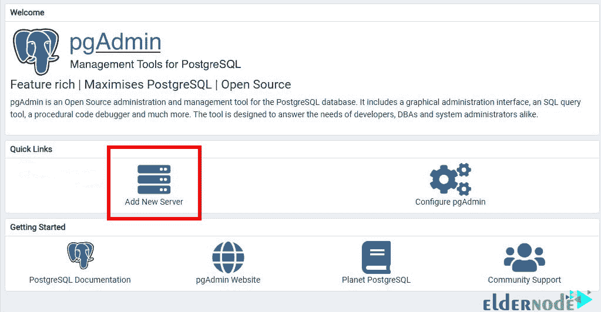
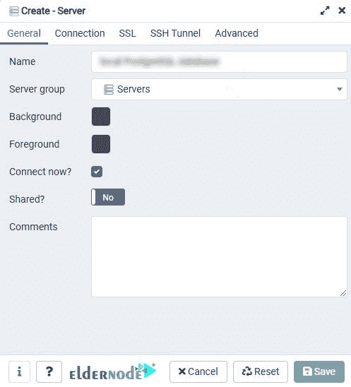
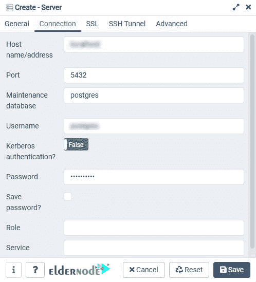
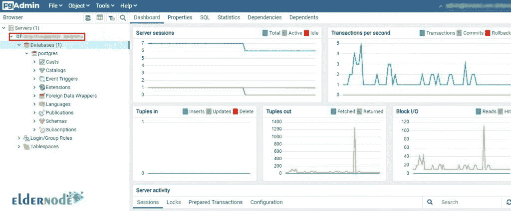

# 教程在 Rocky Linux - Eldernode 博客上安装和使用 PgAdmin

> 原文：<https://blog.eldernode.com/install-and-use-pgadmin-on-rocky-linux/>


PgAdmin 是基于网络的软件，用于管理 PostgreSQL 数据库。PgAdmin 是用 Python 和 jQuery 编写的，带有 Bootstrap，可以安装在各种平台上，比如 Linux、Mac OS 和 Windows。在这篇文章中，我们将一步一步地教你如何在 Rocky Linux 上安装和使用 PgAdmin。如果你想购买一台 [**Linux VPS**](https://eldernode.com/linux-vps/) 服务器，你可以访问 [Eldernode](https://eldernode.com/) 中的软件包。

## **如何在 Rocky Linux 上安装使用 pg admin**

### **pg admin 及其特性介绍**

pgAdmin 提供了一个来自 PostgreSQL 数据库的 web 环境。您可以轻松解决您的所有需求，包括建立和设置数据库、表、用户等。，并且您不需要输入其他命令。

pgAdmin 很像用于 MySQL 的 PhpMyAdmin。使用过 PhpMyAdmin 的用户都知道，拥有一个图形化的 web 环境来管理和控制数据库非常有用。

PgAdmin 的功能和可能性包括:

–在各种 [Windows](https://blog.eldernode.com/tag/windows/) 、 [Linux](https://blog.eldernode.com/tag/linux/) 和 Mac OS 平台上安装

–兼容不同版本的 PostgreSQL

–监控仪表板

–备份和恢复数据库的能力

–支持大多数编码

–强大的查询工具，支持彩色语法

在本文的后续部分，请加入我们，向您展示如何在 Rocky Linux 上安装 PgAdmin。

### **在 Rocky Linux 上安装 PgAdmin 的先决条件**

在这一节中，我们想向您展示在 Rocky Linux 上安装和使用 PgAdmin 的先决条件。为此，只需遵循以下步骤。

在第一步中，您需要使用以下命令安装 yum-utils 包:

```
sudo dnf install yum-utils
```

重要的是 PostgreSQL 必须安装在您的系统上。您现在应该禁用通用 PostgreSQL 存储库:

```
sudo yum-config-manager --disable pgdg-common
```

最后，您需要使用以下命令**安装 PgAdmin4 存储库**:

```
sudo rpm -i https://ftp.postgresql.org/pub/pgadmin/pgadmin4/yum/pgadmin4-redhat-repo-2-1.noarch.rpm
```

## **如何在 Rocky Linux 上安装 pg admin**

在回顾并准备了上一节中必需的先决条件之后，我们现在要解释如何安装 PgAdmin。第一步，您必须通过运行以下命令来更新系统:

```
sudo dnf update
```

然后，您需要使用以下命令**安装 pgAdmin 4** :

```
sudo dnf install pgadmin4
```

如果要求您安装所有软件包和依赖项，您需要按“ **y** ”。

### **在 Rocky Linux 上配置 pg admin**

在配置 PgAdmin 之前，您需要使用以下命令**设置** **Apache Web 服务器**服务:

```
sudo systemctl enable httpd
```

现在您需要使用下面的命令来启动 Apache 服务:

```
sudo systemctl start httpd
```

您可以使用下面的命令**验证 Apache** 正在运行:

```
sudo systemctl status httpd
```

在下一步中，您需要通过运行 PgAdmin4 启动脚本来配置 PgAdmin4:

```
sudo /usr/pgadmin4/bin/setup-web.sh
```

在这一步，你必须输入你的电子邮件地址和密码，然后按“ **y** ”。

现在，您需要使用以下命令来配置 SELinux:

```
sudo setenforce permissive
```

为了**启用 HTTP 流量**，您需要通过运行以下命令来配置防火墙:

```
sudo firewall-cmd --permanent --add-service=http
```

最后，使用以下命令重新加载以应用更改:

```
sudo firewall-cmd --reload
```

### **如何在 Rocky Linux 上使用 pg admin**

在这一节中，我们想向您展示如何在 Rocky Linux 上使用 PgAdmin。您首先需要在浏览器中输入以下 URL 进行登录:

```
http://server-ip/pgadmin4
```

如下图，您必须输入之前指定的**邮箱**和**密码**，点击**登录**:



现在您可以看到 **PgAdmin 4 仪表盘**:



现在你需要点击**添加新服务器**来连接新的数据库服务器:



在“**常规**部分，您可以为您的数据库服务器指定一个名称:



在下一步中，您需要单击“**连接**”选项卡，并填写必填字段。然后点击**保存**:



最后，你可以点击左边栏的**数据库服务器**来查看更多细节。



## 结论

PgAdmin 附带了一组丰富的数据库管理和易于使用的连接功能，一个内置的 SQL 编辑器，用于导入 SQL 脚本，如果需要，还可以在数据库的命令行 shell 中执行 SQL 语句。在本文中，我们试图教您如何在 Rocky Linux 上安装和使用 PgAdmin。