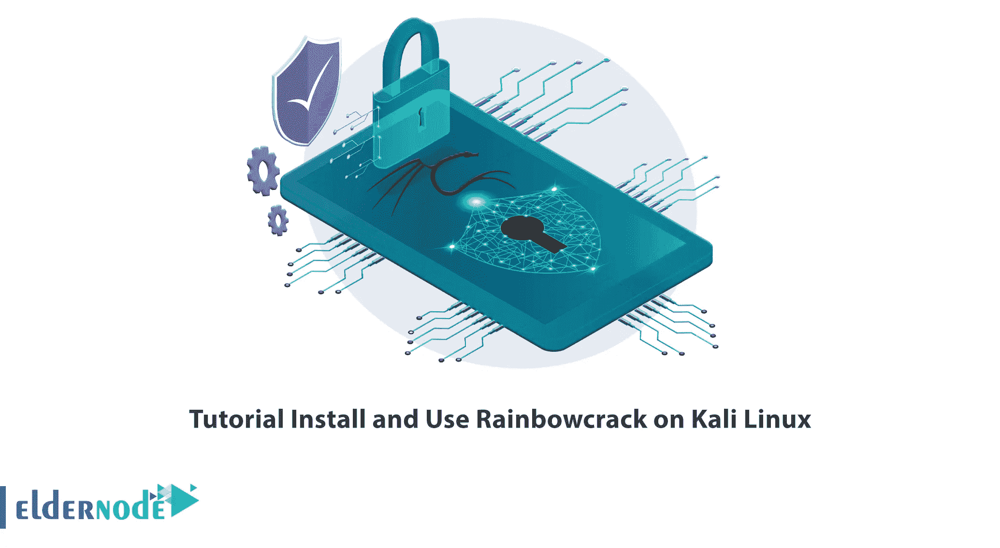

# 教程在 Kali Linux 上安装和使用 Rainbowcrack

> 原文：<https://blog.eldernode.com/install-and-use-rainbowcrack-on-kali-linux/>



如果有人试图访问您的电脑，简单的登录密码无法阻止他们。密码是保护个人或组织的重要文档的字符。获取计算机用户的密码很简单，这使得计算机数据易受攻击。黑客可以使用密码破解工具轻松获得计算机密码。这项工作不需要特别的技术，只需要一些简单的工具。Rainbowcrack 是密码破解工具之一。在本文中，我们将教你如何在 Kali Linux 上安装和使用 Rainbowcrack。如果你想购买一台 [**Linux VPS**](https://eldernode.com/linux-vps/) 服务器，你可以在 [Eldernode](https://eldernode.com/) 网站上查看提供的套装。

## **如何在 Kali Linux 上安装使用 Rainbowcrack**

### **什么是 Rainbowcrack？**

RainbowCrack 是一个密码破解工具，用彩虹表破解哈希。它使用大规模的时间-内存权衡算法来破解哈希。该软件创建称为彩虹表的表格，并执行密码破解。一旦表格准备好，Rainbowcrack 可以比其他工具更快地检测密码。彩虹表是免费的，它们被用来减少破解密码所需的时间。预计算表很耗时，但是一旦预计算完成，Rainbowcrack 会比暴力破解更快。

### **彩虹裂纹特征**

采用 AMD GPUs 的单 GPU 加速

采用 NVIDIA GPUs 的双 GPU 加速

使用多个 GPU 的 3 GPU 加速

4-生成、排序、合并、转换和搜索彩虹表

5-可定制字符的彩虹表

6-SHA1、SHA256、LM、NTLM、MD5 和可配置哈希算法的彩虹表

在这篇来自 [Kali Linux 培训](https://blog.eldernode.com/tag/kali-linux/)系列的文章的续篇中，我们想一步一步的教你如何在 Kali Linux 中安装和使用 Rainbowcrack。

## **在 Kali Linux 上安装 Rainbowcrack**

在本节中，您将学习如何在 Kali Linux 上安装 Rainbowcrack。为此，请遵循以下步骤并输入以下命令。

首先，**使用以下命令更新您的系统**包:

```
sudo apt update
```

现在，您可以使用以下命令**安装 Rainbowcrack** :

```
sudo apt install rainbowcrack
```

### **如何在 Kali Linux 上使用 Rainbowcrack**

在本节中，我们将向您介绍 Rainbowcrack 在 Kali Linux 上的用法。

您可以通过输入以下命令从 **Rainbowcrack** 获得帮助:

```
rcrack -h
```

将彩虹表从。rt 文件格式为。rtc 文件格式，使用 **rt2rtc** 程序:

```
rt2rtc -h
```

把彩虹表从。rtc 格式转换为。rt 格式，可以使用 **rtc2rt** 程序:

```
rtc2rt -h
```

进入创建的文件夹后，**用下面的命令运行 rtgen** 以确保所有东西都正确安装了:

```
rtgen -h
```

### **从 Kali Linux** 卸载 Rainbowcrack】

如果你想**卸载 Rainbowcrack** ，使用以下命令:

```
sudo apt-get remove rainbowcrack
```

要**删除 Rainbowcrack 配置、数据及其所有依赖关系**，只需运行以下命令:

```
sudo apt-get -y autoremove --purge rainbowcrack
```

## 常见问题解答

[sp _ easy agreement]

## 结论

Rainbowcrack 是一个哈希破解程序，它利用了大规模的时间内存权衡。您可以通过从各种来源生成彩虹表来破解密码。本文教你如何在 Kali Linux 上安装和使用 Rainbowcrack。我希望这篇文章对你有用，你喜欢它。如果你有任何问题，可以在评论中联系我们。