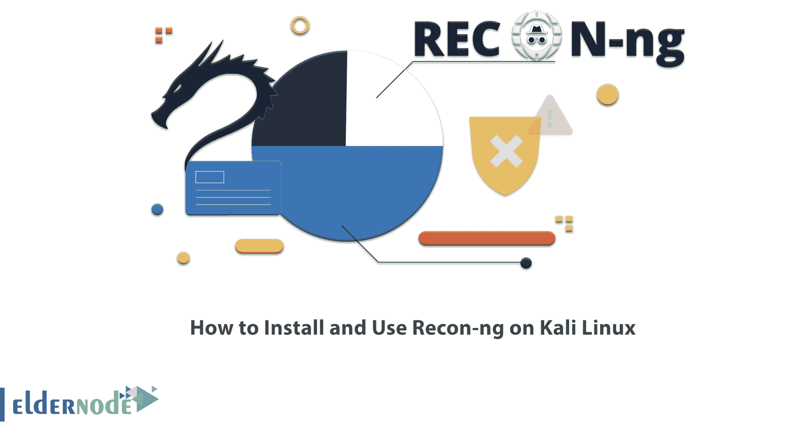

# 如何在 Kali Linux - Eldernode 博客上安装和使用 Recon-ng

> 原文：<https://blog.eldernode.com/install-and-use-recon-ng-on-kali-linux/>



渗透测试领域的一个问题是，在开始攻击或任何测试之前，我们必须收集关于我们目标的信息。在本文中，我们将介绍 Kali Linux 的一个信息收集工具 Recon-ng。这个工具为快速、开源的基于 web 的身份识别提供了一个强大的环境。让我们熟悉一下 Recon-ng 独特特性，并学习如何在 Kali Linux 上安装和使用 Recon-ng。你可以访问 [Eldernode](https://eldernode.com/) 网站上提供的软件包，购买一个 [**Linux VPS**](https://eldernode.com/linux-vps/) 。

## **教程在 Kali Linux 上安装和使用 Recon-ng**

### **什么是侦察？**

Recon-ng 是一个开源的基于 web 的身份识别框架，用 Python 编写。侦察可以锁定一个域并找到它的所有子域，这使得入侵者很容易得手。Recon-ng 的界面与 Metasploit 1 和 Metasploit 2 非常相似。这个工具提供了一个命令行界面，可以在 [Kali Linux](https://blog.eldernode.com/tag/kali-linux/) 上运行。

### **侦查特征**

1 –>免费的开源工具。

2 –>充当 web 应用程序和网站扫描器。

3 –>执行识别操作的有用工具。

4 –>它有一个交互式控制台来提供有用的功能。

5 –>在 web 应用程序和网站的代码中寻找漏洞。

6 –> web 应用程序的信息收集和漏洞评估。

7 –>它有强大的模块，如 Geoip 搜索，横幅捕捉，DNS 搜索，端口扫描。

## **如何在 Kali Linux 上安装 Recon-ng**

您可以使用下面的命令在 Kali Linux 上安装 Recon-ng :

```
apt install recon-ng
```

### **如何在 Kali Linux 上使用 Recon-ng**

在下文中，我们将回顾不同的识别工具以及如何在 Kali Linux 上使用它们:

#### **在 Kali Linux 上使用 Recon-CLI**

这个工具允许从命令行使用 Recon-ng。您可以通过以下命令使用此工具:

```
recon-cli -h
```

#### **在 Kali Linux 上使用 Recon-ng**

如前所述，这个工具是一个网络识别框架。运行以下命令来使用它:

```
recon-ng -h
```

#### **在 Kali Linux 上使用 Recon-web**

这个工具是一个基于网络的用户界面。通过运行以下命令来使用它:

```
recon-web -h
```

## **常见问题**

[sp _ easy agreement]

## 结论

在本文中，我们介绍了 Recon-ng，这是一个用 Python 编写的基于 web 的开源身份识别框架，我们还回顾了 Recon-ng 的各种特性。您还学习了如何在 Kali Linux 上安装 Recon-ng 和使用不同的 Recon-ng 工具。