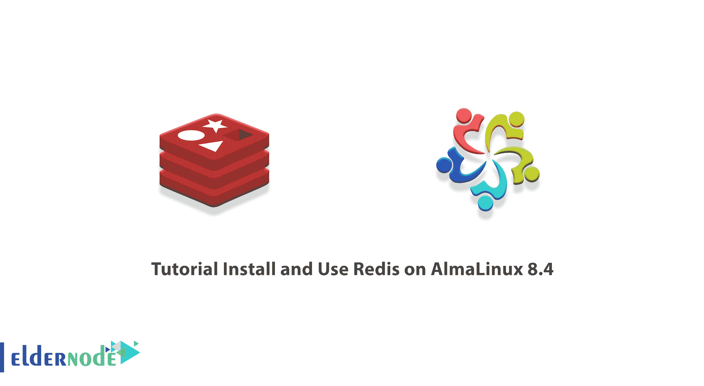

# 教程在 AlmaLinux 8.4 上安装和使用 Redis-elder node 博客

> 原文：<https://blog.eldernode.com/install-and-use-redis-on-almalinux-8-4/>



Redis 技术是用主存作为数据库来维护数据库、缓存和消息代理。事实上，可以说 Redis 是用键值体系存储数据的。由于这一特性，访问和检索这一信息将更加容易，因为数据之间没有复杂的关系。Redis 用作数据库和缓存。在本文中，我们将一步一步地教你如何在 AlmaLinux 8.4 上安装和使用 Redis。如果你想购买一台 [**Linux VPS**](https://eldernode.com/linux-vps/) 服务器，可以访问 [Eldernode](https://eldernode.com/) 中的软件包。

## **如何在 AlmaLinux 8.4 上安装使用 Redis**

### **Redis 是什么？**

在键-值存储系统中，信息以键和值的形式存储。我们说的内存键值系统，是指这个系统将信息存储在 RAM 中，所以访问信息的速度会成倍提高。在 Radis 中，每个记录都有一个标题和数据。

如今，我们看到 Redis 支持不同类型的数据，如字符串、散列、列表、集合和有序集合。另一方面，由于数据是通过 Redis 存储在主存中，这个过程非常快。这使得 Redis 成为缓存、计数、队列以及发布和订阅的好选择。

Redis 结构被称为 NoSQL 数据库，这个特性也吸引了开发人员的注意。所有这些都使得大型科技公司越来越倾向于使用 Redis。像 Github、Weibo、Pinterest、Snapchat、Craigslist、Diggs、StackOverflow 和 Flickr 这样的大网站在这方面都可以提及。因此，我们预计未来会看到 Redis 用户范围的扩大。

这项技术与基于云计算平台的数据库的交互较少，因此成本会低得多。除了所有这些，Redis 的简单易用也应该提到。

Redis 的一些好处包括:

1.免费和开源

2.使用简单

3.持久性:你的数据不会因为重启服务器而丢失！

4.复制支持:Redis 很好地支持复制。您可以运行不同的服务器作为您的主/从或自定义场景。

5.使用广泛的数据类型

6.惊人的响应速度

## **在 almlinux 8.4**上安装缰绳

在这一节，我们想教你如何在 [AlmaLinux 8.4](https://blog.eldernode.com/install-and-use-almalinux/) 上安装 Redis。为此，您必须按顺序执行以下步骤。您必须首先使用以下命令更新服务器:

```
dnf update -y
```

您可以使用以下命令安装 Redis :

```
dnf install redis -y
```

应该注意的是，监督指令允许您提供一个 init 系统来管理 Redis 服务。因此，在第一步中，您需要使用您想要的文本编辑器打开配置文件:

```
vi /etc/redis.conf
```

打开配置文件后，您应该查找“ **supervised** ”，并将其从 no 更改为 systems。然后**保存**配置文件并退出。

现在您需要使用以下命令**启动**和**启用** Redis:

```
systemctl start redis
```

```
systemctl enable redis
```

最后，要确认 Redis 已经成功安装，您需要运行以下命令:

```
redis-cli ping
```

### **如何在 AlmaLinux 8.4 上配置使用 Redis**

在您了解了如何安装 Redis 之后，我们现在想要配置它。

第一步是配置密码。注意，和设置 bind 一样，密码是直接在 Redis， **/etc/redis.conf** 配置文件中配置的。因此，您必须使用以下命令打开配置文件:

```
vi /etc/redis.conf
```

然后您需要在命令中找到 Findpasspass:

```
# requirepass foobared
```

需要注意的重要一点是，必须通过删除#来取消对它的注释。然后指定您想要的密码。这样做之后，您可以**保存**配置文件并退出。使用以下命令和**重启**系统一次以应用更改:

```
systemctl restart redis
```

为了确保密码正确工作，您可以首先使用以下命令打开 Redis 客户端:

```
redis-cli
```

您可以按照下面的步骤检查 Redis 密码是否正常工作。您可以使用以下命令将键设置为一个值。请注意，由于缺少身份验证，以下命令将不起作用。

```
set key1 23
```

因此，您可以使用 Redis 配置文件中指定的密码，使用以下命令进行身份验证:

```
auth your_redis_password
```

通过身份验证后，您现在可以再次成功运行之前的命令:

```
set key1 23
```

使用以下命令，您可以向 Redis 询问新密钥的值:

```
get key1
```

最后，您可以使用以下命令退出:

```
quit
```

## 结论

正如您在本文中读到的，Redis 是一个开放源代码的数据存储库、NoSQL 键/值和内存，主要用作应用程序缓存或快速响应数据库。Redis 将数据存储在 RAM 中，而不是硬盘或 SSD 驱动器中。Redis 为您提供前所未有的速度、可靠性和性能。在本文中，我们试图教您如何在 AlmaLinux 8.4 上安装和使用 Redis。