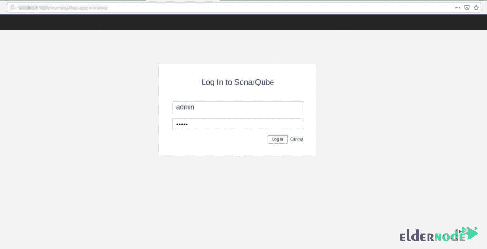
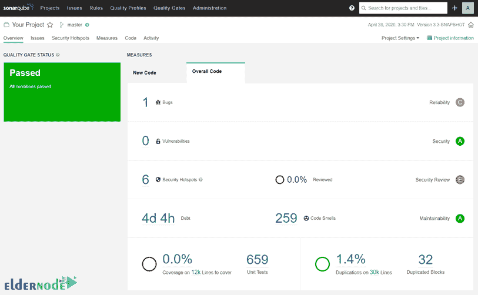

# 教程在 Ubuntu 20.04 上安装和使用 sonar cube-elder node

> 原文：<https://blog.eldernode.com/install-and-use-sonarqube-on-ubuntu/>


Sonar 是一个高质量的源代码管理工具。这个工具能够覆盖和分析设计、编码规则、文档、复制、单元测试、复杂性和程序错误这七个方面的编程质量。Sonar 有能力结合指标来生成统计报告。这个工具可以用来分析几乎所有编程语言的源代码。在这篇文章中，我们将教你关于在 Ubuntu 20.04 上安装和使用 SonarQube 的**教程。如果你想购买一台 [**Ubuntu VPS**](https://eldernode.com/ubuntu-vps/) 服务器，你可以访问 [Eldernode](https://eldernode.com/) 中提供的软件包。**

## **SonarQube**简介

一般来说，使用 SonarQube 有以下好处:

**_ 持续检查:**在 SonarQube 的帮助下，代码的质量可以得到系统性的提升。

**_ 识别欺骗性问题:**在这个程序的帮助下，不引用空指针、逻辑错误等欺骗性问题都可以检查识别。

**_ 与 DevOps 的集成:**使用该软件的 webhooks 和内部 RestAPI，可以集成制造系统、CI 引擎、开发管道等所有 DevOps 工具。

**_ 集中质量:**借助该程序，可以集中管理整个项目控制过程的质量

SonarQube 还具有以下特性:

1-支持用 Python、Javascript、Java 等多种语言编写的程序的源代码分析。

2-支持用 PL/SQL 和 TSQL 语言编写的数据库函数和过程的源代码分析

3-支持客户端源代码分析，如 JavaScript、CSS、HTML 等。

4-支持 Android 和 iOS 等平台下的移动应用程序的源代码分析

5-从不同的角度分析编程质量，例如设计、编码原则、文档数量、可重用性和复杂性

6-提供多个图表和统计数据来识别编程错误

7-提供代码分析结果的综合报告

下一节，我们将教你如何在 [Ubuntu](https://blog.eldernode.com/tag/ubuntu/) 20.04 上安装 SonarQube。请加入我们。

### **如何在 Ubuntu 20.04 上安装 Java**

鉴于安装 SonarQube 的先决条件之一是安装 Java，所以在这一节中，我们打算教你如何安装 Java。为此，只需遵循以下步骤。

您必须首先使用以下命令更新系统:

```
apt update
```

在下一步中，如果你想使用 **JRE** ，你可以使用下面的命令:

```
apt install default-jre
```

如果您想使用 **OpenJDK** ，也可以使用以下命令:

```
apt install default-jdk
```

### 如何在 Ubuntu 20.04 上安装和设置 SonarQube 的数据库

有趣的是，SonarQube 支持 Windows 系统的 PostgreSQL、Oracle 或 MSSQL。在本节中，我们将教您如何安装 PostgreSQL。您可以使用以下命令安装 PostgreSQL:

```
apt install postgresql postgresql-contrib
```

现在，您应该以 PostgreSQL 超级用户的身份登录，并使用以下命令**创建 SonarQube PostgreSQL 数据库**和**数据库用户**:

```
sudo -Hiu postgres
```

```
createuser sonaradmin
```

```
createdb -O sonaradmin sonarqubedb
```

```
psql
```

```
ALTER USER sonaradmin WITH ENCRYPTED password 'changeme';
```

```
\q
```

```
exit
```

成功创建并启动 PostgreSQL 数据库后，现在应该启用安全计算过滤器。需要注意的是，在 Ubuntu 20.04 上， **Seccomp 滤镜**通常默认开启。但是您可以使用下面的命令来检查您的内核中是否存在 Seccomp:

```
grep SECCOMP /boot/config-$(uname -r)
```

最后，安装 SonaQube 的另一个先决条件是用于生成 SonarQube 可执行报告的 Fontconfig 和 FreeType 字体。您可以使用以下命令来安装它们:

```
apt install fontconfig-config libfreetype6
```

## **如何在 Ubuntu 20.04 上安装 sonar cube**

在这一节，我们想一步一步地教你如何在 Ubuntu 20.04 上安装 SonarQube。为此，只需遵循以下步骤。

第一步，你要下载 SonarQube。要获得下载链接，可以参考[sonar cube 二进制页面](https://binaries.sonarsource.com/Distribution/sonarqube/)。然后使用以下命令下载 SonarQube:

```
wget https://binaries.sonarsource.com/Distribution/sonarqube/sonarqube-8.7.0.41497.zip
```

成功下载文件后，您现在必须通过执行以下命令**提取**文件:

```
apt install zip
```

```
unzip sonarqube-8.7.0.41497.zip -d /opt/
```

您也可以重命名 SonarQube 来删除版本号:

```
mv /opt/sonarqube{-8.7.0.41497,}
```

安装 sonar cube 后，现在可以通过执行以下步骤来创建 sonar cube 系统帐户。需要记住的一点是，SonarQube 不应该以 root 身份运行。因此，您需要创建一个**非管理员帐户**来运行 SonarQube:

```
useradd -M -d /opt/sonarqube/ -r -s /bin/bash sonarqube
```

最后，您应该使用以下命令将**/opt/sonar cube**的所有权设置为上面创建的 sonar 用户:

```
chown -R sonarqube: /opt/sonarqube
```

### **在 Ubuntu 20.04 上配置 sonar cube**

成功安装 SonarQube 后，可以在此阶段对其进行配置。因此，您可以根据上面的 PostgreSQL 设置来配置数据库连接细节。只需用一个文本编辑器打开配置文件。这里我们使用 vim 文本编辑器:

```
vim /opt/sonarqube/conf/sonar.properties
```

对配置文件进行以下更改后，您可以**保存**并退出:

```
# DATABASE  ...  # User credentials.  ...  sonar.jdbc.username=sonaradmin  sonar.jdbc.password=changeme  ...  #----- PostgreSQL 9.3 or greater  # By default the schema named "public" is used. It can be overridden with the parameter "currentSchema".  #sonar.jdbc.url=jdbc:postgresql://localhost/sonarqube?currentSchema=my_schema  sonar.jdbc.url=jdbc:postgresql://localhost/sonarqubedb
```

### **如何在 Ubuntu 20.04 上运行和使用 sonar cube**

在这一节中，我们将教你如何运行和使用 SonarQube。您可以使用以下脚本绕过 start 选项以独立模式启动 SonarQube。如下面的脚本开始所示，最好使用 systemd 服务单元:

```
/opt/sonarqube/bin/linux-x86-64/sonar.sh
```

您可以使用以下命令**创建一个 SonarQube Systemd 服务**单元文件:

***注:*** 替换以下命令中的路径，**/opt/sonar cube/lib/sonar-application-8 . 7 . 0 . 41497 . jar**:

```
cat > /etc/systemd/system/sonarqube.service << 'EOL'  [Unit]  Description=SonarQube service  After=syslog.target network.target    [Service]  Type=simple  User=sonarqube  Group=sonarqube  PermissionsStartOnly=true  ExecStart=/bin/nohup java -Xms32m -Xmx32m -Djava.net.preferIPv4Stack=true -jar /opt/sonarqube/lib/sonar-application-8.7.0.41497.jar  StandardOutput=syslog  LimitNOFILE=131072  LimitNPROC=8192  TimeoutStartSec=5  Restart=always  SuccessExitStatus=143    [Install]  WantedBy=multi-user.target  EOL
```

在下一步中，您必须使用以下命令重新加载 systemd 配置:

```
systemctl daemon-reload
```

我们建议您在下一步中使用以下命令为 elasticsearch 设置最大内存映射数:

```
echo 'vm.max_map_count=262144' >> /etc/sysctl.conf
```

```
sysctl -p
```

如果您已经正确地遵循了本教程中的所有步骤，现在您可以使用以下命令轻松地**运行并启用 sonar cube**:

```
systemctl enable --now sonarqube
```

您现在需要安装一个 Apache 或 T2 的 Nginx web 服务器来访问 SonarQube web 界面。这里我们**使用以下命令安装 Nginx** 服务器:

```
apt install nginx -y
```

您现在可以通过运行以下命令来**启用 SonarQube Nginx 站点**:

```
ln -s /etc/nginx/sites-available/sonarqube /etc/nginx/sites-enabled/
```

最后，您需要使用以下命令**重启 Nginx** :

```
systemctl restart nginx
```

需要记住的重要一点是，打开防火墙上的**端口 80/TCP** 或**端口 443/TCP** :

```
ufw allow "Nginx Full"
```

您可以使用以下 URL 访问 SonarQube:

```
http://sonarqube-server-host-IP-or-hostname
```



在下图中，您可以看到 SonarQube 仪表板:



## 结论

SonarQube 开源软件是一个强大的工具，用于自动扫描代码，检测 Java、C#、JavaScript、C/C++和 PHP 等 20 多种编程语言中的 bug 和编程错误以及代码漏洞。在本文中，我们试图教你如何一步一步地在 Ubuntu 20.04 上安装和使用 SonarQube。