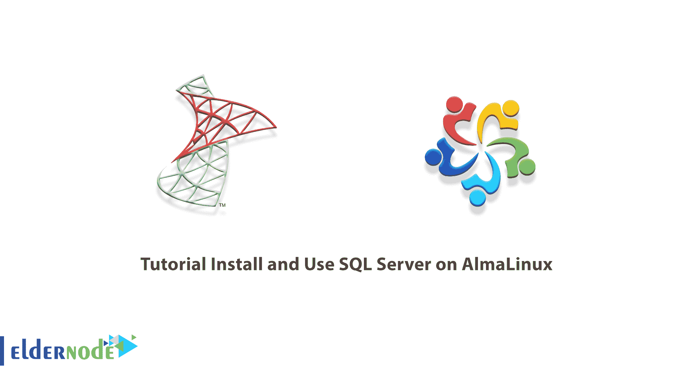
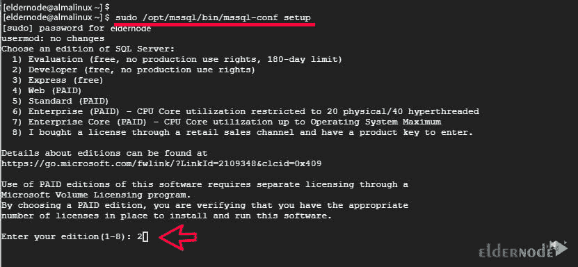
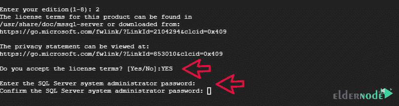
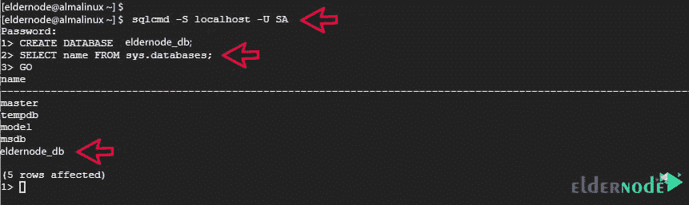

# 教程在 AlmaLinux - Eldernode 博客上安装和使用 SQL Server

> 原文：<https://blog.eldernode.com/install-and-use-sql-server-on-almalinux/>



如今，信息保持是系统生存的最重要的器官之一。这就是为什么 Microsoft SQL Server 是最流行和最强大的数据库构建和管理软件之一。在本文中，我们将一步一步地教你如何在 AlmaLinux 上安装和使用 SQL Server。如果你想购买一台 [**Linux VPS**](https://eldernode.com/linux-vps/) 服务器，你可以访问 [Eldernode](https://eldernode.com/) 中的软件包。

## **如何在 AlmaLinux 上安装和使用 SQL Server**

### **SQL 及其特性简介**

SQL Server 是一个关系数据库管理系统(DBMS)。该系统由微软开发，支持 ANSI SQL 语言。有几种类型的数据库管理软件，其中之一是关系模型。在关系模型中，不是简单地将数据放入文件，而是将数据组织成一系列的表，然后存储起来。每个表包含许多行和列，称为元组和属性。

微软的 SQL Server 也有一些竞争对手，比如 MySQL 和 Oracle。现在，我们想研究一下 SQL Server 的优势，看看是什么让它在某些情况下领先于竞争对手:

1.它易于安装、配置和设置。

2.它有一个很好的用户界面，使得处理数据更加容易。

3.它有很高的安全性。

4.如果需要，您可以恢复丢失的数据。

5.支持云和本地数据库。

6.它有不同的版本，针对不同的任务进行了优化。

7.为此准备了许多培训和文件。

8.也可以在 [Linux](https://blog.eldernode.com/tag/linux/) 操作系统上使用。

在下一节中，我们将教您如何在 AlmaLinux 上安装 SQL Server。请加入我们。

## **在 AlmaLinux 上安装 SQL Server**

在这一节中，我们将向您展示如何在 AlmaLinux 上安装 SQL Server。为此，您必须按顺序执行以下步骤。您必须首先使用以下命令**添加存储库**:

```
sudo curl https://packages.microsoft.com/config/rhel/8/mssql-server-2019.repo -o /etc/yum.repos.d/mssql-server-2019.repo
```

```
sudo curl https://packages.microsoft.com/config/rhel/8/prod.repo -o /etc/yum.repos.d/msprod.repo
```

现在，您可以通过运行以下命令轻松地**安装 SQL Server** :

```
sudo dnf install mssql-server
```

您也可以使用以下命令安装 Microsoft SQL server 命令行工具:

```
sudo dnf install mssql-tools unixODBC-devel
```

当您看到消息“**您接受许可条款吗？**，输入**是**，然后按**进入**。

安装完成后，使用以下命令验证是否安装了 Microsoft SQL Server:

```
rpm -qi mssql-server
```

### **如何在 AlmaLinux 上配置 SQL Server**

在本节中，我们将配置 Microsoft SQL Server 并启动数据库引擎。为此，您可以运行以下命令:

```
sudo /opt/mssql/bin/mssql-conf setup
```

如下图所示，您将被要求选择 SQL Server 的**版本。选择第二个选项**【2】**:**



当您看到消息“**您接受许可条款吗？**，输入**是**，然后按**进入**。然后指定管理员密码:



为了**验证 SQL server 的运行状态**，使用以下命令:

```
sudo systemctl status mssql-server.service
```

使用以下命令并**启用**来启动引导:

```
sudo systemctl enable mssql-server.service
```

然后在下一步中，使用以下命令导出路径 **/opt/mssql/bin/** :

```
echo 'export PATH=$PATH:/opt/mssql/bin:/opt/mssql-tools/bin' | sudo tee /etc/profile.d/mssql.sh
```

现在您需要使用以下命令来启用 **/etc/profile.d/mssql.sh** 文件:

```
source /etc/profile.d/mssql.sh
```

需要记住的一点是，默认情况下，MS SQL 监听**端口 1433** 。因此，有必要使用以下命令在防火墙中打开此端口，以便外部用户可以访问服务器:

```
sudo firewall-cmd --add-port=1433/tcp --permanent
```

```
sudo firewall-cmd --reload
```

### **如何在 AlmaLinux 上使用 SQL Server**

在前面几节中，您已经了解了如何在 AlmaLinux 上安装和配置 SQL Server，现在我们想教您如何使用和测试 SQL Server。

第一步是使用以下命令确保安装了 MS SQL 版本，并检查版本:

```
sqlcmd -S localhost -U SA -Q 'select @@VERSION'
```

要查看版本，输入上述命令后按**回车**。您也可以使用以下命令退出:

```
exit
```

现在，要测试 SQL Server，您必须通过执行以下命令再次登录:

```
sqlcmd -S localhost -U SA
```

***注意:*** 现在你需要用你的密码认证然后按**进入**。请注意，您可以通过运行以下命令来列出用户名:

```
SELECT name FROM sys.sysusers;
```

```
GO
```

您可以使用以下命令轻松地**创建一个数据库**:

```
CREATE DATABASE eldernode_db;
```

您还可以使用以下命令查看所有数据库的列表:

```
SELECT name FROM sys.databases;
```

```
GO
```



最后，您可以使用以下命令删除数据库:

```
DROP DATABASE eldernode_db;
```

```
GO
```

## 结论

SQL Server 最突出的特性之一是它可以处理高达万亿字节的大型数据库。另一件事是成千上万的用户可以同时访问这个数据库。在本文中，我们试图教您如何在 AlmaLinux 上安装和使用 SQL Server。