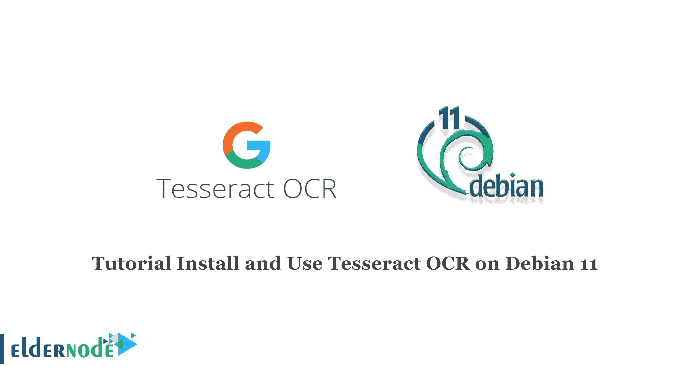

# 教程在 Debian 11 - Eldernode 博客上安装和使用 Tesseract OCR

> 原文：<https://blog.eldernode.com/install-and-use-tesseract-ocr-on-debian/>



Tesseract 被认为是目前最精确的开源 OCR 引擎之一，其开发自 2006 年以来一直得到谷歌的支持。它的功能可能比 Adobe Acrobat Pro 和 ABBYY FineReader 等商业软件更加有限。在本文中，我们将教你如何在 Debian 11 上安装和使用 Tesseract OCR。如果你想购买一台 [**Linux VPS**](https://eldernode.com/linux-vps/) 服务器，你可以访问 [Eldernode](https://eldernode.com/) 中的软件包。

## 如何在 Debian Linux 上安装和使用 tessera CT OCR

### 介绍宇宙魔方 OCR

Tesseract 是通过命令行界面运行的免费开源软件，是一个光学字符识别(OCR)系统。宇宙魔方自 2006 年以来一直由谷歌赞助。

### 如何按魔方分析文档

*   用户输入所需的标题，文件标题和所需的格式到宇宙魔方。
*   Tesseract 分析图像，并以用户所需的格式创建新的可搜索文档。
*   你不能直接把东西扫描进宇宙魔方。

## 在 Debian 11 | Debian 10 上安装 tessera CT OCR

首先，用下面的命令更新 [Debian](https://blog.eldernode.com/tag/debian/) :

```
apt update -y
```

然后通过执行以下命令在 Debian 11 上安装 Tesseract:

```
sudo apt install tesseract-ocr
```

Tesseract 将安装在/usr/share/tessera CT-ocr/4.00/Tess data 下。

convert 命令对于在图像格式之间转换和调整图像大小、模糊、裁剪、去斑点、抖动、绘制、翻转、连接、重新采样等非常有用。该工具由 Imagemagick 提供，您应该输入以下命令来安装它:

```
sudo apt install imagemagick
```

现在你应该测试宇宙魔方。为此，找到包含文本的图像，然后执行以下命令:

```
tesseract <image_name> <output file_name>
```

宇宙魔方从图像中提取文本。要使用 Tesseract，您需要做的就是创建字数统计文档。你必须训练它理解笔迹。

## 安装带源的宇宙魔方

在不同的 Linux 发行版上，您也可以使用以下命令获得 Tesseract:

```
git clone https://github.com/tesseract-ocr/tesseract.git
```

现在您可以通过运行 cd 进入 tesseract 目录:

```
cd tesseract
```

此时，您应该运行 autogen.sh 脚本。为此，请输入以下命令:

```
sudo ./autogen.sh
```

上面的命令创建安装文件。您可以通过输入以下命令开始安装过程:

```
sudo ./configure
```

您应该输入以下命令来开始编译 Tesseract:

```
sudo make
```

接下来，运行以下命令；

```
sudo make install
```

然后输入 Idconfig 命令:

```
sudo Idconfig
```

现在您需要编译培训工具。为此，请运行以下命令:

```
sudo make training
```

最后，运行以下命令:

```
sudo make training-install
```

## 结论

本文教你如何在 Debian 11 上安装和使用 Tesseract。我们希望这篇文章对你有用。