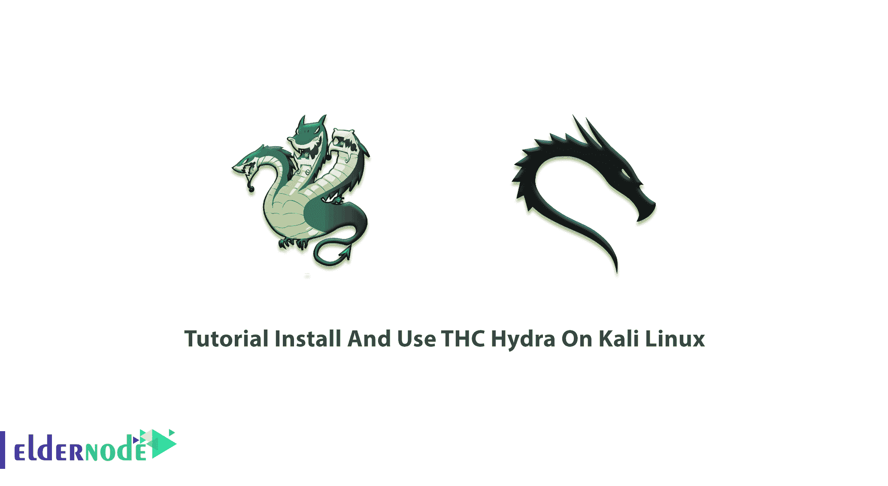

# Kali Linux - Eldernode 博客上的 THC Hydra 安装和使用教程

> 原文：<https://blog.eldernode.com/install-and-use-thc-hydra-on-kali-linux/>



Hydra 也称为 THC-Hydra，构建在各种操作系统中，如 Kali Linux、Parrot 和其他主要的渗透测试环境。虽然有几个登录黑客工具不能支持一个以上的协议，但该工具是一个基于命令的计算机程序，它通过字典攻击从许多协议和应用程序复制解密密码。Hydra 是一个并行网络登录破解程序，仅用于合法目的。Hydra 可以在 [Linux](https://eldernode.com/linux-vps/) 、Windows/Cygwin、Solaris、FreeBSD/OpenBSD、QNX 和 macOS 上干净地编译。这篇文章向你展示了**教程在 Kali Linux** 上安装和使用 THC Hydra。如果你准备购买自己的 [VPS](https://eldernode.com/vps/) ，那么 [Eldernode](https://eldernode.com/) 的套餐是经济的，也是 VIP 的。

## **如何在 Kali Linux 上安装使用 THC Hydra**

范·豪泽和罗纳德·凯斯勒是《九头蛇》的作者。它受 AGPL 3.0 许可。正如你所读到的，Hydra 是并行化的，这个特性就是这个[密码](https://blog.eldernode.com/linux-login-without-entering-password/)破解工具速度快的原因。根据协议，它可能非常快。最快的是 POP3 和 FTP。研究人员和安全团队使用 Hydra 来观察他们如何保护自己免受攻击。接下来，你将了解更多关于九头蛇的知识。

### **支持的平台**

-所有 Unix 平台，如 Linux、BSD、Solaris 等。

-马科斯

-适用于 IPv4 和 IPv6 的 Windows 和 Cygwin

基于 Linux、macOS 或 QNX 的移动系统，如 Android、iPhone、黑莓 10、Zaurus、iPaq

### **支持的协议**

与其他黑客工具不同，Hydra 支持多协议攻击。以下是他们的名单。

-思科使能

-思科认证

-FTP

-HTTP(S)-FORM-GET-POST

-HTTP 代理

-IMAP

SQL 女士

-MySQL

NNTP

-IRC

个人电脑 NFS

-POP3

-PostgreSQL

RDP

-中小企业

-SMTP

-SNMP

-袜子 5

嘘

-团队语言

-远程登录

-VMware 授权

VNC

-XMPP

诸如此类。九头蛇非常快速灵活。此外，您可以轻松地添加新模块。

### **九头蛇命令**

Hydra 有命令和图形两种格式。类型*。/hydra -h* 查看所有可用的命令行选项，或者 *hydra* 查看更短的版本。

```
hydra [[[-l LOGIN|-L FILE] [-p PASS|-P FILE]] | [-C FILE]] [-e nsr] [-o FILE] [-t TASKS] [-M FILE [-T TASKS]] [-w TIME] [-W TIME] [-f] [-s PORT] [-x MIN:MAX:CHARSET] [-SuvV46] [service://server[:PORT][/OPT]]
```

_ **v** vrebose 模式

_ **l** 登录名

_ **p** <密码 _ 文件/单词表>

_ **e** nsr，附加检查，“n”为空密码，“s”尝试以 pass 身份登录，“r”尝试以 pass 身份反向登录

_ **t** <并联数量>

_ **w** <等待响应的最长时间>

_ **f** :找到第一个登录/密码对后退出

_ **m** :选项–模块特定选项。见九头蛇-U <模块>有哪些选项可用。

### **在 Kali Linux 上安装 THC Hydra**

Hydra 预装在 [Kali Linux](https://blog.eldernode.com/install-and-configure-kali-linux-on-vps/) 上，你将**已经** **安装了 Hydra 的一个版本。**

但是如果您希望使用其他基于 Debian 的 Linux 操作系统，可以通过运行以下命令从存储库中下载:

```
sudo apt-get install hydra
```

另外，你可以从 THC 的公共 *GitHub* 开发库下载最新版本。打开你的终端，运行下面的命令**下载**、**配置**、**编译**、**安装九头蛇**:

```
git clone https://github.com/vanhauser-thc/thc-hydra.git
```

```
cd thc-hydra
```

```
./configure
```

```
make
```

```
make install
```

### **如何使用九头蛇**

正如我们提到的，Hydra 有两种版本，GUI-gtk 和 CLI 版本。“九头蛇向导”是九头蛇 CLI 指导版本。因此，您可以使用它来一步一步地指导，而不是将所有命令或参数手动键入终端。从您的终端使用以下命令运行 hydra。

1- **对于 CLI:**

```
hydra
```

2- **对于 CLI 向导:**

```
hydra-wizard
```

3- **对于 GUI:**

```
xhydra
```

### **九头蛇 GTK**

**九头蛇 GTK 是九头蛇的 GUI 前端，因为这是九头蛇的 GUI，你已经安装了 THC-九头蛇。当您运行 Kali Linux 时，hydra-gtk 将已经预装。通过运行下面的命令很容易安装:**

```
`sudo apt-get install hydra-gtk`
```

## **结论**

**教程《在 Kali Linux 上安装和使用 THC Hydra》和这个指南一起呈现给你。如果您有兴趣阅读更多关于 Kali Linux 或安全性的教程，在 Eldernode 博客上有很多有用的文章。在[老年人社区](https://community.eldernode.com/)上与你的朋友讨论或帮助初学者。**