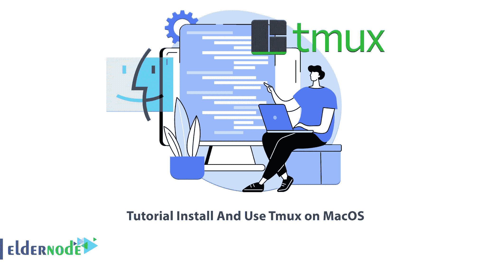

# 教程在 MacOS 上安装和使用 Tmux

> 原文：<https://blog.eldernode.com/install-and-use-tmux-on-macos/>



你应该有过这样的经历，你想在一个终端上同时做几个任务，或者用几个不同的服务器工作。您可以使用 Tmux 来完成这项工作。这个程序允许你把一个终端分成几个部分，每个部分有一个外壳，你可以做任何你想做的事情。本文将教你如何在 MacOS 上安装和使用 Tmux。Eldernode 的网站提供经济实惠的 [VPS](https://eldernode.com/vps/) 套餐，如果你打算购买，这可能是最好的选择。

## **在 MacOS 系统上设置 Tmux 的 2 种方式**

### **Tmux 是什么？**

Tmux 是一个替代 GNU 屏幕的开源终端复用器。它允许您在一个窗口中同时访问多个终端会话。您可以同时运行多个命令行程序，并在一个终端中轻松切换多个程序。这个终端会话通过将程序从主终端上解耦来防止程序意外断开。此外，它是可脚本化的，允许您为不同的目的创建自定义 Tmux 会话。

## **用 2 路**在 MacOS 上安装 Tmux

在这个来自 [Mac](https://blog.eldernode.com/tag/mac/) 培训系列的教程中，我们将讲解 Tmux 在 MacOS 上的安装方法。在 Mac 操作系统上安装 Tmux 有两种方法:使用自制软件安装 Tmux 和不使用自制软件安装 Tmux。无论选择哪种方法，都需要打开终端。为此，进入**应用> >实用程序**，点击**终端。**

### **1)如何用家酿**安装 Tmux】

首先，**使用下面的命令安装 Xcode** 命令行工具包:

```
xcode-select --install
```

如果您运行的是 macOS High Sierra、Sierra、EL Capitan 或更早版本，请输入以下命令下载安装脚本:

```
/usr/bin/ruby -e "$(curl -fsSL https://raw.githubusercontent.com/Homebrew/install/master/install)"
```

但是如果您运行的是 Catalina、Mojave 或 Big Sur，只需输入下面的命令:

```
/bin/bash -c "$(curl -fsSL https://raw.githubusercontent.com/Homebrew/install/master/install.sh)"
```

成功安装家酿后，使用下面的命令**在 macOS 上安装 Tmux** :

```
brew install tmux
```

### **2)没有自制软件如何安装 Tmux**

如上所述，有必要安装 Xcode 命令行工具包。

一旦你安装了 Xcode，你应该下载两个发布 tarballs。所以继续安装最新版本的 libevent 和 Tmux。

现在运行下面的命令，进入解压后的 libevent 目录:

```
tar -zxf libevent-*.tar.gz
```

您可以检查依赖关系，如下所示:

```
./configure --prefix=$HOME/local --enable-shared
```

要构建和安装软件包，请运行以下命令:

```
make
```

```
make install
```

在这一步中，您应该切换到如下所示的解压缩后的 Tmux 目录:

```
tar -zxf tmux-*.tar.gz
```

您可以使用以下命令检查依赖关系:

```
PKG_CONFIG_PATH=$HOME/local/lib/pkgconfig ./configure --prefix=$HOME/local
```

要构建和安装软件包，请使用以下命令:

```
make
```

```
make install
```

***注意:*** 记得用你需要的路径替换$HOME/local。

## **在 MacOS 上使用 Tmux**

要启动 Tmux ,只需运行以下命令:

```
tmux
```

您可以使用以下命令创建新会话:

```
tmux new-session -s <your_session_name>
```

要查看可用会话，请输入以下命令:

```
tmux list-sessions
```

完成后，运行以下命令从您的会话中分离:

```
tmux detach
```

并在准备好继续工作时使用以下命令重新连接到 Tmux 会话:

```
tmux attach -t <your_session_name>
```

以下是使用 Tmux 的一些常用快捷方式:

**–>Ctrl-b？:**显示所有命令

**–>Ctrl+b c:**新建一个窗口

**–>Ctrl-b o:**开关

**–>Ctrl+b 箭头键:**切换窗格

**–>Ctrl+b ":**水平分割

**–>****Ctrl+b %**垂直拆分

**–>Ctrl+b n:**下一步

**–>Ctrl+b p:**上一页

就是这样！

## 结论

Tmux 是一个终端多路复用器，允许您运行单独的进程或命令，同时预览输出。此外，您可以在同一个终端中创建多个窗口和面板。在本文中，我们向您介绍了 Tmux，并教您如何在 macOS 上安装和使用 Tmux。希望这篇教程能帮助你在 mac 操作系统上安装 Tmux。如果你面临任何问题或有任何疑问，可以在评论区联系我们。