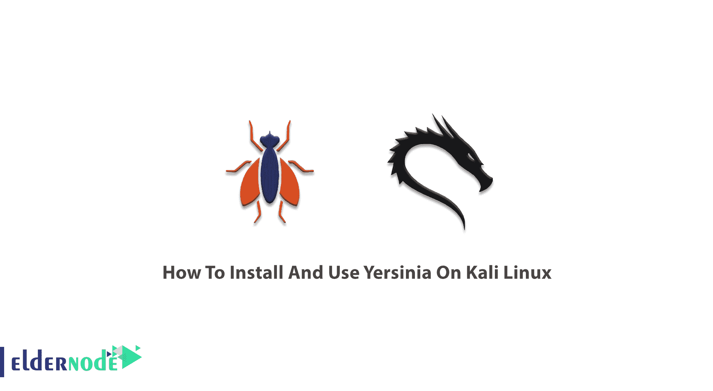
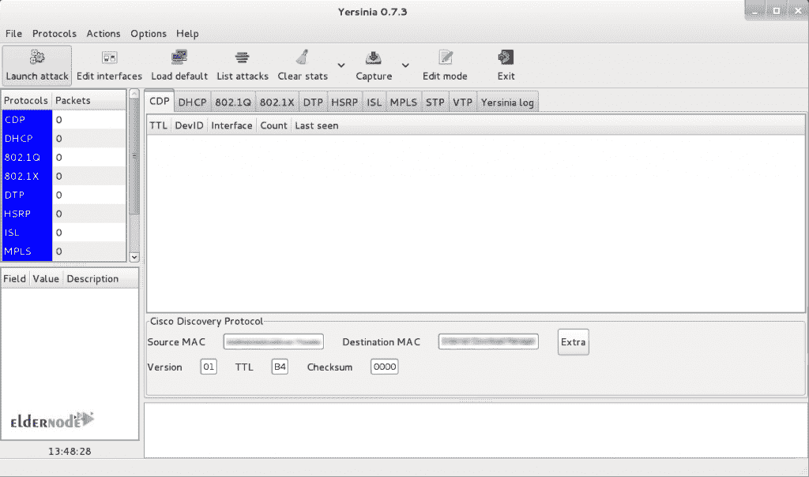

# 如何在 Kali Linux - Eldernode 博客上安装和使用耶尔森菌

> 原文：<https://blog.eldernode.com/install-and-use-yersinia-on-kali-linux/>



有时候你只是需要一个助手来告诉你你的弱点是什么，以及你应该如何应对它们。耶尔森氏菌就是你需要利用不同网络协议中的弱点。由于除非收到问题报告，否则网络管理部门通常不会监控 LAN，因此发生攻击并不奇怪，对第 2 层协议的几次攻击都可能发生(第 2 层是网络的第二层，OSI 协议的第二层)。因此，您可以使用 Yersinia 作为执行第 2 层攻击、分析和测试部署的网络和系统的框架。虽然它由利用不同第 2 层协议弱点的各种第 2 层攻击组成，但 pentester 可以识别网络深层第 2 层中的漏洞，这些漏洞位于数据链路层，如 STP 和 CDP。通过这篇文章来学习如何在 Kali Linux 上安装和使用 Yersinia。不要错过 [Eldernode 优惠券](https://eldernode.com/coupons/)的特别优惠，购买自己的 [Linux VPS](https://eldernode.com/linux-vps/) 。

## **教程在 Kali Linux 上安装使用耶尔森菌**

耶尔森菌用 C 语言编写，在 GNU**G**general**P**public**L**icense**v**2.0 版本下。它被设计用于对第 2 层设备(如交换机、DHCP 服务器生成树协议等)进行渗透测试和攻击。使用它的 GUI，Yersinia 能够使对 DHCP 的服务(DOS)攻击变得简单而容易。对某些网络协议实施攻击，例如:

1.  **S** 平移 **T** 自由 **P** 旋转
2.  **C**isco**D**is covery**P**rotocol
3.  **D** 动力 **T** 运行 **P** 转子
4.  **D** 动态 **H** ost **C** 配置 **P** 协议
5.  **H**ost**S**tandby**R**outer**P**rotocol
6.  802.1 问
7.  802.1x
8.  **我**温特- **S** 女巫 **L** 墨水协议
9.  **V** 局域网中继 **P** 协议

### 耶尔森菌选项:

```
-h, --help [Help screen.]
```

```
-V, --Version [Program version.]
```

```
-G [Start a graphical GTK session.]
```

```
-I, --interactive [Start an interactive ncurses session.]
```

```
-D, --daemon [Start the network listener for remote admin (Cisco CLI emulation).]
```

```
-d [Enable debug messages.]
```

```
-l logfile [Save the current session to the file logfile. If logfile exists, the data will be appended at the end.]
```

```
-c  conffile [Read/write configuration variables from/to conffile.]
```

```
-M [Disable MAC spoofing.]
```

**GTK GUI**

```
The GTK GUI (-G) is a GTK graphical interface with all of the yersinia powerful features and a professional 'look and feel'. 
```

**NCURSES GUI**

```
The ncurses GUI (-I) is a ncurses (or curses) based console where the user can take advantage of yersinia powerful features.  Press 'h' to display the Help Screen
```

**网络守护进程**

```
The  Network Daemon (-D) is a telnet based server (ala Cisco mode) that listens by default in port 12000/tcp waiting for incoming  telnet  connections. It supports  a  CLI  similar  to  a  Cisco device where the user (once authenticated) can display different settings and  can  launch  attacks without  having yersinia  running in her own machine (especially useful Windows users). 
```

### 在 Kali Linux 上安装耶尔森菌

默认情况下，耶尔森氏菌在 Kali 2020 中不可用。它有两个版本，终端和图形。但是，可以通过一个命令安装该工具，并且不需要通过几个步骤来完成。使用下面的命令将其安装在 Kali 上。

```
sudo apt-get install yersinia
```

现在，您已经安装了耶尔森氏菌及其所需的任何软件包。

要安装依赖项，请键入:

```
sudo apt-get install
```

此外，您可以通过键入以下命令来使用其图形版本:

```
yersinia -G
```

### 耶尔森氏菌用法举例



### 如何卸载耶尔森菌

如果需要删除耶尔森氏菌，只需运行以下命令:

```
sudo apt-get remove yersinia
```

这样，您将只移除耶尔森氏菌包。

但是如果您需要卸载 yersinia 及其依赖项，请键入下面的命令:

```
sudo apt-get remove --auto-remove yersinia
```

当然，通过执行上面的命令，您将删除 yersinia 包和所有其他依赖包。

### 如何清除配置数据

您也可以删除本地/已配置的文件。使用下面的命令来完成此操作。

```
sudo apt-get purge yersinia
```

运筹学

```
sudo apt-get purge --auto-remove yersinia
```

**注意**:首先，请注意，如果您重新安装软件包，您将无法恢复已清除的配置/数据。

## 结论

在本文中，您了解了如何在 [Kali Linux](https://blog.eldernode.com/introduction-kali-linux-server-and-its-applications/) 上安装和使用 Yersinia。从现在开始你可以使用最酷的第二层黑客工具。用这个入侵工具开始伪装多种协议的数据包。Yersinia 帮助 pentester 检查第二层协议配置的能力。如果你有兴趣阅读更多，可以找到我们关于[如何在 Ubuntu 20.04 LTS](https://blog.eldernode.com/configure-beef-on-ubuntu-20-04/) 上配置牛肉的相关文章。