# 教程安装 Android Studio Windows Server 2016-elder node 博客

> 原文：<https://blog.eldernode.com/install-android-studio-windows-server/>

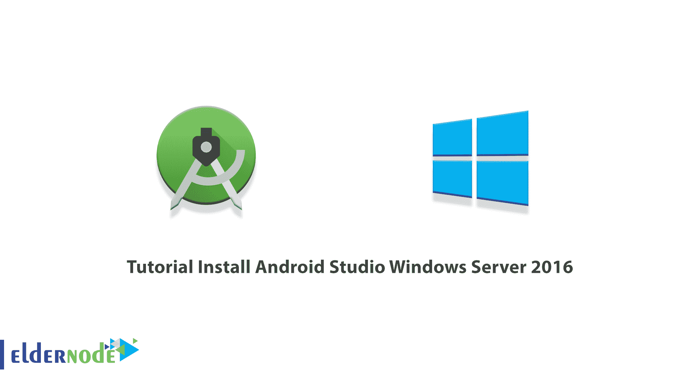

Android Studio 简单来说就是一个 Android 的编程环境。实际上是一个正式的 Android 平台开发和编程的集成开发环境(IDE)。Android Studio 编程环境是基于 JetBrains 软件设计的。这个软件是专门为 Android 开发的。Android Studio 现在可以在 Windows、Mac 和 Linux 上下载。在这篇文章中，我们将教你如何安装 Android Studio Windows Server 2016。如果你想买一台 [**Windows VPS**](https://eldernode.com/windows-vps/) 服务器，你可以在 [Eldernode](https://eldernode.com/) 看到可用的软件包。

## **如何安装 Android Studio Windows Server 2016**

### **安卓工作室简介**

Android Studio IDE 是 Android 的官方开源应用。这个程序将使你在构建一个 Android 应用程序方面取得进展。它还可以帮助您在任何运行 Android 操作系统的设备上构建最好的 Android 应用程序。Android Studio 软件已经取代了 Eclipse。

据 Intellij IDEA 报道，Android Studio 在编程方面为你提供了最快的周转。数字行业开发 Android 的方法有很多。但是 Android 开发最重要最强大的官方程序是 Android Studio。

### **安卓工作室特色**

在这一节中，我们将提到 Android Studio 的一些功能。这些功能包括:

–基于梯度的构建支持

–为 Android 重写代码并立即更正

–Lint 工具，用于修复性能问题、性能、版本兼容性和其他问题

–集成 ProGuard 和应用程序签名功能

–基于模板的向导窗口，用于创建通用的 Android 设计和组件

–一个丰富的布局编辑器，允许用户拖放用户界面组件，并且有一个在多个屏幕配置中预览布局的选项。

–支持构建 Android Wear 应用

–对 Google 云平台的内部支持，允许与消息传递和 Google 云应用程序引擎集成。

## **安装 Android Studio Windows Server 2016**

在这一节，我们将教你如何安装 Android Studio[Windows Server](https://blog.eldernode.com/tag/windows/)2016。为此，只需遵循以下步骤。

第一步，你需要 [**下载安卓工作室**](https://developer.android.com/studio#downloads) 。所以点击下载 Android Studio。

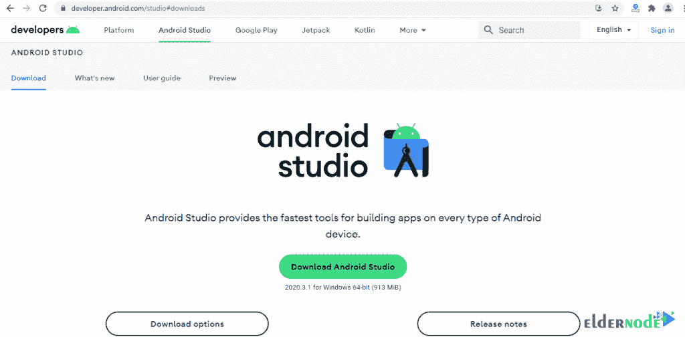

在阅读完**条款和条件**后打开的窗口中，您必须勾选**我已经阅读并同意上述条款和条件**选项。然后点击**下载 Android Studio for Windows** 。

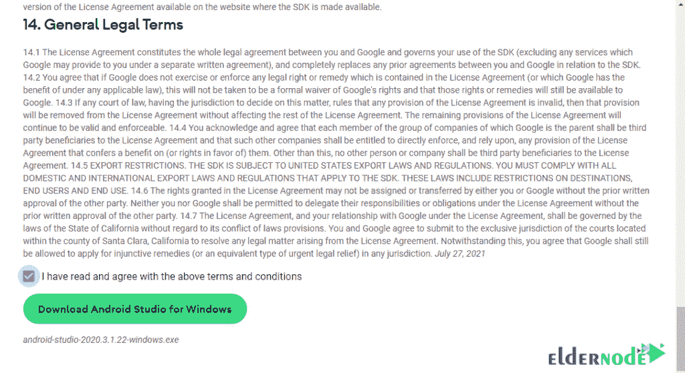

现在，你需要去你下载文件的地方。双击所需的文件。在打开的窗口中，点击**运行**开始安装过程。

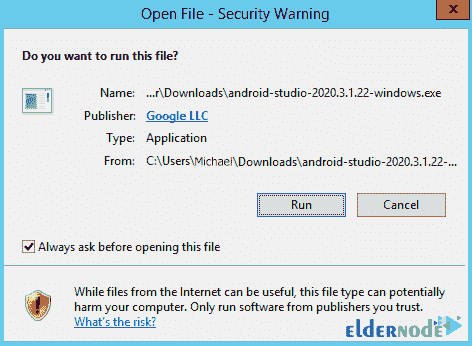

点击**下一步**继续安装过程。

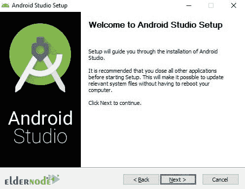

在下一步中，您将看到选择**组件**的选项。选择两个选项，点击**下一个**。

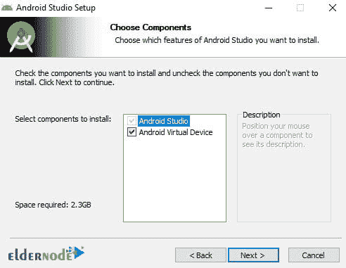

如下图所示，您需要指定**安装位置**，然后点击**下一个**。

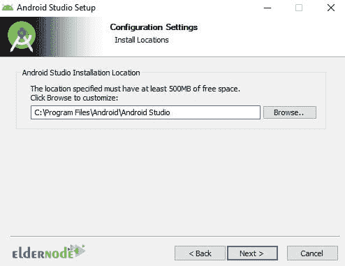

在下一个与**开始菜单文件夹**相关的窗口中，接受默认设置并点击**安装**开始安装 Android Studio。

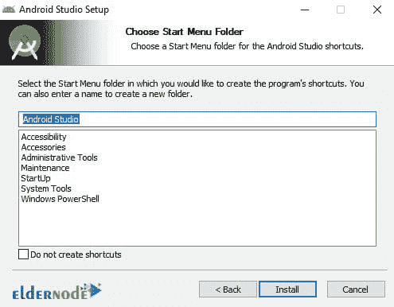

最后点击**完成**完成 Android Studio 的安装。

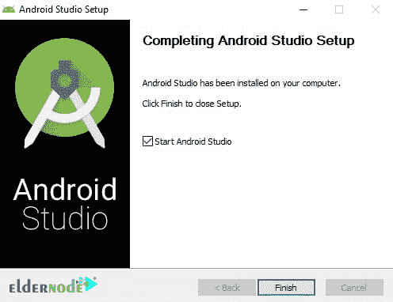

### **如何设置 Android Studio Windows Server 2016**

在你能够按照上一节提到的步骤安装 Android Studio 之后，现在我们要讨论如何设置它。当你第一次启动 Android Studio 时，它会要求你输入 Studio 设置。请注意，您应该通过查看下图点击 **OK** :

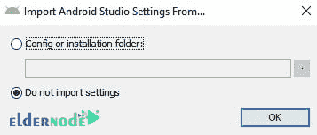

点击“确定”后，可能会要求您向 Google 提交使用统计数据:

Android Studio 加载一些组件，然后显示 **Android Studio 设置向导**对话框，如下所示。在这一步，您必须点击**下一步**继续查看下图:

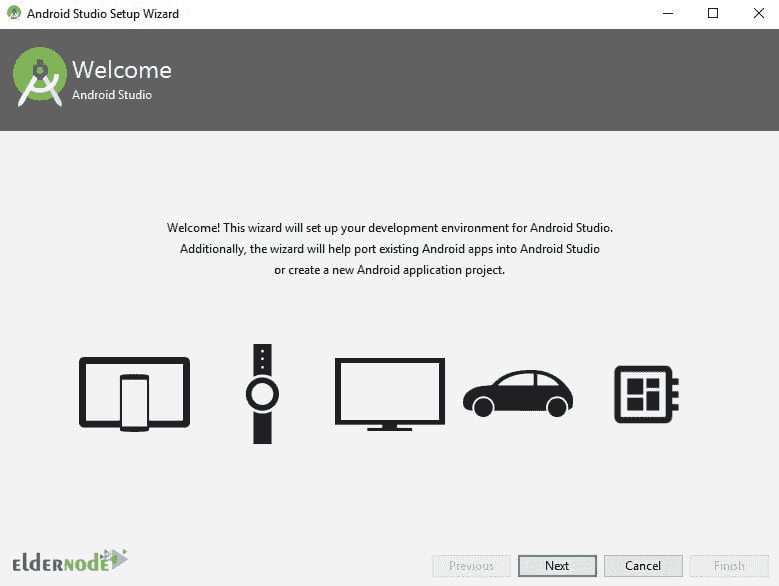

在下一节中，您将看到一个安装类型窗口。在这里可以选择**标准**，点击**下一个**:

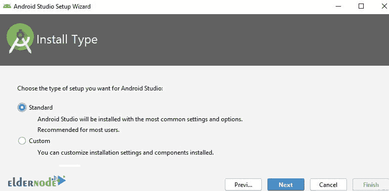

下一项是“ **UI 主题**选择页面，有两个选项**灯&灯**。我们建议您在此部分选择默认选项:

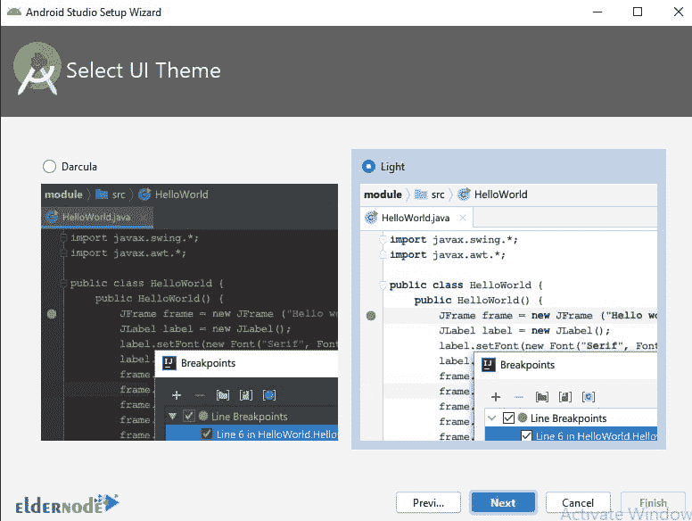

在下一步验证设置中，点击**完成**完成 Android studio 的安装:

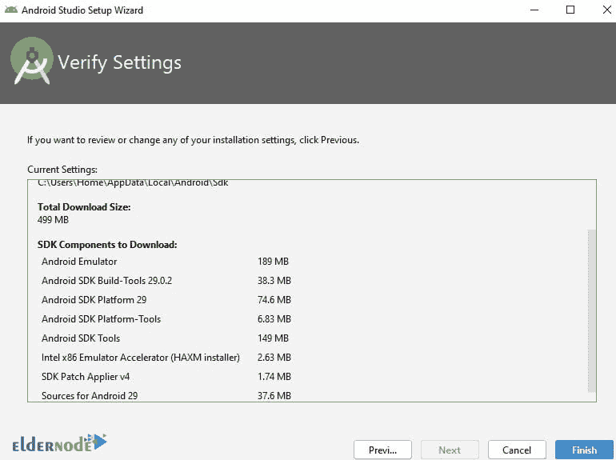

*

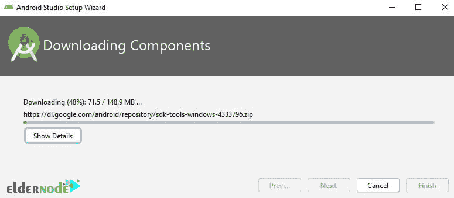

在下图中，您可以看到 Android Studio 仪表盘:

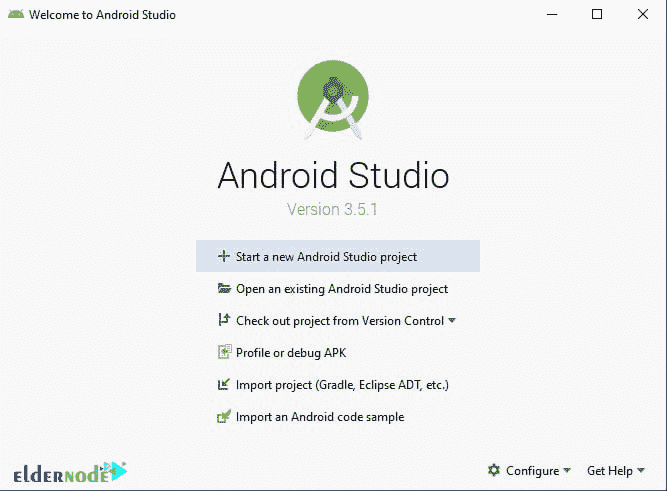

## 结论

Android Studio 是专为 Android 平台编程而设计的软件。当前版本的 Android Studio 在 Windows 上使用了大量的 RAM，但它比以往任何时候都快。在这篇文章中，我们试图教你如何安装 Android Studio Windows Server 2016。