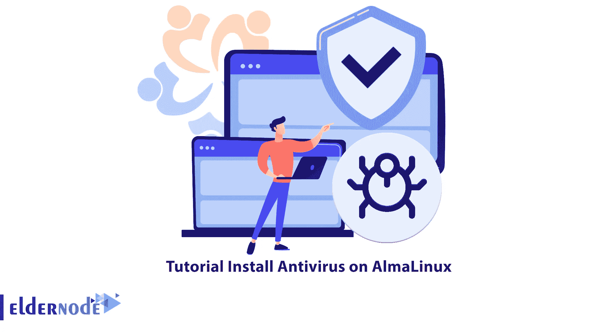
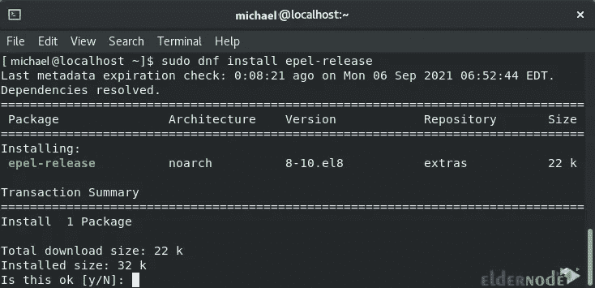

# 教程在 AlmaLinux - Eldernode 博客上安装杀毒软件

> 原文：<https://blog.eldernode.com/install-antivirus-on-almalinux/>



Linux 是一个非常安全的平台，但这并不意味着它不会受到恶意软件和其他攻击的伤害。因此，您应该采取一切可能的措施来防止漏洞并提高服务器安全性。在这篇文章中，我们将教你如何在 AlmaLinux 上安装杀毒软件。需要注意的是，你可以访问 [Eldernode](https://eldernode.com/) 网站上提供的购买 [Linux VPS](https://eldernode.com/linux-vps/) 服务器的计划。

### **ClamAV 及其特性介绍**

ClamAV 是由思科系统公司开发的开源、跨平台的反恶意软件工具包。该工具包包含一个新的保护系统，用于处理特洛伊木马、病毒、蠕虫和其他类型的恶意软件。由于 [ClamAV Antivirus](https://blog.eldernode.com/install-clamav-antivirus-on-ubuntu/) 支持多种平台，因此可以用来保护 Linux、Mac 和 Windows 操作系统。该防病毒软件基本上是一个轻型的基于命令行的系统，它与其他工具(如 FreshClam、ClamDaemon、ClamDTop、ClamScan 和 Clamtk)相结合，并提供许多有用的功能，如自动数据库更新、实时扫描和计划扫描。

**这款杀毒软件的一些主要功能有:**

–它又轻又快。

–它可以通过 CLI 和 GUI 界面使用。

–使用 ClamDaemon 系统进行实时扫描和防护。

–数据库已更新。检测数以百万计的病毒、蠕虫、特洛伊木马和其他恶意软件，包括宏 office 病毒、移动恶意软件和其他威胁。

–扫描存档文件并保护它们免受存档炸弹的攻击。

### **在 AlmaLinux 上安装杀毒的先决条件**

在这一节，我们将教你如何在 [AlmaLinux](https://blog.eldernode.com/tag/almalinux/) 上安装 ClamAV 杀毒软件。为此，您需要在开始安装之前使用以下命令更新系统:

```
sudo dnf upgrade --refresh -y
```

然后，您需要运行以下命令来验证您的帐户的 sudo 状态:

```
sudo whoami
```

请注意，您可以使用 root 帐户和 root 密码登录。为此，请运行以下命令:

```
su
```

使用以下命令从 EPEL 导入存储库:

```
sudo dnf install epel-release
```

当你看到下图这样的信息时，你需要输入“ **y** ”，然后按**回车**:



现在，您可以通过运行以下命令来轻松检查存储库是否已成功添加:

```
sudo dnf repolist
```

## **如何在 AlmaLinux 上安装 ClamAV**

在上一节中，我们安装了 ClamAV 安装的先决条件。在这一部分，我们将安装 ClamAV。为此，只需运行以下命令:

```
sudo dnf install clamav clamd clamav-update
```

如下图，当你看到问题时，你必须输入“ **y** ”，然后按**回车**:


您可以使用以下命令来确认 ClamAV 的安装:

```
clamd --version
```

需要注意的一点是，AlmaLinux 使用的是 SELinux。因此，有必要使用以下命令配置 ClamAV:

```
sudo setsebool -P antivirus_can_scan_system 1
```

## 结论

ClamAV 是用于 Unix 的防病毒工具，最常用于电子邮件扫描和通信路由领域，如 gmail。它提供了许多应用程序，如灵活和可扩展的多线程守护程序、命令行扫描器和用于自动数据库更新的高级工具。在这篇文章中，我们试图教如何在 AlmaLinux 上安装防病毒软件。如果你有任何问题，你可以在评论区和我们分享。