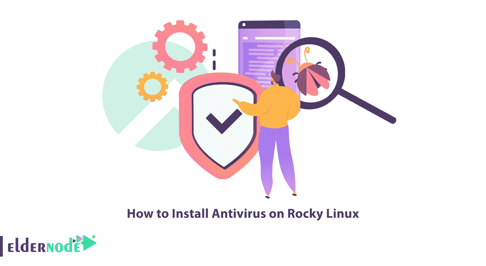

# 如何在 Rocky Linux 上安装杀毒

> 原文：<https://blog.eldernode.com/install-antivirus-on-rocky-linux/>



如今，恶意软件发展迅速，其有害影响是许多用户面临的问题。这就是为什么使用防病毒软件并保持其最新是很重要的。防病毒软件是一种旨在检测和删除系统中的恶意软件和其他恶意软件的程序。本文将教你如何在 Rocky Linux 上安装杀毒软件。 [Eldernode](https://eldernode.com/) 网站提供了一款经济实惠的 [Linux VPS](https://eldernode.com/linux-vps/) 服务器，如果你想购买的话可以是最好的选择。

## **在洛基 Linux 上安装 2 杀毒**

### **什么是杀毒？**

防病毒软件是一种计算机程序或一组程序，用于检测、防止和删除软件病毒。除了病毒，大多数防病毒程序还能够检测和删除其他类型的恶意软件，包括特洛伊木马、广告软件、间谍软件、勒索软件、键盘记录程序和 rootkits。事实上，它保护计算机和删除恶意软件或代码，旨在破坏计算机或数据。这个软件被认为是一种防止威胁进入你的计算机和防止问题的方法。

## **在洛基 Linux 上安装杀毒**

下面我们就去介绍 2 款适合 [Rocky Linux](https://blog.eldernode.com/rocky-linux-operating-system/) 的最好的杀毒软件。

### **1-安装 ClamAV**

ClamAV 是一款免费的开源杀毒软件，可以通过命令行运行。这个反病毒软件提供了一个命令行扫描程序、一个 Milter 接口、一个高级数据库更新程序，以及对存档格式、ELF 可执行文件+可移植可执行文件和流行文档格式的内置支持。它可以检测所有类型的恶意软件和病毒，您可以使用它来扫描电子邮件、web 和终端安全。

首先，您可以从 EPEL 回购获得安装 ClamAV 所需的软件包。因此，输入下面的命令来安装它:

```
sudo dnf install epel-release -y
```

要下载并安装 ClamAV，请运行以下命令:

```
sudo dnf update -y
```

```
sudo dnf install clamav clamd clamav-update
```

使用以下命令在 Rocky Linux 上添加一个 ClamAV 用户:

```
sudo groupadd clamav
```

```
sudo useradd -g clamav -s /bin/false -c "Clam Antivirus" clamav
```

记住使用以下命令为 ClamAV 配置 SELinux:

```
sudo setsebool -P antivirus_can_scan_system 1
```

### **2-安装 RootkitHunter**

RootkitHunter 是一款针对 Rocky Linux 的反病毒软件，可以扫描任何 rootkit、后门和任何其他本地漏洞。它实际上是一个 shell 脚本，在本地系统上执行各种检查，以尝试和检测已知的 rootkits 和恶意软件。这个工具是强化的 Apache web 服务器设置的一个可能的组件，您可以使用它，也可以不使用其他工具。

首先，**使用以下命令安装 EPEL 存储库**:

```
dnf install epel-release
```

要**安装 rkhunter** ，只需运行以下命令:

```
dnf install rkhunter
```

使用以下命令修改配置文件:

```
vi /etc/rkhunter.conf
```

并找到下面一行:

```
#MAIL-ON-WARNING=emailaddress [[email protected]](/cdn-cgi/l/email-protection)
```

您应该删除备注并更改电子邮件地址。然后将[【邮件保护】](/cdn-cgi/l/email-protection)_ 服务器名 _ 替换为[【邮件保护】](/cdn-cgi/l/email-protection)

就是这样！

## 结论

防病毒软件是在计算机和网络上发现并清除病毒的软件。在这篇文章中，我们向你介绍了两个适合 Rocky Linux 的最好的反病毒软件，并教你如何在 Rocky Linux 上安装反病毒软件。我希望这篇教程对你有用，并帮助你在你的 Rocky Linux 上安装杀毒软件。如果你有任何问题，可以在评论区联系我们。