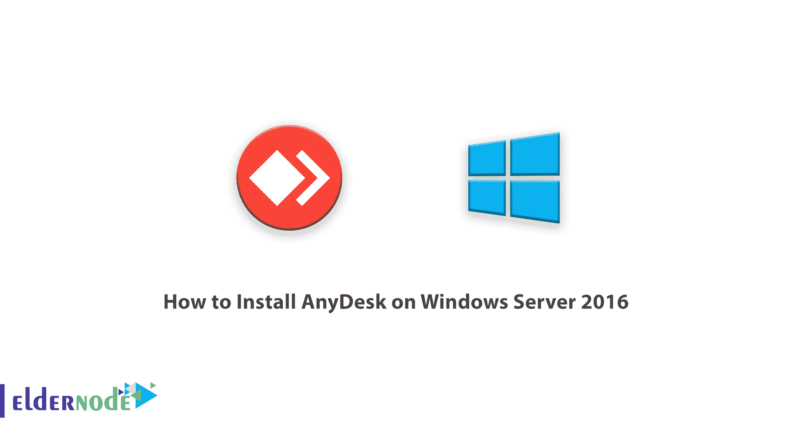
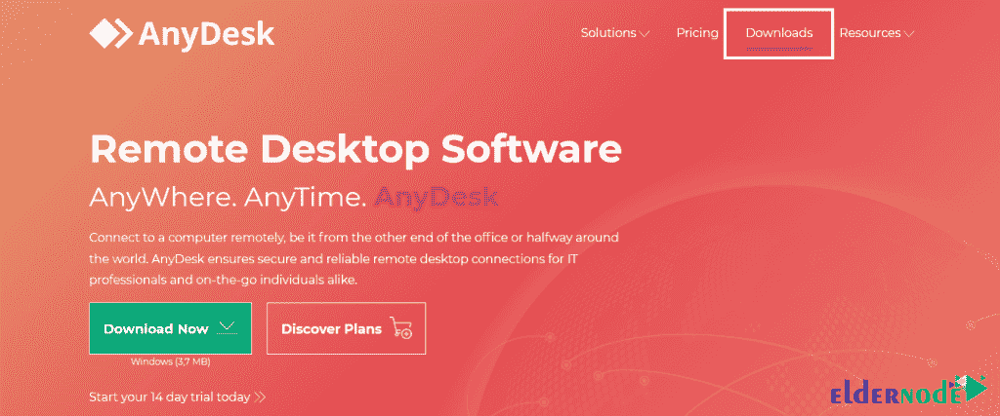
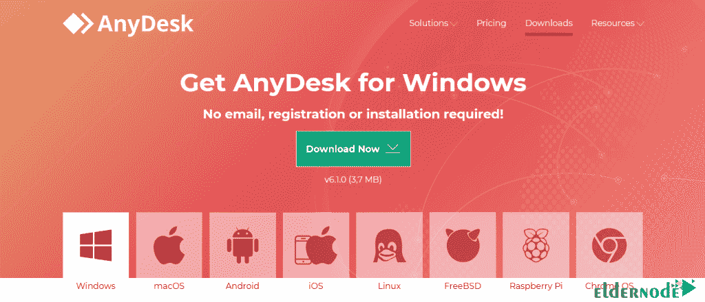
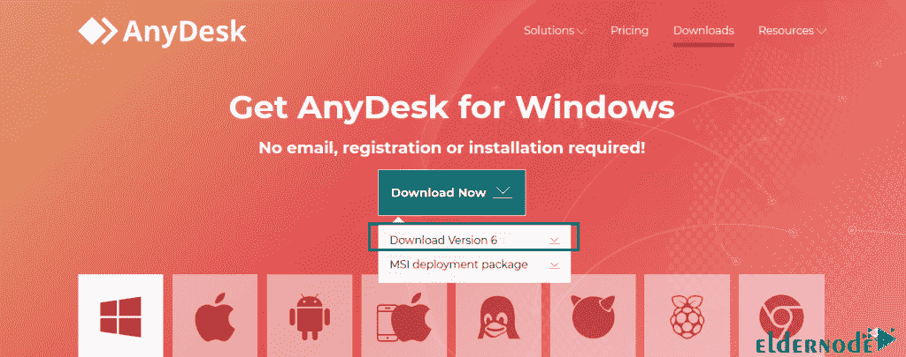
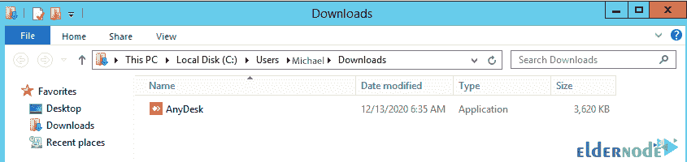
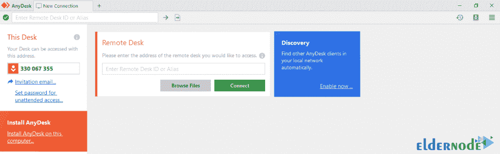
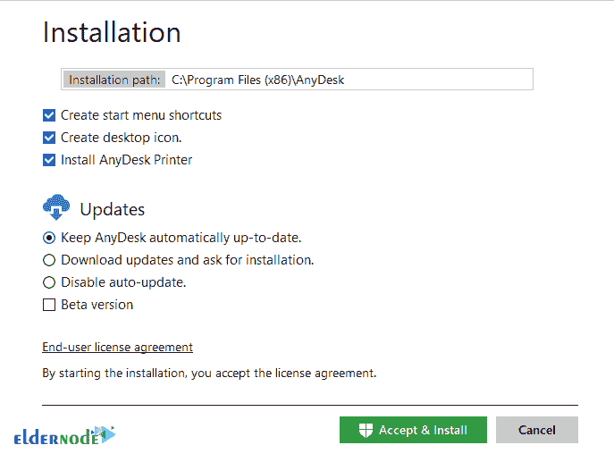
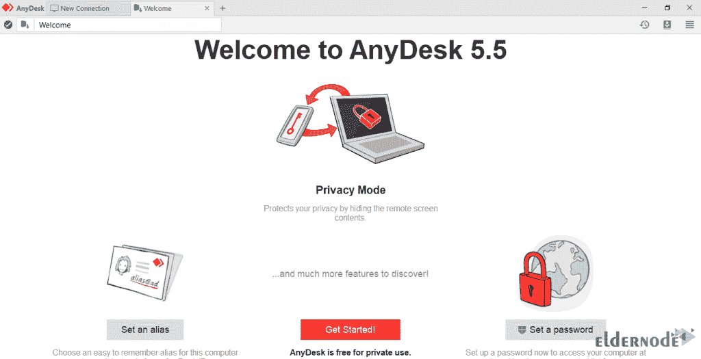
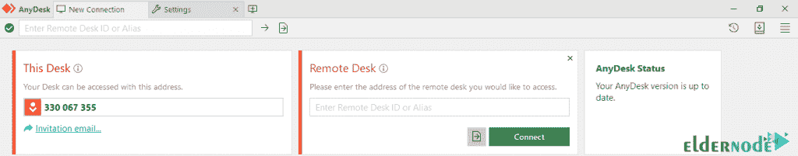

# 如何在 Windows Server 2016 上安装 any desk-elder node 博客

> 原文：<https://blog.eldernode.com/install-anydesk-on-windows-server-2016/>

你可能会遇到这样的情况，有人请你帮助解决你的计算机问题，但你没有机会使用它，你也不能通过电话来完成这项工作。在这种情况下，您需要一个软件，它可以连接到目标计算机并解决该人的问题，或者连接到您的系统以接收必要的信息。任何桌面程序都被设计成允许用户连接两个系统。这个程序是一个远程桌面工具，为个人提供对互联网上远程系统的控制和访问。在本文中，我们将向您介绍如何在 Windows Server 2016 上安装 AnyDesk。你可以访问 [Eldernode](https://eldernode.com/) 提供的包来购买 [Windows VPS](https://eldernode.com/windows-vps/) 服务器。

## **教程在 Windows Server 2016 上安装 any desk**

Anydesk 程序是一个[远程桌面](https://blog.eldernode.com/connect-remotedesktopmanager-remote-desktop-on-windows-10/)工具，为人们提供对互联网上远程系统的控制和访问。Anydesk 是最快的系统远程控制软件。

要连接两个系统，两个用户必须下载并安装该程序的软件。这个程序可以通过创建一个互联网连接来连接不同地方的两台计算机，用户可以通过连接到目标计算机来解决问题。AnyDesk 软件有一个漂亮而简单的用户界面，易于使用。因此，考虑到 AnyDesk 软件的良好质量，我们认为有必要在本文中教您如何下载和安装该程序。

## **在 Windows Server 2016 上安装 any desk**

在本教程中，我们将一步一步地教你如何安装 AnyDesk 软件。按顺序执行以下步骤。第一步，进入 [anydesk 网站](https://anydesk.com/en)，点击主菜单中的**下载**。

然后点击**立即下载**:

转到您下载 anydesk 文件的位置:

右击软件可执行文件，选择**以管理员身份运行**。运行后，将显示类似下图的窗口:

在上图中，点击“**在这台电脑上安装 any desk……”**并在您的 Windows Server 2016 上安装相同的程序。

在打开的窗口中，点击**接受&安装**。

最后，你必须点击**开始**来安装 Anydesk。您也可以在此部分进行密码设置。

该软件现已成功安装。安装软件后，您可以向任何想要连接到您的系统的人公布软件左上角的 9 位 ID。

在打开的窗口中，点击**接受&安装**。

结论

## AnyDesk 软件是一个在互联网上远程控制个人系统的工具。这款软件由于体积极小，速度很快，受到了很多关注。AnyDesk 可以在 Windows、Mac、 [Linux](https://blog.eldernode.com/tag/linux/) 和 freebsd 操作系统上下载。也可以从 Android 和 iOS 手机连接。在本文中，我们试图向您学习如何在 Windows Server 2016 上安装 AnyDesk。

AnyDesk software is a tool for remote control of personal system on the Internet. This software has received a lot of attention due to its very low volume and high speed. AnyDesk is available for download on Windows, Mac, [Linux](https://blog.eldernode.com/tag/linux/) and freebsd operating systems. It is also possible to connect from Android and iOS phones. In this article, we tried to learn you how to install AnyDesk on Windows Server 2016.