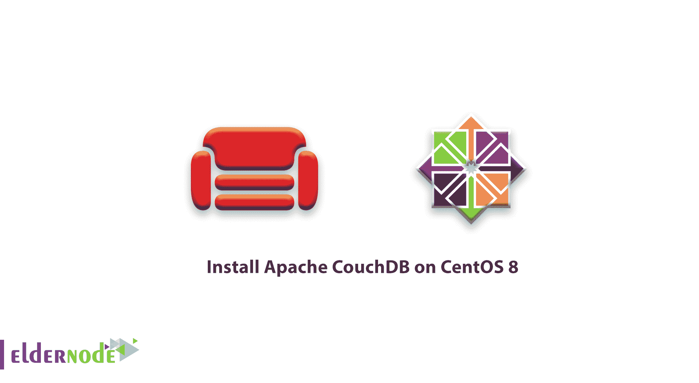
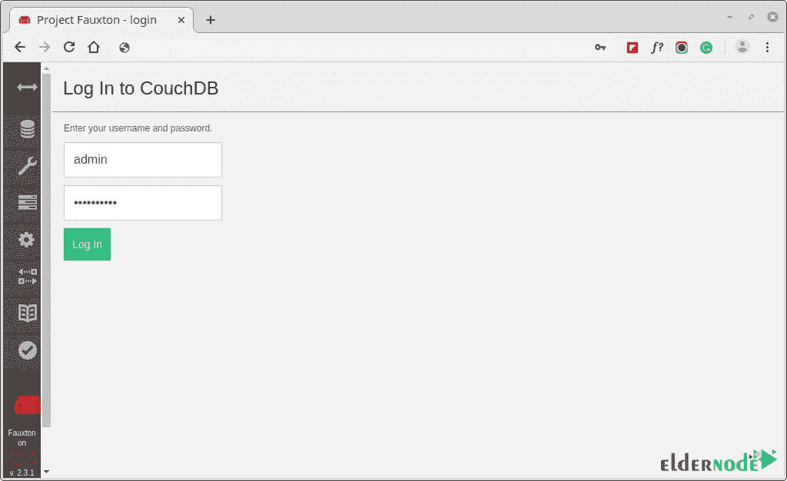
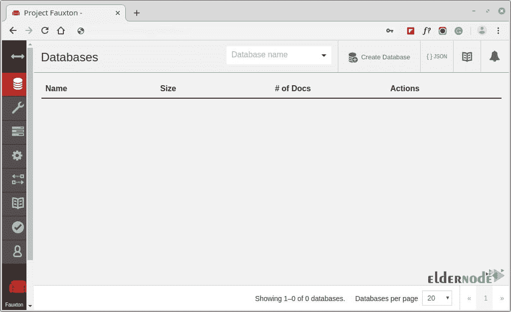
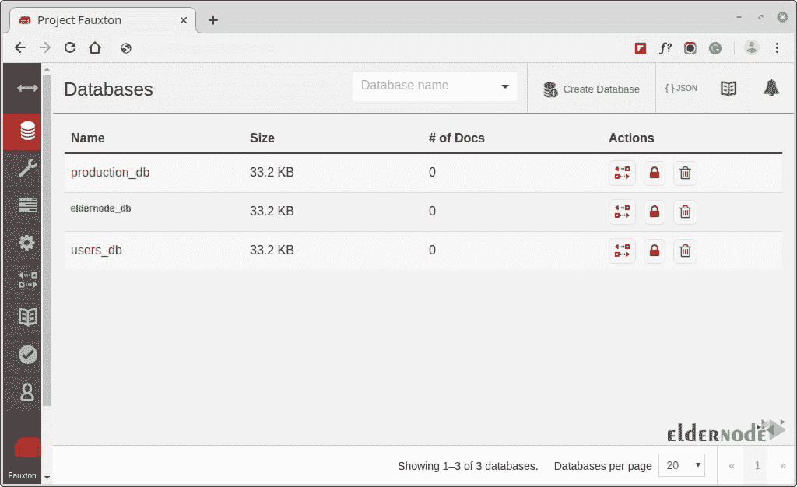

# 教程在 CentOS 8 - Eldernode 博客上安装 Apache CouchDB

> 原文：<https://blog.eldernode.com/install-apache-couchdb-centos-8/>



Apache CouchDB 用 Erlang 语言编写，是一个免费、可靠的 NoSQL 数据库引擎，它本身支持 JSON 格式的数据。与传统的 SQL 关系数据库(如 MySQL)相比，这使得数据建模更具可伸缩性，也更容易。CouchDB 的杀手锏是它的复制功能，这种功能可以跨越各种计算设备和各种计算环境，提供高可用性和按需数据访问。在本文中，我们试图向您介绍在 CentOS 8 上安装 Apache CouchDB 的教程**。你可以访问 [Eldernode](https://eldernode.com/) 提供的套装来购买 [CentOS VPS](https://eldernode.com/centos-vps/) 服务器。**

## **如何在 CentOS 8 上安装 Apache couch db**

让我们通过这篇文章的步骤来学习如何在 [CentOS](https://blog.eldernode.com/tag/centos/) 8 上安装 **Apache CouchDB** 。请加入我们。

### **安装 EPEL 资源库**

首先，你需要在 CentOS 8 上安装 [EPEL 库](https://blog.eldernode.com/how-fix-epel-repository-error-centos-7/)。

```
yum install epel-release 
```

### 启用 CouchDB 存储库

在这一步中，您将通过首先创建一个存储库文件来继续并启用 **CouchDB** 存储库，因为您已经成功地安装了 EPEL 包。

```
vi /etc/yum.repos.d/apache-couchdb.repo 
```

将下面的配置粘贴到存储库文件中，并**保存**。

```
[bintray--apache-couchdb-rpm]  name=bintray--apache-couchdb-rpm  baseurl=http://apache.bintray.com/couchdb-rpm/el$releasever/$basearch/  gpgcheck=0  repo_gpgcheck=0  enabled=1 
```

### **在 CentOS 8** 上安装 CouchDB

在其配置文件中定义了 **CouchDB** 存储库之后，使用下面的命令继续安装 CouchDB。

```
yum install couchdb 
```

一旦成功安装了 **CouchDB** 包及其依赖项，启动，使 CouchDB 在引导时启动，并通过运行命令来验证状态。

```
systemctl start couchdb 
```

```
systemctl enable couchdb 
```

```
systemctl status couchdb
```

要验证 CouchDB 监听端口 5984:

```
netstat -pnltu
```

### **如何在 CentOS 8 上配置 couch db**

CouchDB 既可以配置为独立模式，也可以配置为集群模式。然而，在本指南中，您将在单模配置中配置 CouchDB 服务器。此外，您将配置 CouchDB，以便我们可以通过 web 浏览器访问它。

CouchDB 的配置文件位于 **/opt/couchdb/etc/** 目录中。您将在 **local.ini** 文件中进行一些配置。所以用你最喜欢的编辑器打开文件。

```
vi /opt/couchdb/etc/local.ini 
```

在**【admins】**部分中，通过取消其下一行的注释来创建一个 admin 帐户，并按照以下格式定义 admin 的密码。

```
[admins]  admin = mypassword
```

接下来，滚动到**【chttpd】**部分。取消端口和绑定地址值的注释。此外，将绑定地址设置为 **0.0.0.0** ，以允许来自外部 IP 地址的访问。出于安全原因，您可以稍后更改该值。

```
[chttpd]  port = 5984  bind_address = 0.0.0.0
```

**保存**更改并退出配置文件。为了使更改生效，**重启** CouchDB。

```
systemctl restart couchdb 
```

如果你在服务器上运行防火墙，你必须打开端口 **5984** 以允许流量流向 **CouchDB** 。

```
firewall-cmd --zone=public --permanent --add-port=5984/tcp 
```

```
firewall-cmd --reload
```

### **如何访问 CouchDB Web 界面**

按照我们的配置，CouchDB 应该运行在 **localhost:5984** 上。为了确认 CouchDB 按预期工作，使用 **curl** 命令以 JSON 格式打印 CouchDB 的信息。

```
curl http://127.0.0.1:5984/ 
```

通过启动浏览器并浏览所示的服务器 IP 地址，您可以进一步确认一切都按照计划进行。

```
http://server-ip:5984/_utils/
```

您应该会看到下面的网页，提示您使用在 **local.ini** 文件中定义的**用户名**和**密码**登录，并点击**回车**。



仪表板将显示如下。



没有显示任何内容，因为到目前为止您还没有创建任何数据库。在下一节中，您将创建几个数据库。

### **如何在 CouchDB** 中创建数据库

要在终端上用 CouchDB 创建一个数据库，使用所示语法中的 curl 命令。

```
curl -u ADMINUSER:PASSWORD -X PUT http://127.0.0.1:5984 
```

您将创建 3 个数据库: **eldernode_db** 、 **users_db** 和 **production_db** 。

```
curl -u admin:[[email protected]](/cdn-cgi/l/email-protection) -X PUT http://127.0.0.1:5984/production_db 
```

```
curl -u admin:[[email protected]](/cdn-cgi/l/email-protection) -X PUT  http://127.0.0.1:5984/eldernode_db 
```

```
curl -u admin:[[email protected]](/cdn-cgi/l/email-protection) -X PUT http://127.0.0.1:5984/users_db
```

对于每个命令，您应该得到下面的输出。

```
{“Ok”: true}
```

要检查使用命令中的 **GET** 参数创建的数据库。

```
curl -u admin:[[email protected]](/cdn-cgi/l/email-protection) -X GET http://127.0.0.1:5984/production_db 
```

```
curl -u admin:[[email protected]](/cdn-cgi/l/email-protection) -X GET  http://127.0.0.1:5984/eldernode_db 
```

```
curl -u admin:[[email protected]](/cdn-cgi/l/email-protection) -X GET http://127.0.0.1:5984/users_db 
```

```
curl -u admin:[[email protected]](/cdn-cgi/l/email-protection) -X GET http://127.0.0.1:5984/_all_dbs
```

要在浏览器上查看数据库，只需**刷新** / **重新加载**浏览器。



同样，要删除一个数据库，使用如下所示的 **delete** 参数。例如，该命令删除了 **users_db** 数据库。

```
curl -u admin:[[email protected]](/cdn-cgi/l/email-protection) -X DELETE http://127.0.0.1:5984/users_db 
```

运行下面的命令再次检查数据库。

```
curl -u admin:[[email protected]](/cdn-cgi/l/email-protection) -X GET http://127.0.0.1:5984/_all_dbs 
```

正如您所看到的，只有两个数据库，因为我们已经删除了 **users_db** 数据库。

## 结论

在本文中，你成功完成了在 CentOS 8 上安装 Apache CouchDB 的学习教程。从现在开始，您将能够轻松地在 CentOS 8 系统上安装和配置 CouchDB。