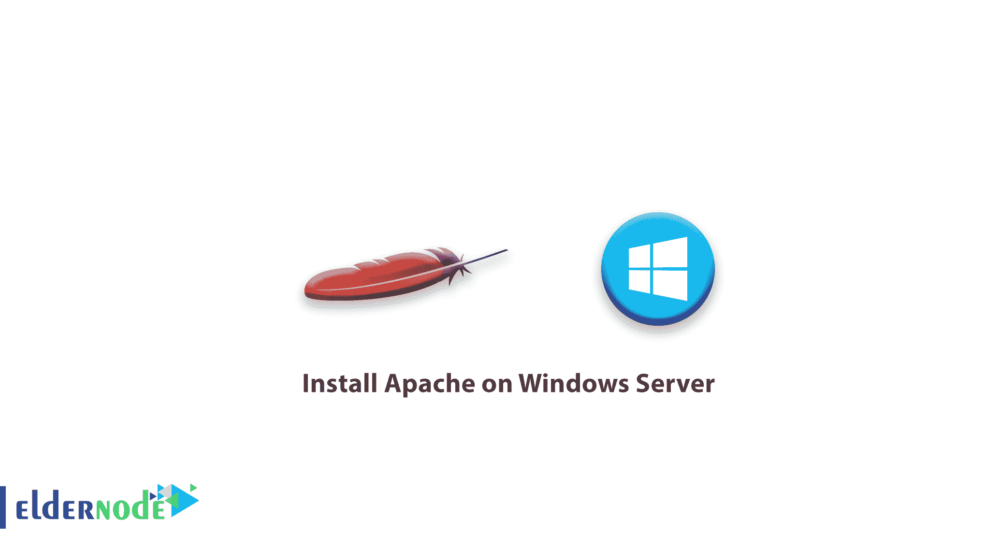
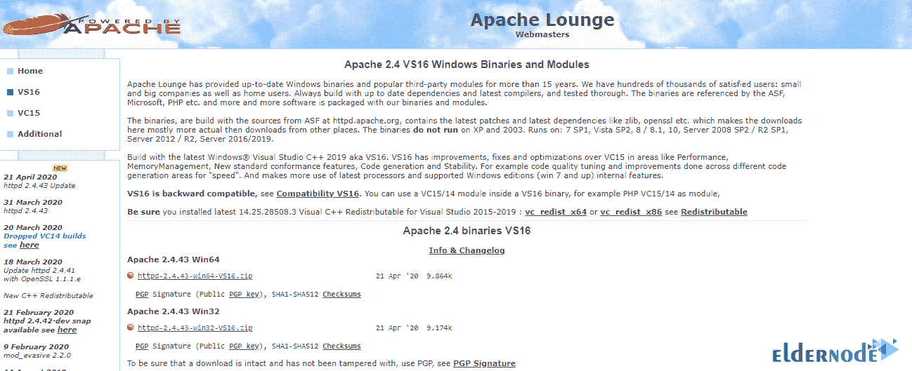
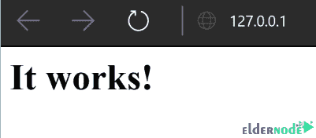

# 如何在 Windows Server - Eldernode 上安装 Apache

> 原文：<https://blog.eldernode.com/install-apache-on-windows-server/>



Apache 是当今用于提供 web 服务的最流行的 web 服务器之一。这个 web 服务器的基础是 Linux，它通常在 Linux 发行版中安装和使用。由于 Apache web 服务器的轻量级和高性能，用户也有兴趣在 Windows 上使用它。在本文中，我们将在 Windows 上独立安装 Apache web 服务器。你可以从[长老节点](https://eldernode.com/)中选择你最完美的 [Windows VPS](https://eldernode.com/windows-vps/) 服务器包。

## **教程在 Windows 服务器上安装 Apache**

使用 Apache 有几种方法，包括[安装 Xampp](https://eldernode.com/install-xampp-on-windows-10/) 。Apache 是一个模块化的、基于进程的 web 服务器应用程序，它为每个并发连接创建一个新线程。许多线程被编译为独立的模块，从而增加了其核心功能，并能够提供广泛的服务。它拥有超过 60%的商业 web 服务器市场份额，是世界上使用最广泛的 web 服务器程序。事实上，Apache 是 Unix 和 Linux 操作系统中使用最广泛的 web 服务器程序，但另一方面，它可以在 Windows、OS X、OS / 2 等几乎所有操作系统中使用。

### A)下载 Apache for Windows

1-首先，点击下面的链接并下载 Apache web server for Windows。请注意，本页有 32 位和 64 位两个版本，您应该下载并安装适合您操作系统的版本。

[**下载 Apache for Windows**](https://www.apachelounge.com/download/)



根据 ApacheLounge 下载页面上的信息，您还需要确保您的服务器上也安装了相关的 Visual Studio 可再发行版。这很可能已经安装在您的系统上，但如果有疑问，请从以下链接下载并运行 **vc_redist_x64.exe** (对于 64 位操作系统)，或 **vc_redist_86.exe** (对于 32 位系统)。

下载完成后，打开下载的"**httpd-2 . 4 . 43-win 64-vs16 . zip**"文件。然后，将其内容解压缩到服务器上的一个合适的位置，即 C:\Apache24。

### **B)在 Windows 服务器上启动 Apache**

以管理员身份打开命令行，转到 C:\Apache24\bin 文件夹:

```
cd C:\Apache24\bin
```

输入下面的命令:

```
httpd -k install
```

然后进入**开始**菜单，输入**服务**并点击它。你应该看到阿帕奇在那里选择它，并点击**开始**。

打开您的网络浏览器并导航至 **http://127.0.0.1** 。如果 Apache 正在运行，您应该会看到“**成功了！**"显示在您的浏览器中:



## 结论

亲爱的用户，我们希望您能喜欢本教程，您可以在评论区提出关于本次培训的问题，或者解决[老年人节点培训](https://eldernode.com/blog/)领域的其他问题，请参考[提问页面](https://eldernode.com/ask)部分，并尽快提出您的问题。腾出时间给其他用户和专家来回答你的问题。

祝您好运