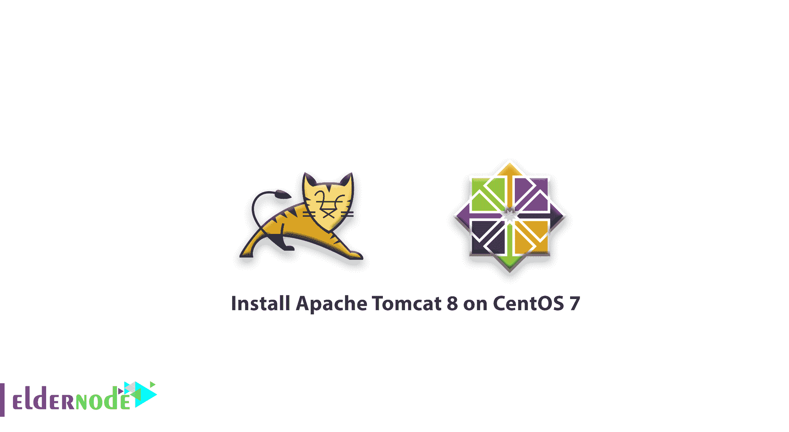
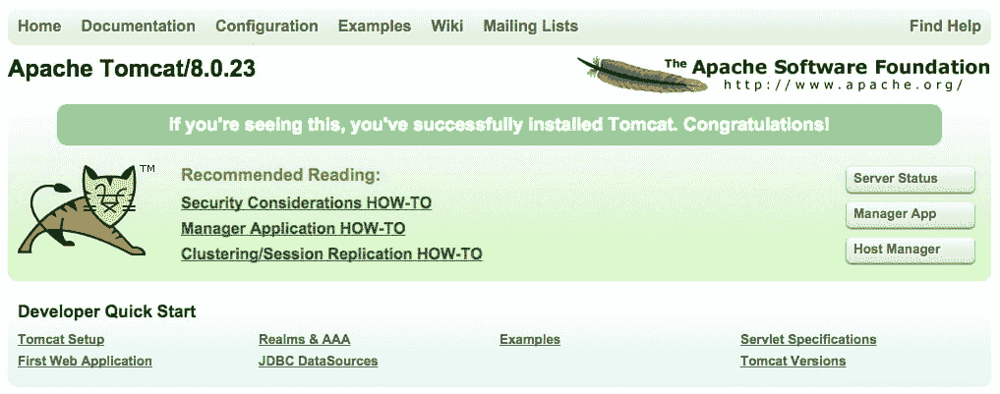
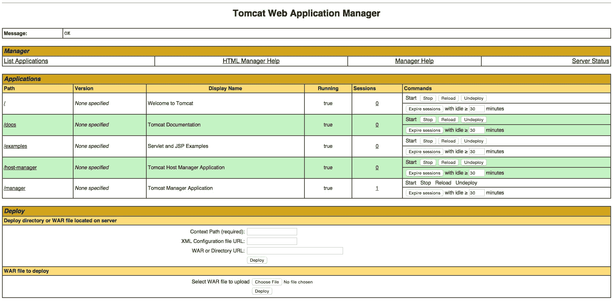
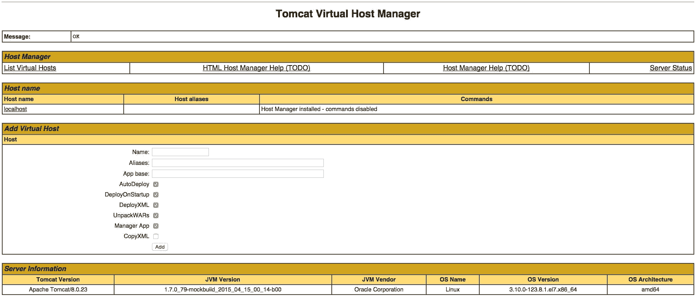

# 教程在 CentOS 7 - Eldernode 上安装 Apache Tomcat 8

> 原文：<https://blog.eldernode.com/install-apache-tomcat-centos-7/>



Apache Tomcat 是 Java Servlet 和 JavaServer Pages 技术的开源实现。它是一个由 Apache 软件基金会发布的 web 服务器。但是在畅游本指南的海之前，请确保你有自己的 [Linux 虚拟私人服务器](https://eldernode.com/linux-vps/)。

为了让本教程更好地发挥作用，请考虑以下**先决条件**:

拥有 sudo 权限的非 root 用户

## 教程在 CentOS 7 上安装 Apache Tomcat 8

让我们浏览一下本教程的步骤，看看如何在 CentOS 7 上安装 Apache Tomcat 8 及其配置。

### 步骤一:如何安装 Java

安装 Tomcat 的前一步是[在服务器上安装 Java](https://eldernode.com/install-java-apt-debian-10/) 。随意选择任何 Java web 应用程序代码。所以使用下面的命令和 yum 来安装 OpenJDK。

```
sudo yum install java-1.7.0-openjdk-devel
```

出现提示时，按 **y** 继续安装 OpenJDK 7。

当您安装了 [Java](https://blog.eldernode.com/install-java-apt-ubuntu-20/) 之后，您就可以创建一个 tomcat 用户来运行 tomcat 服务了。

**注意** :你可以在 /usr/lib/jvm/jre 找到 JAVA_HOME 目录的快捷方式，记得以后用它来配置 Tomcat。

### 第二步:如何创建 Tomcat 用户

在这一步中，您将观察[安全性](https://eldernode.com/installations/configure-linux-server-security/)。为了达到这个目标，您可能必须以非特权用户的身份运行。因此，让我们创建一个新的用户和组来运行 Tomcat 服务。

使用下面的命令创建一个新的 tomcat 组:

```
sudo groupadd tomcat
```

从现在起，你应该骑以及你不要让任何人登录帐户。为此，您需要创建一个新的 tomcat 用户。之后，您将使这个用户成为 tomcat 组的成员，主目录为/ opt/tomcat ，外壳为/bin/false

```
sudo useradd -M -s /bin/nologin -g tomcat -d /opt/tomcat tomcat
```

### 第三步:如何安装 Tomcat

如果你学会了安装 Tomcat 8 最简单的方法呢？是的，这是可能的。你只需要下载最新的二进制版本，然后手动配置它。

### 如何下载 Tomcat 二进制

使用最短的方式下载 Tomcat 8 的最新版本，并访问 [Tomcat 8 下载页面](http://tomcat.apache.org/download-80.cgi)。一旦你有了它，在**核心**列表下，复制链接到“tar.gz”。

现在，使用 yum 包管理器开始安装 wget。

```
sudo yum install wget
```

如果您想切换到您的主目录:

```
cd ~
```

接下来，要下载 Tomcat 8 归档文件，使用 wget 并粘贴到链接中。

```
wget https://www-eu.apache.org/dist/tomcat/tomcat-8/v8.5.37/bin/apache-tomcat-8.5.37.tar.gz 
```

此时，是时候将 Tomcat 安装到 /opt/tomcat 目录中了。要做到这一点，最好使用下面的命令将归档文件解压缩到目录中。

```
sudo mkdir /opt/tomcat  sudo tar xvf apache-tomcat-8*tar.gz -C /opt/tomcat --strip-components=1
```

### 如何更新权限

有必要为 tomcat 用户分配对 Tomcat 安装的访问权。运行以下命令，切换到 Tomcat 安装路径:

```
cd /opt/tomcat
```

然后，尝试给 tomcat 组整个安装目录的所有权:

```
sudo chgrp -R tomcat /opt/tomcat
```

现在，您可以将对 conf 目录及其所有内容的读取权限分配给 tomcat 组。之后，键入以下命令来执行对目录本身的访问:

```
sudo chmod -R g+r conf  sudo chmod g+x conf 
```

正如你所猜测的， tomcat 用户现在应该是 webapps 、 work 、 temp 和 logs 目录的所有者。

```
sudo chown -R tomcat webapps/ work/ temp/ logs/
```

### 如何安装 Systemd 单元文件

要设置这个部分，您需要运行一个 Tomcat Systemd 单元文件，让您将 Tomcat 设置为一个服务。

键入以下命令创建并打开单元文件:

```
sudo vi /etc/systemd/system/tomcat.service
```

以防您需要修改在 CATALINA_OPTS 中指定的内存分配设置。并粘贴以下脚本。

/etc/systemd/system/Tomcat。服务

```
# Systemd unit file for tomcat  [Unit]  Description=Apache Tomcat Web Application Container  After=syslog.target network.target    [Service]  Type=forking    Environment=JAVA_HOME=/usr/lib/jvm/jre  Environment=CATALINA_PID=/opt/tomcat/temp/tomcat.pid  Environment=CATALINA_HOME=/opt/tomcat  Environment=CATALINA_BASE=/opt/tomcat  Environment='CATALINA_OPTS=-Xms512M -Xmx1024M -server -XX:+UseParallelGC'  Environment='JAVA_OPTS=-Djava.awt.headless=true -Djava.security.egd=file:/dev/./urandom'    ExecStart=/opt/tomcat/bin/startup.sh  ExecStop=/bin/kill -15 $MAINPID    User=tomcat  Group=tomcat  UMask=0007  RestartSec=10  Restart=always    [Install]  WantedBy=multi-user.target
```

现在您可以保存并退出。如您所见，该脚本告诉服务器使用指定的设置，以 tomcat 用户的身份运行 Tomcat 服务。

毕竟，您可以重新加载 Systemd 来加载 Tomcat 单元文件:

```
sudo systemctl daemon-reload
```

要启动 Tomcat 服务:

```
sudo systemctl start tomcat
```

您可以使用下面的命令来检查服务是否成功启动。

```
sudo systemctl status tomcat
```

如果是，它将在服务器启动时启动，您可以通过运行以下命令来启用 Tomcat 服务:

```
sudo systemctl enable tomcat
```

如你所见，到这里为止，你还没有完全设置好 Tomcat 。因此，让我们通过在网络浏览器中访问您的域名或 [IP 地址](https://eldernode.com/find-server-public-ip-linux/)，然后是 8080 ，来访问默认的启动页面:

在 web 浏览器中打开:

```
http://server_IP_address:8080
```

`第四步:如何配置 Tomcat Web 管理界面`

### `每当您决定使用 Tomcat 附带的管理器 web 应用程序时，请尝试在我们的 Tomcat 服务器上添加一个登录名。要开始这样做，编辑 tomcat-users.xml 文件:`

`您会看到很多描述如何配置文件的注释。因此，您有两种选择，第一种是删除下面两行之间的所有注释，第二种是如果您想要引用示例，则保留它们:`

```
`sudo vi /opt/tomcat/conf/tomcat-users.xml`
```

`tomcat-users.xml 摘录`

`为了添加一个可以访问管理器-gui 和管理器-gui 的用户，让我们定义一个类似于下面例子的用户。**不要**忘记将用户名 [密码](https://eldernode.com/how-to-create-strong-password/) 改成安全的:`

```
`<tomcat-users>  ...  </tomcat-users>`
```

`tomcat-users.xml —管理员用户`

`现在，您可以保存并退出 tomcat-users.xml 文件。`

```
`<tomcat-users>      <user username="admin" password="password" roles="manager-gui,admin-gui"/>  </tomcat-users>`
```

`如果你使用最新版本的 Tomcat，你会发现它将管理器和主机管理器应用程序的访问限制在来自服务器本身的连接上。在远程计算机上安装时，您可能希望删除或更改此限制。因此，打开适当的 context.xml 文件，来改变这些上的 IP 地址限制。`

`为管理器应用程序运行以下命令:`

`并为主机管理器应用程序键入以下命令，键入:`

```
`sudo vi /opt/tomcat/webapps/manager/META-INF/context.xml`
```

`在内部，注释掉 IP 地址限制以允许来自任何地方的连接。此外，如果您希望只允许来自您自己 IP 地址的连接访问，您可以将您的公共 IP 地址添加到列表中。`

```
`sudo vi /opt/tomcat/webapps/host-manager/META-INF/context.xml`
```

`Tomcat web apps 的 context.xml 文件`

`现在您可以在完成后保存并关闭文件。`

```
`<Context antiResourceLocking="false" privileged="true" >    <!--<Valve className="org.apache.catalina.valves.RemoteAddrValve"           allow="127\.\d+\.\d+\.\d+|::1|0:0:0:0:0:0:0:1" />-->  </Context>`
```

`您也可以重新启动 Tomcat 服务来使您的更改生效。`

`第五步:如何访问 Web 界面`

```
`sudo systemctl restart tomcat`
```

### ``到目前为止，Tomcat 已经启动并运行了，那么为什么你不能在网络浏览器中访问网络管理界面呢？``

``通过在端口 8080 上访问服务器的公共 IP 地址来实现:``

``在 web 浏览器中打开:``

``然后，您将看到如下页面。``

```
``http://server_IP_address:8080``
```

```
````
```

``查看管理 web 应用程序的链接，您为其配置了一个管理用户。现在，如果您使用经理应用程序，可以通过链接或http://server _ IP _ address:8080/Manager/html:访问它``

````

``您将使用 Web 应用程序管理器来管理 Java 应用程序。对于一些活动，如启动、停止、重新加载、部署和取消部署。或者对您的应用程序运行一些诊断程序。考虑到您可以通过本页的最底部访问您的服务器信息。``

``不过，让我们看看主机管理器，可以通过链接或http://server _ IP _ address:8080/Host-Manager/html/访问:``

````

``使用此页面的方法是添加虚拟主机来为您的应用程序提供服务。``

``结论``

## ``在本文中，通过本指南的步骤后，您已经成功安装了 Apache Tomcat 8，并准备好使用它。此外，要查看更多相关文章，请阅读更多关于如何在 Windows 上安装 Apache Tomcat 的文章。``

``在本文中，通过本指南的步骤后，您已经成功安装了 Apache Tomcat 8，并准备好使用它。此外，要查看更多相关文章，请阅读更多关于如何在 Windows 上安装 Apache Tomcat 的文章。``