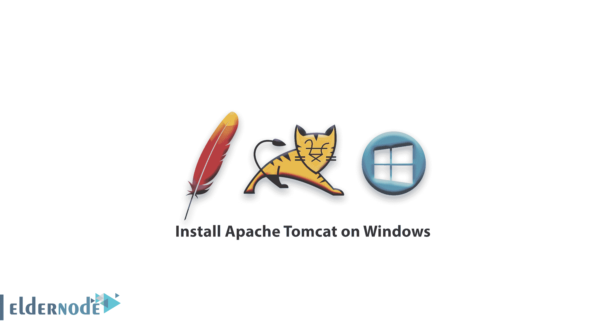
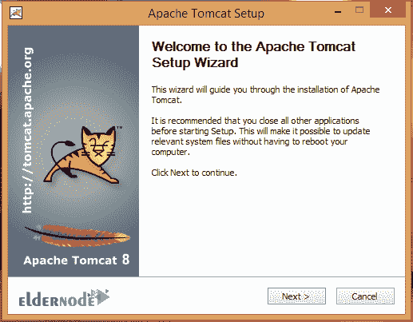
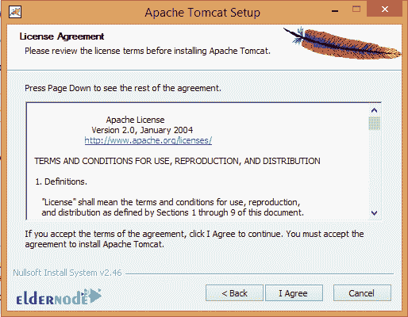
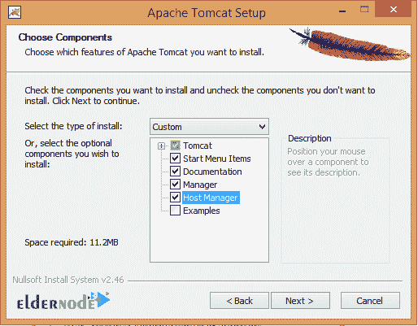
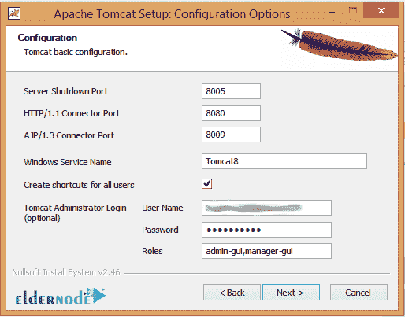
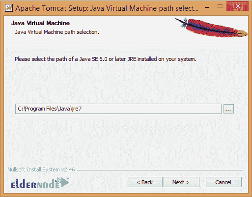
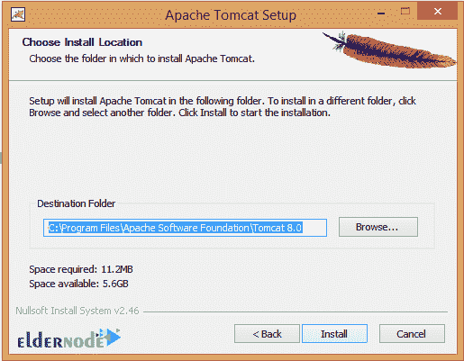
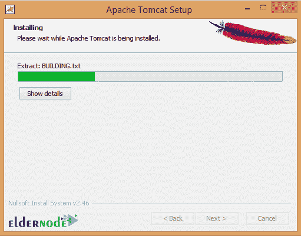
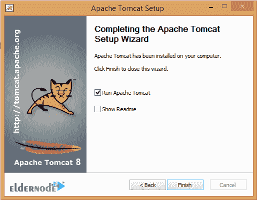
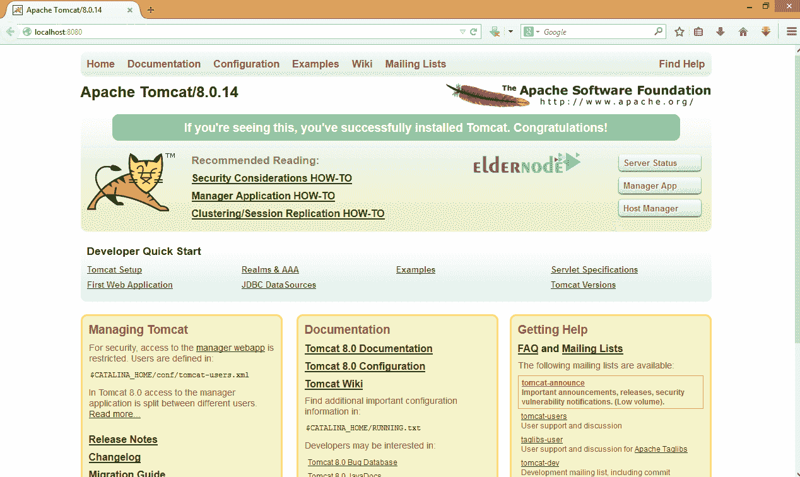

# 如何在 Windows - Eldernode 上安装 Apache Tomcat

> 原文：<https://blog.eldernode.com/install-apache-tomcat-on-windows/>

如何在 Windows 上安装 Apache Tomcat？Tomcat 是由 [Apache](https://www.apache.org/) 开发的 web 服务器。这个网络服务器帮助你运行用 JSP 编写的网络应用程序作为网站。为了测试你的软件，你需要在你的系统中创建一个本地网站，并把你的程序放在里面。在这篇文章中，你将学会如何在 Windows 上安装 Apache Tomcat 。

**[购买 Windows 虚拟专用服务器](https://eldernode.com/windows-vps/)**

如果你以前写过 web 软件或者稍微熟悉网络概念的话，你知道我们系统的 IP 地址永远是 127.0.0.1 。它引用的默认域名地址也是本地主机。

这意味着我们的本地网站可以通过输入地址 http: // localhost: port 在我们的系统中访问，其中 port 是我们的网络服务器的端口号。(当然端口 80 无需输入端口号)。

## 在 Windows 操作系统上安装 Apache Tomcat

要运行 Apache Tomcat ，您必须在系统上安装 Java JDK 。所以在你开始安装 tomcat 之前，最好在你的系统上安装 JDK，并为它设置 JAVA_HOME 和 PATH 变量。

如果你不知道如何安装和配置 JDK，你可以通过下面的链接学习:

[如何在 Ubuntu 20.04 上配置 NetBeans](https://eldernode.com/configure-netbeans-on-ubuntu-20-04/)

### 开始安装 Tomcat

安装 Tomcat 有几种方法，比如下载一个 Zip 文件或者[安装XAMP服务器。这里我们使用 Exe 文件的下载方法。](https://eldernode.com/install-xampp-on-windows-10/)

**1。** 第一步，从以下链接下载 Tomcat 安装 exe 文件:

[**下载 TomCat exe 文件**](http://tomcat.apache.org/)

**2。** 下载安装文件后，运行安装文件，点击下一步进入下一页。

**3。T3 点击我同意确认同意。**

**4。** 选择如下图所示的组件，进入下一页。

**5。** 为软件输入你最喜欢的港口。

请记住，如果您使用另一个端口号而不是 Http 端口部分中的 8080 ，您必须输入**Localhost:Port number**而不是 **Localhost:8080** 来访问您的站点。

**注意:** 端口号是您在安装时输入的端口号。

**6。** 进入您安装在系统上的 JRE 安装路径。

软件本身试图找到路径并显示在这里，所以如果它是正确的，你不需要改变它。

**7。** 按照剩下的步骤安装软件。

*

**

**8。** 输入地址 http://Localhost:8080 ，应该会看到默认的 Tomcat 页面，对于我安装的版本如下:

**9。** 为了测试Tomcat 的正确执行，转到 Tomcat 软件的根目录下，创建一个名为 **test** 的文件夹(小写)。通常在 Windows 中，Tomcat 软件的根地址如下:

**Tomcat 安装路径/WebApps/Root/**

对于我的系统的示例:

**C:\ Program Files \ Apache Software Foundation \ Tomcat 8.0 \ web apps \ ROOT**

**10。** 因为我们在这里创建一个服务器进行测试，如果你没有权限在测试文件夹中创建一个文件，**右击**就可以了。然后选择属性并点击安全并点击编辑。在用户中，选择编辑并勾选允许栏中的所有选项。

**11。** 现在在测试文件夹中创建一个名为【Index.jsp】(小写)的文本文件，并在其中键入以下代码:

**12。** 确定文件是【index.jsp】和**。txt** 格式不加在末尾。另外， SP Jfiles 可以用记事本++ 或 Windows 记事本编辑:

**<% out . write(" elder node . com ")；% >**

**13。** 现在去下面的地址看看结果:

http://localhost:8080/test/

结果应该是一个空白页，上面写着 eldernode.com。

**尊敬的用户**，我们希望您能喜欢这个[教程](https://eldernode.com/category/tutorial/)，您可以在评论区提出关于本次培训的问题，或者想解决[老年人节点培训](https://eldernode.com/blog/)领域的其他问题，请参考[提问页面](https://eldernode.com/ask)部分，并尽快提出您的问题。腾出时间给其他用户和专家来回答你的问题。

好运。

**也，见**

##### **[如何在 CentOS 8 上安装纱线](https://eldernode.com/install-yarn-centos-8/)**

**[How to install Yarn on CentOS 8](https://eldernode.com/install-yarn-centos-8/)**