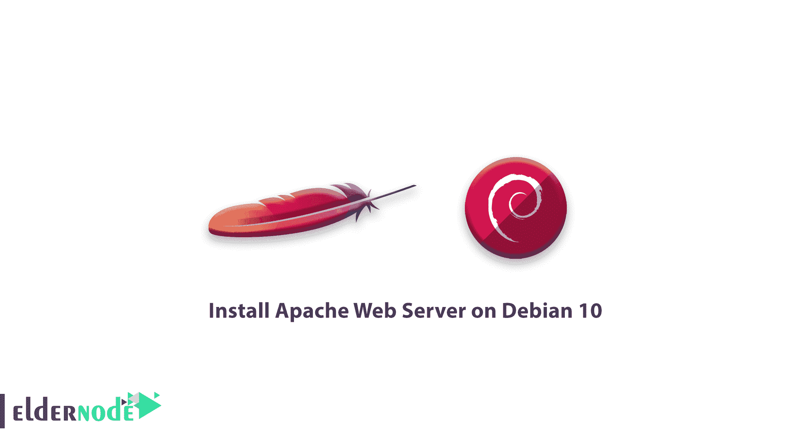
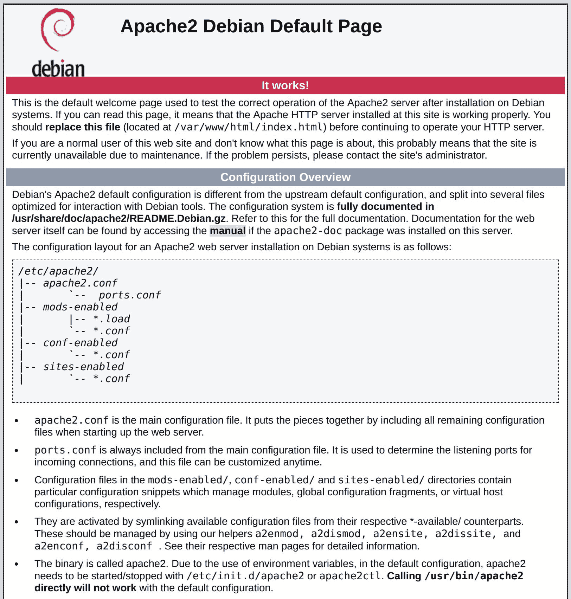

# 如何在 Debian 10 - Apache web server 上安装 Apache Web Server

> 原文：<https://blog.eldernode.com/install-apache-web-server-debian/>



为了介绍和安装世界上最广泛使用的 web 服务器，在本文中，您将学习如何在 Debian 10 上安装 Apache Web 服务器。

Apache HTTP Server 提供了许多强大的功能，包括可动态加载的模块、强大的媒体支持以及与其他流行软件的广泛集成。

**先决条件**

如果您知道以下内容，本教程可能会更有用:

## 如何在 Debian 10 上安装 Apache Web Server

加入我们，通过这个指南的步骤来学习如何在你的 Debian 10 服务器上安装一个 Apache web 服务器。

### 1-安装 Apache

由于 Apache 在 Debian 的默认软件仓库中可用，它帮助我们使用传统的[包管理](https://blog.idrsolutions.com/2018/07/what-is-a-package-manager-and-why-should-you-use-one/)工具来安装它。

首先，更新本地包索引:

```
sudo apt update 
```

然后，安装 **apache2** 包:

```
sudo apt install apache2 
```

**不要错过相关文章:**

[如何在 Windows 服务器上安装 Apache](https://eldernode.com/install-apache-on-windows-server/)

### 2-调整防火墙

您必须修改防火墙设置以允许外部访问默认 web 端口，然后测试 apache。正如您在**先决条件**中所读到的，您需要配置一个 UFW 防火墙来限制对您的服务器的访问。

为了提供一些应用程序概要，Apache 向 UFW 注册了自己。所以您将使用它来启用或禁用通过防火墙对 Apache 的访问。

要列出**应用配置文件:**

```
`sudo ufw app list` 
```

**输出**

```
`Available applications:    AIM    Bonjour    CIFS  . . .    WWW   WWW Cache   WWW Full   WWW Secure  . . .`
```

**在下文中，您可以查看一些以 WWW:**

**此配置文件仅打开端口 80(正常、未加密的网络流量): **WWW****

**并且这个配置文件只打开端口 8080(有时用于缓存和 web 代理): **WWW Cache** :**

**此外，此配置文件同时打开端口 80(正常的未加密 web 流量)和端口 443 (TLS/SSL 加密流量): **WWW Full** :**

**最后，此配置文件仅打开端口 443 (TLS/SSL 加密流量): **WWW Secure** :**

**最好启用最严格的配置文件，它仍然允许您配置的流量。在本指南中，我们没有为我们的服务器配置 SSL，因此我们只需要允许端口 80 上的流量:**

**要验证更改，请执行以下操作:**

```
`sudo ufw allow 'WWW'` 
```

**输出**

```
`sudo ufw status` 
```

**3-检查你的网络服务器**

```
`Status: active    To                         Action      From  --                         ------      ----  OpenSSH                    ALLOW       Anywhere  WWW                        ALLOW       Anywhere  OpenSSH (v6)               ALLOW       Anywhere (v6)  WWW (v6)                   ALLOW       Anywhere (v6)`
```

**在安装过程的最后，Debian 10 启动 Apache，而服务器已经启动并运行。**

**要确保服务正在运行，请检查 **系统和** init 系统**

### **输出**

**任何类似上面的输出都意味着服务已经成功启动。但是我们建议您向 Apache 请求一个页面，以获得最佳的测试方法。**

**此外，您可以通过您的 IP 地址访问默认的 Apache 登录页面，以确认软件运行正常。获取您的服务器的 IP 地址，如果您不知道的话，可以从命令行用几种不同的方法获取。**

```
`sudo systemctl status apache2` 
```

**你得到几个用空格隔开的地址，在你的浏览器中尝试每个地址，看看它们是否有效。**

```
`● apache2.service - The Apache HTTP Server     Loaded: loaded (/lib/systemd/system/apache2.service; enabled; vendor preset: enabled)     Active: active (running) since Fri 2019-07-19 15:33:01 UTC; 4min 13s ago       Docs: https://httpd.apache.org/docs/2.4/    . . .    Jul 19 15:33:01 debssh systemd[1]: Starting The Apache HTTP Server...  Jul 19 15:33:01 debssh apachectl[2791]: AH00558: apache2: Could not reliably determine the server's fully qualified domain name, using 127.0.1.1\. Set the 'ServerName' directive global  Jul 19 15:33:01 debssh systemd[1]: Started The Apache HTTP Server.`
```

**你可以使用 **curl** 工具，它会给出你在互联网上另一个位置看到的公共 IP 地址。**

**使用 **apt** 安装:**

**然后，使用 IPv4 使用 **curl** 检索 icanhazip.com:**

```
`hostname -I` 
```

**接下来，在浏览器的地址栏中输入服务器的 IP 地址:**

**应该会出现下面的页面，这意味着 Apache 工作正常。您还可以查看一些关于重要 Apache 文件和目录位置的基本信息。**

```
`sudo apt install curl` 
```

****

```
`curl -4 icanhazip.com` 
```

```
`http://your_server_ip`
```

**4-管理阿帕奇流程**

**您可以查看一些基本的管理命令，因为您已经启动并运行了 web 服务器。**

**要停止您的 web 服务器:**

**使用下面的命令启动 web 服务器。**

### **当您需要停止然后再次启动服务时，请键入:**

**如果您只是简单地更改配置，Apache 通常可以在不中断连接的情况下重新加载:**

**要重新启用该服务以在引导时启动，请使用以下命令。**

```
`sudo systemctl stop apache2` 
```

**此时，当服务器再次启动时，Apache 会自动启动。**

```
`sudo systemctl start apache2` 
```

```
`sudo systemctl restart apache2` 
```

```
`sudo systemctl reload apache2` 
```

**5-设置虚拟主机(推荐)**

```
`sudo systemctl enable apache2` 
```

**使用 Apache web 服务器时，可以使用虚拟主机(类似于 T2 Nginx T3 中的服务器模块)。**

**Debian 10 上的 Apache 有一个默认启用的服务器块，它被配置为提供来自 **/var/www/html** 目录的文档。为 **your_domain** 创建目录，如下所示，使用-p 标志创建任何必要的父目录:**

****注** :别忘了用自己的域名替换**your _ domain****

### ****接下来，使用环境变量 $USER 分配目录的所有权:****

****如果你没有修改你的 **unmask** 值，你的 web roots 权限应该是正确的。要确保这一点，请键入:****

****使用您首选的编辑器或 nano ，创建一个示例【index.html】页面。****

****然后，在其中添加以下示例 HTML:****

```
**`sudo mkdir -p /var/www/your_domain`** 
```

****/var/www/your _ domain/index . html****

```
**`sudo chown -R $USER:$USER /var/www/your_domain`** 
```

****您现在可以保存并关闭文件。****

```
**`sudo chmod -R 755 /var/www/your_domain`** 
```

```
**`nano /var/www/your_domain/index.html`** 
```

****要让 Apache 提供这些内容，您必须用正确的指令创建一个虚拟主机文件。为此，不要直接修改位于/etc/Apache 2/sites-available/000-default . conf的默认配置文件，而是在/etc/Apache 2/sites-available/your _ domain创建一个新的配置文件。形态:****

****/etc/Apache 2/sites-available/your _ domain . conf****

```
**`<html>      <head>          <title>Welcome to your_domain!</title>      </head>      <body>          <h1>Success!  The your_domain virtual host is working!</h1>      </body>  </html>`**
```

****现在，您可以使用a2 en site ttool 启用该文件:****

****接下来，禁用在 000-default.conf 中定义的默认站点:****

```
**`sudo nano /etc/apache2/sites-available/your_domain.conf`** 
```

****您可以使用以下命令测试配置错误:****

```
**`<VirtualHost *:80>      ServerAdmin [[email protected]](/cdn-cgi/l/email-protection)_email_domain      ServerName your_domain      ServerAlias www.your_domain      DocumentRoot /var/www/your_domain      ErrorLog ${APACHE_LOG_DIR}/error.log      CustomLog ${APACHE_LOG_DIR}/access.log combined  </VirtualHost>`**
```

****输出****

****要实现您的更改，请重新启动 Apache****

```
**`sudo a2ensite your_domain.conf`** 
```

****这是 Apache 为您的域名提供服务的地方。此外，您可以通过导航到 http://your_domain 来测试它，在这里您应该会看到类似下面的内容:****

```
**`sudo a2dissite 000-default.conf`** 
```

********

```
**`sudo apache2ctl configtest`** 
```

```
**`AH00558: apache2: Could not reliably determine the server's fully qualified domain name, using 127.0.1.1\. Set the 'ServerName' directive globally to suppress this message  Syntax OK`**
```

```
**`sudo systemctl restart apache2`** 
```

****6-熟悉重要的 Apache 文件和目录****

****在熟悉管理 Apache 服务本身之后，让我们花几分钟时间熟悉一些重要的目录和文件。****

****内容****

****/var/www/html :实际的 web 内容，默认情况下只包含您之前看到的默认 Apache 页面，从 /var/www/html 目录提供。此外，您通过修改 Apache 配置文件进行了更改。****

****服务器配置****

### ****/etc/Apache 2:Apache 配置目录。所有的 Apache 配置文件都在这里。****

****/etc/apache 2/Apache 2 . conf:主 Apache 配置文件。您可以使用它来修改和更改 Apache 全局配置。这个文件负责加载配置目录中的许多其他文件。****

****/etc/apache2/ports.conf :这个文件指定 apache 将监听的端口。默认情况下，Apache 监听端口 80，当启用了提供 SSL 功能的模块时，还会监听端口 443。****

### ****/etc/Apache 2/sites-available/:可以存储每个站点虚拟主机的目录。Apache 不会使用在这个目录中找到的配置文件，除非它们链接到启用了站点的目录。通常，所有服务器块配置都在这个目录中完成，然后通过使用 a2ensite 命令链接到另一个目录来启用。****

****/etc/Apache 2/sites-enabled/:存放已启用的每站点虚拟主机的目录。通常，它们是通过用 a2ensite 链接到站点可用目录中的配置文件来创建的。Apache 在启动或重新加载以编译一个完整的配置时，会读取这个目录中的配置文件和链接。****

****/etc/Apache 2/conf-available/、/etc/Apache 2/conf-enabled/:这些目录与 sites-available 和 sites-enabled 目录具有相同的关系，但是用于存储不属于虚拟主机的配置片段。 conf-available 目录中的文件可以使用 a2enconf 命令启用，使用 a2disconf 命令禁用。****

****/etc/Apache 2/MODS-available/、/etc/Apache 2/MODS-enabled/:这些目录分别包含了可用和启用的模块。文件以结尾。load 包含加载特定模块的片段，而文件以结尾。conf 包含这些模块的配置。可以使用 a2enmod 和 a2dismod 命令启用和禁用模块。****

****服务器日志****

****/var/log/apache 2/access . log:默认情况下，对 web 服务器的每个请求都记录在这个日志文件中，除非 Apache 被配置为不这样做。****

****/var/log/Apache 2/error . log:默认情况下，所有错误都记录在这个文件中。Apache 配置中的 LogLevel 指令指定了错误日志将包含多少细节。****

### ******好样的** ！学完本教程后，您知道您已经安装了 web 服务器，您可以选择提供的内容类型以及可以用来创建更丰富体验的技术。****

****亲爱的用户，我们希望你喜欢这个教程，你可以在评论区提出关于这个培训的问题，或者要解决 [Eldernode](https://eldernode.com/) 培训领域的其他问题，请参考[提问页面](https://eldernode.com/ask)部分并在其中提出你的问题。****

******Good job**! by finishing this tutorial, you know that you have your web server installed, you have many options for the type of content you can serve and the technologies you can use to create a richer experience.****

****Dear user, we hope you would enjoy this tutorial, you can ask questions about this training in the comments section, or to solve other problems in the field of [Eldernode](https://eldernode.com/) training, refer to the [Ask page](https://eldernode.com/ask) section and raise your problems in it.****