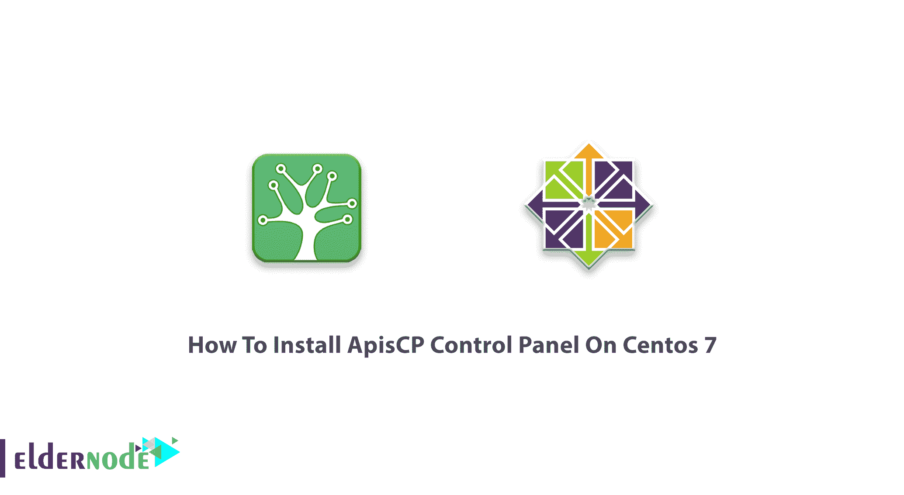
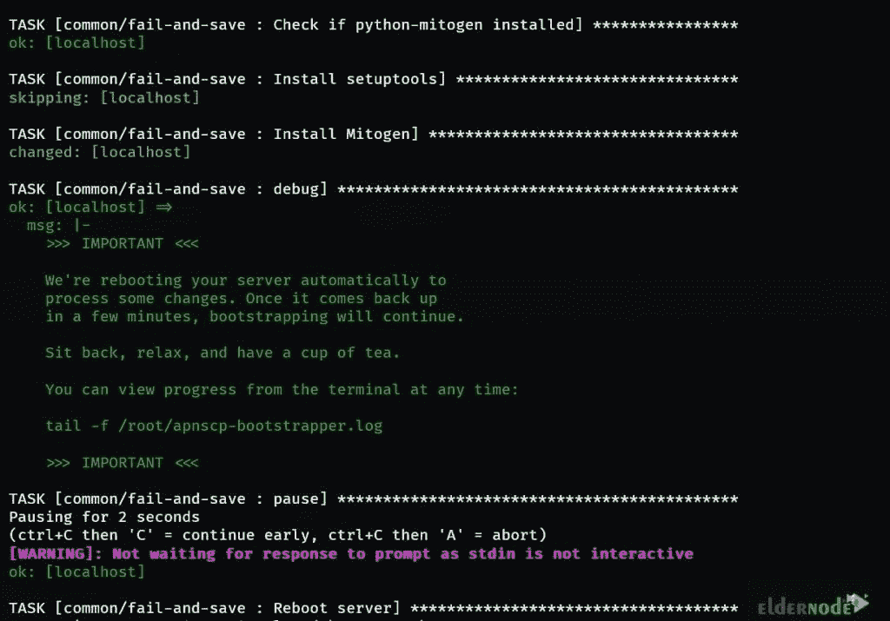
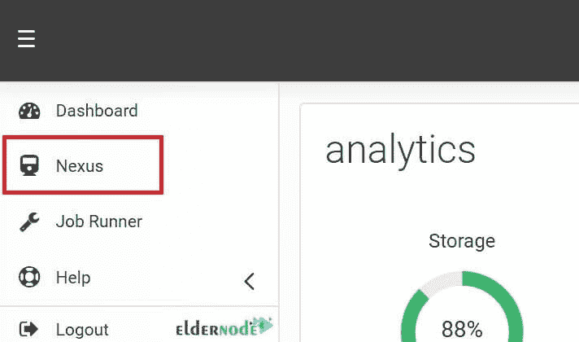
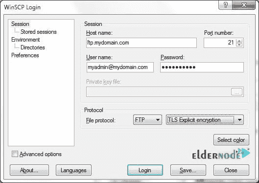

# 如何在 Centos 7 - Eldernode 博客上安装 ApisCP 控制面板

> 原文：<https://blog.eldernode.com/install-apiscp-control-panel-on-centos/>



ApisCP 是一个开源的 100%自托管的托管面板和平台，始于 2002 年，当时是 Apis Networks 的面板。ApisCP 无代理运行，无需许可证。它能够在安装时进行优化配置，您将面临一个简单的设计。ApisCP 支持各种即插即用的 DNS 集成。此外，自适应防火墙、巨大的 API 和有限的资源是它受欢迎的一些特征和原因。由于资源许可，单个 ApisCP 服务器可以管理站点。ApisCP 已经为 WordPress、Discourse、Ghost、Drupal 和 Laravel 提供了一键式安装和自动更新。在本文中，您将学习如何在 Centos 7 上安装 ApisCP 控制面板。购买您自己的 **[CentOS VPS](https://eldernode.com/centos-vps/)** ，同时从 [Eldernode](https://eldernode.com/) 获得支持、高质量和最优惠的价格。

为了让本教程更好地发挥作用，请考虑以下**先决条件**:

_ 拥有 Sudo 权限的非 root 用户。

_ 1 个 CPU、2 GB 内存和 20 GB 存储空间。

_ RHEL/ [厘斯](https://blog.eldernode.com/tag/centos/) 7.4 或更高。

## **教程在 Centos 7 上安装 ApisCP 控制面板**

公平地说，ApisCP 是为所有高速组件构建的，因为 ApicCP 的后端每秒可以处理超过 13，000 条特权命令。它被称为现代[主机](https://blog.eldernode.com/what-is-hosting-a-website-mean/)的新标准。加入我们这篇文章来回顾一下 CentOS 7 上 **ApisCP 的安装。**

## **如何在 CentOS 7 | Centos 8** 上安装 ApisCP

你可能知道自举。一种自启动过程，它应该在没有外部输入的情况下继续进行。您可以使用 Bootstrapper 充当幂等工具来更新和更正您的服务器。当您使用 Bootstrapper 时，您可以确保它将有助于您在丢失数据时使服务器正常工作，因为它旨在提供最小的强制更改集。在安装期间和完整性检查期间执行引导，每月运行一次。首先，运行**存根脚本**。您可以使用下面的命令将 ApisCP 与 30 天的许可证一起使用。

```
curl https://raw.githubusercontent.com/apisnetworks/apnscp-bootstrapper/master/bootstrap.sh | bash
```

但是，如果您购买了许可证，它将在安装时通过提供令牌来提供:

```
curl https://raw.githubusercontent.com/apisnetworks/apnscp-bootstrapper/master/bootstrap.sh | bash -s - <api token>
```

根据功能和提供商容量，引导将需要 30 到 120 分钟。如果需要 30 分钟左右，则表明是高性能的硬件提供商。但是，性能会随着客户端密度的变化而变化。

在引导实用程序开始阶段 2(平台供应)之前，您将有最后一次机会自定义安装。此外，您可以在可选步骤中立即配置 SSL。这些值可以在以后用*范围更改:在面板中设置*。

***注意*** :安装后所有设置可能会改变，但不适用于 MariaDB 和 PostgreSQL。

### **平台配置安装 ApisCP**

让我们继续第二阶段。在本节中，您将面临一次或多次重启。但是 ApisCP 会在重启时自动恢复安装。



您可以使用下面的命令进行操作:

```
tail -f /root/apnscp-bootstrapper.log
```

当引导程序记录类似的行时，安装完成。

```
2021-01-16 03:46:28,096 p=1108 u=root n=ansible | PLAY RECAP *********************************************************************
```

```
2021-01-16 03:46:28,096 p=1108 u=root n=ansible | localhost : ok=1815 changed=722 unreachable=0 failed=0 skipped=553 rescued=1 ignored=15
```

要确保全部设置，请检查查看失败=0。安装后，使用正确的 ApisCP 环境加载新的 shell。

```
exec $SHELL -i
```

### **在 CentOS** 上安装 ApisCP 后做什么

安装 ApisCP 后，具有正确限定的 FQDN 的域将收到通知。如果没有，管理员用户名/密码/联系人可以在任何时候使用 ApisCP 的 API 助手重新配置。

```
cpcmd auth:change-username 'NEWUSER'
```

```
cpcmd auth:change-password 'NEWPASSWORD'
```

```
cpcmd common:set-email '[[email protected]](/cdn-cgi/l/email-protection)'
```

将所有 3 项设置为允许您登录新面板。以管理员身份登录时，将域字段留空。

## **如何在 CentOS 7 上使用 API scp**

到目前为止，您已经成功完成了上述步骤。请加入我们的后续步骤，教您如何在 CentOS 上使用 ApisCP。

### **如何在 ApisCP** 内添加自己的第一个域名

当您以管理员身份登录面板时，您将访问 **Nexus** 。服务可以在 Nexus 中或从命令行重新配置。



*AddDomain* 从**命令行**创建一个站点。可以提供多个参数来改变分配给帐户的服务。管理面板中的 nexus 是该实用程序的前端。 ***admin_add_site*** 是这个命令行实用程序的后端 API 调用。

```
AddDomain -c siteinfo,domain=mydomain.com -c siteinfo,admin_user=myadmin
```

### **如何在 ApisCP** 内编辑域名

点击 Nexus 中的 ***选择*** 按钮，可以编辑域名。您将使用 EditDomain 来更改帐户状态，而不删除它。此外，还可以切换服务，并以非破坏性的方式就地进行更改。

**重命名域**一个简单而常见的情况是更改帐户的主域。只需更改 siteinfo 服务下的 domain 属性就可以实现这一点。

```
EditDomain -c siteinfo,domain=newdomain.com mydomain.com
```

此外，您可以更改密码来执行另一个常见操作。

```
EditDomain -c auth,tpasswd=newpasswd site12
```

### **如何登录 ApisCP 中的服务**

为了登录所有服务，ApisCP 使用 **[【电子邮件保护】](/cdn-cgi/l/email-protection)** 符号。这样，您可以在多个域中共享相同的用户名，而不会发生冲突。唯一的限制是主帐户用户名必须唯一。但是如果需要登录控制面板或者远程访问 [MySQL](https://blog.eldernode.com/install-mysql-on-linux-ubuntu-20-04/) 使用 **@** 或者 **#** 加入用户名+域名，域名是必填项。

**举例**:

当在 eldernode.com 上以用户 Marilyn 的身份登录 ssh 时，所有这些都是 SSH 的可接受变体:

```
ssh -l [[email protected]](/cdn-cgi/l/email-protection) eldernode.com
```

```
ssh [[email protected]](/cdn-cgi/l/email-protection)@eldernode.com
```

```
ssh -l [[email protected]](/cdn-cgi/l/email-protection) eldernode.com
```

```
ssh [[email protected]](/cdn-cgi/l/email-protection)@eldernode.com
```

为了更简单，一个名为 ***的文件在 ***~/中配置*** 。ssh*** 可以使用下面的代码行创建。

```
Host bar
```

```
 HostName eldernode.com
```

```
 User [[email protected]](/cdn-cgi/l/email-protection)
```

因此， *ssh 吧*会使用登录名“Marilyn#eldernode.com”登录“eldernode.com”。考虑 FTP 的用户名 myadmin +域 mydomain.com。以下配置将允许使用显式 SSL 访问 FTP 服务器。(FTPES)。

***注意*** :如果账户启用了 SSH，则支持 SFTP



如果失败，引导程序将继续重试。它还在每次尝试之前从 ApisCP 的存储库中下载更新的代码。如果您希望停止自动重试，您可以禁用 ***引导恢复*** 服务。

```
systemctl disable bootstrapper-resume
```

```
cd /usr/local/apnscp/resources/playbooks
```

```
ansible-playbook bootstrap.yml
```

### 如何在 CentOS 上更新 API scp

您可以将 ApisCP 配置为自动和手动更新。ApisCP 每天晚上使用以下命令进行自我更新:

```
cpcmd scope:set cp.nightly-updates 1
```

同样，ApisCP 可以用 *upcp 手动更新。*如果自上次更新以来资源/行动手册发生了变化，则可以使用 upcp -b 或 upcp -a 无条件运行行动手册。

## 结论

在本文中，您了解了如何在 Centos 7 上安装 ApisCP 控制面板。ApisCP 使用由 ApisCP 直接管理的各种服务，只需很少的配置。如果你有兴趣了解更多，请找到我们关于 2021 年【Linux 服务器的 [4 免费控制面板托管的相关文章。](https://blog.eldernode.com/free-control-panel-hosting-for-linux/)