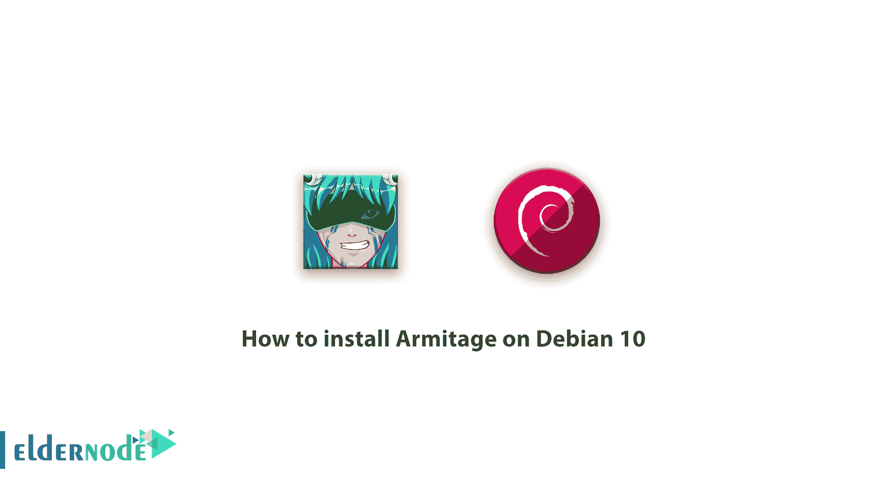
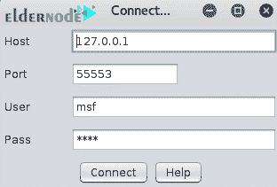
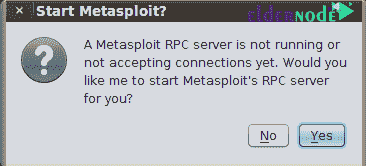
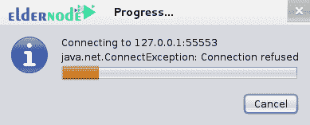
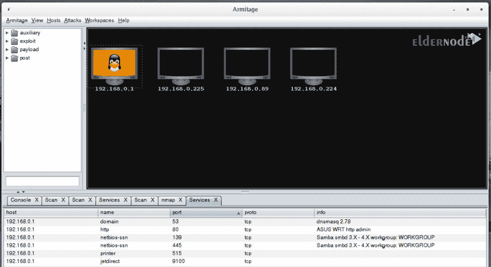
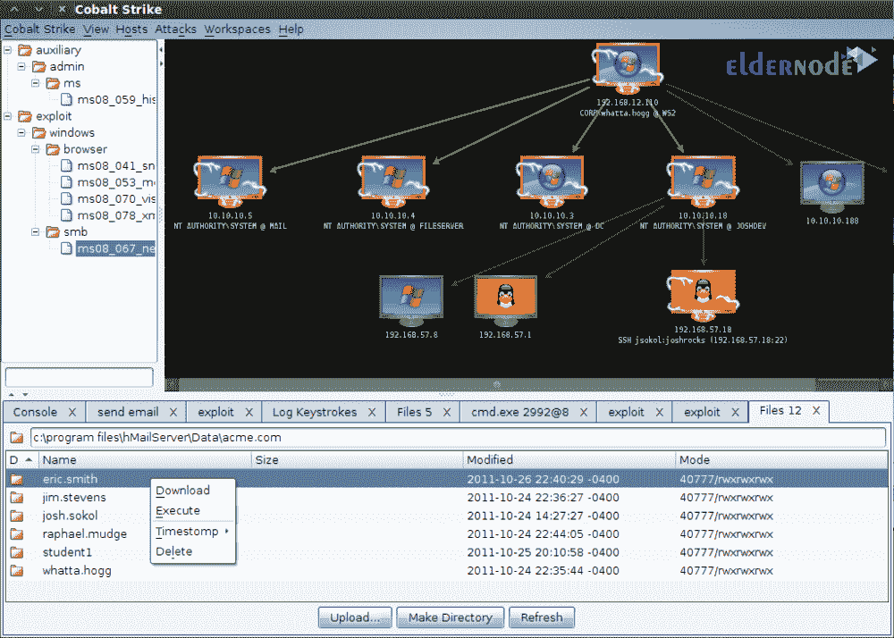

# 如何在 Debian 10 - Eldernode 博客上安装 Armitage

> 原文：<https://blog.eldernode.com/install-armitage-on-debian-10/>



Armitage 是一个用于渗透测试的框架，它允许你管理你的渗透测试过程，并以最好的方式完成它。该工具是 metasploit 的图形化版本，具有更加用户友好的环境。Armitage 对于安全专业人员来说是一个非常强大和流行的工具，当然对于新手来说也是如此，它有各种各样的漏洞。在这篇文章中，我们试图教你如何在 Debian 10 上安装 Armitage。如果您需要在[购买 Linux VPS](https://eldernode.com/linux-vps/) 服务器，可以访问 [Eldernode](https://eldernode.com/) 中的软件包。

## **Tuorial 如何在 Debian 10 上安装 Armitage**

### 阿米蒂奇有哪些用途？

**–**用于网页渗透测试

**–**能够在网络服务器和个人系统上进行渗透测试

**–**超过 500 个有效载荷

**–**易于使用且用户友好的图形

## 了解如何在 Debian 10 上安装 Armitage

Armitage 是 metasplit 的一个很棒的图形用户界面。这个工具是 Raphael Mudge 写的。加入我们这个教程的续篇，教你如何在 Debian 10 中安装 Armitage。

第一步，您必须使用下面的命令在 Debian 10 中下载并安装 Armitage:

```
apt-get install armitage
```

输入并执行上述命令后，Armitage 就成功安装了。在运行 Armitage 之前，必须确保 postgresql 数据库正在运行。

***注:*** 如果愿意，可以参考[如何在 Debian 10](https://blog.eldernode.com/install-postgresql-debian10/) 中安装 PostgreSQL 数据库的文章。

使用以下命令启动数据库:

```
service postgresql start
```

如果您得到一个丢失的数据库，您必须输入以下命令。yml 错误:

```
service metasploit start
```

需要注意的是，Armitage 不使用 Metasploit 服务。但是一旦启动， **database.yml** 文件就会为您的系统启动。所以，要处决阿米蒂奇就必须这么做。

```
# armitage
```

执行 Armitage 命令后，会出现如下所示的窗口。点击**连接**进入下一步:



在下一步中，将询问您是否希望 Metasploit 的 RPC 服务器启动？点击**是**:



如下图所示，进度条开始显示:



### 阿米蒂奇程序的主要环境

你现在将被带到 Armitage 程序的主环境。如下图所示:



程序顶部的工具栏中有选项，其应用如下:

***Armitage item:*** 在这个部分中您可以控制如何连接到应用服务器以及与图形显示或现有目标表相关的设置。

***查看项目:*** 在此部分，您可以添加控制台项目、凭证、下载、作业、战利品、脚本控制台或后台任务，并根据需要向应用环境添加报告。

***Host item:*** 在这个部分中，如果您已经在记事本中保存了 IP 号或目标地址，那么您可以通过 Import Hosts 选项调用 Armitage 环境。或者，您可以通过第二个添加主机选项手动输入目标 IP。

强化的另一个特点是使用了 **Nmap** 工具。你可以通过点击 **Nmap 扫描**使用不同的扫描来识别你的目标。也可以使用程序自带的工具(MSF Scans)扫描受害目标。

***攻击项:*** 如果你已经在应用环境中定义了目标 IP 或地址，Armitage 有能力自动为你的目标搜索合适的漏洞利用。

### 介绍 Armitage 程序的各种工具

现在我们去程序左边的工具栏，它包含了辅助库，漏洞，有效载荷，发布。



***辅助文件夹:*** 在这个库中你会看到带有 metasploit 的模块的所有辅助变量的列表。

***Metasploit 文件夹:*** 在这个库中，你会看到 Armitage 程序中所有漏洞的列表。在本节中，如何穿透目标，这取决于操作系统类型、开放端口、防火墙等参数。通过选择适当形式的利用。

***有效载荷文件夹:*** 在这个库中你会看到 Armitage 中所有有效载荷的列表。比如入侵之后，你想在目标端获得一系列的控制(比如访问命令行、FTP、数据库等。)有了这个库，你就可以进行你的操作了。

***Post 文件夹:*** 用于将漏洞利用模块发送到特定的目标服务器上，使用不同的应用程序。

***注:*** 在程序的左栏，你会看到你介绍给阿米蒂奇的目标 IP 列表。同样在底部工具栏中，主程序环境用于扫描和开发操作。

## 结论

Armitage 是一个用于渗透测试的框架，它允许你管理渗透测试过程，并以最好的方式完成它。事实上，Armitage 集成了您的 metasploit 渗透测试，满足了渗透测试不同阶段对不同工具的需求。在本文中，我们试图教你如何在 Debian 10 上安装 Armitage，并解释它的各种工具。