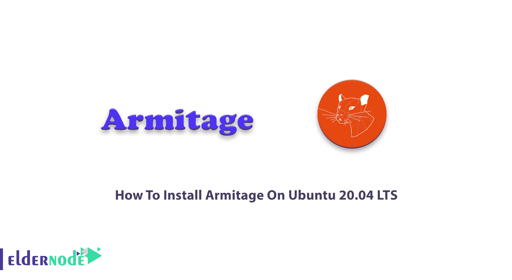
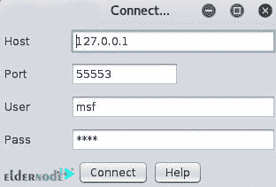

# 如何在 Ubuntu 20.04 上安装 Armitage LTS-elder node 博客

> 原文：<https://blog.eldernode.com/install-armitage-on-ubuntu-20-04/>



之前，您已经了解了这么多渗透测试工具。Armitage 是一个免费的开源网络安全工具，允许你管理你的渗透测试过程。Armitage 是一个 GUI 工具，用于在机器人的帮助下管理和执行所有任务。Metasploit 的这个图形版本有助于可视化目标，自动推荐合适的利用方式，并在框架中公开高级的利用后特性。对于安全专业人员和新手来说，Armitage 作为一个强大而流行的工具提供了各种利用。使用 Armitage 将帮助您理解黑客技术以及 Metasploit 的能力和潜力。在这篇文章中，你将学习如何在 Ubuntu 20.04 LTS 上安装 Armitage。如果您希望准备自己的 **[Ubuntu VPS](https://eldernode.com/ubuntu-vps/)** ，请依靠我们的技术团队，并在 [Eldernode 上注册您的订单。](https://eldernode.com/)

## **教程逐步在 Ubuntu 20.04 上安装 Armitage**

Armitage 由 Raphael Mudge 开发，因为它使用 Metasploit 作为后端，所以您需要在您的系统上有一个正在运行的 Metasploit 实例。Armitage 是一个可脚本化的红队协作工具。作为客户机和服务器，Armitage 允许红队进行协作。Armitage 客户端包可用于 Windows、macOS X、 [Linux](https://blog.eldernode.com/tag/linux/) ，包含在 [Kali Linux](https://blog.eldernode.com/tag/kali-linux/) 中，并附带安装的 Metasploit 框架。它不需要 Metasploit 框架的本地副本来连接到团队服务器。

### **阿米蒂奇特征**

Armitage 包括帮助您更好地管理目标的工具，这对于管理针对大量主机的攻击和侦察操作非常有用。它是构建在 Metasploit 框架之上的可脚本化的 red team 协作工具。安装 Armitage 允许您启动扫描和利用，获得利用建议，并使用 Metasploit 框架的 Meterpreter 的高级功能。以下是 Armitage 的特性列表:

–易于使用和用户友好的图形

–能够在网络服务器和个人系统上进行渗透测试

–用于网络渗透测试

–500 多种功能有效载荷

### **在 Ubuntu 20.04 上安装 Armitage 的先决条件**

为了让本教程更好地工作，请考虑以下先决条件:

_ 拥有 Sudo 权限的非 root 用户。

_ 要进行设置，请遵循我们在 Ubuntu 20.04 上的[初始服务器设置。](https://blog.eldernode.com/initial-server-setup-on-ubuntu-20/)

_ Metasploit 框架及其依赖项。

_ [PostgreSQL](https://blog.eldernode.com/tutorial-postgresql-installation-ubuntu-20/) 数据库

_ [Nmap](https://blog.eldernode.com/install-nmap-on-linux/)

_ Oracle 的 Java 1.7

## **在 Ubuntu 20.04 上安装 Armitage | Ubuntu 18.04**

Armitage 不仅集成了 Metasploit，还集成了其他工具，如用于高级端口扫描和枚举的 NMAP。在下面的指南中加入我们来回顾一下在 Ubuntu 20.04 上安装 Armitage 的过程。

首先打开阿米蒂奇的[官网](http://www.fastandeasyhacking.com/download/)下载包，解压包，移动解压后的包。

然后，检查我们上面提到的先决条件，并全部准备好。要安装 Metasploit，可以使用自动安装程序:

```
wget https://downloads.metasploit.com/data/releases/metasploit-latest-linux-x64-installer.run
```

```
wget https://downloads.metasploit.com/data/releases/metasploit-latest-linux-x64-installer.run.sha1
```

```
echo $(cat metasploit-latest-linux-x64-installer.run.sha1)' 'metasploit-latest-linux-x64-installer.run > metasploit-latest-linux-x64-installer.run.sha1
```

```
shasum -c metasploit-latest-linux-x64-installer.run.sha1
```

```
chmod +x ./metasploit-latest-linux-x64-installer.run
```

```
sudo ./metasploit-latest-linux-x64-installer.run
```

***注*** :上面的命令是针对 64 位的。对于 32 位版本，命令相同，但从文件名/URL 中删除了'-x64 ')

一旦 **PostgreSQL** 和 **Metasploit** 服务启动并运行，您就可以启动 Armitage 控制台了。所以，开放运行:

```
armitage
```

然后，可以看到如下图的窗口，按**连接**继续。



如果 Metasploit 没有运行，将提示您启动它。按下**是**并继续。


单击“是”后，应该会开始启动进程。


### **如何在 Ubuntu Linux 上使用 Armitage**

一旦 Armitage 控制台启动并运行，您就可以添加想要攻击的主机。点击*主机*；菜单，然后选择*添加主机*；选项。

***注*** :每行可以添加一台主机或多台主机

如果你已经很好地通过了所有提到的步骤，现在你可以在你的 [Ubuntu](https://blog.eldernode.com/tag/ubuntu/) 中开始使用 Armitage 了。Armitage 程序的主要环境如下所示。


## 结论

在本文中，您了解了如何在 Ubuntu 20.04 LTS 版上安装 Armitage。如果您希望利用主机上的漏洞，您必须与该主机建立连接。它被称为会话，你可以使用 Armitage 来知道如何处理会话。可以使用基于 Meterpreter 构建的图形来组织会议。如果你有兴趣了解更多，你可以找到我们关于如何在 Debian 10 上安装 Armitage 的相关文章。