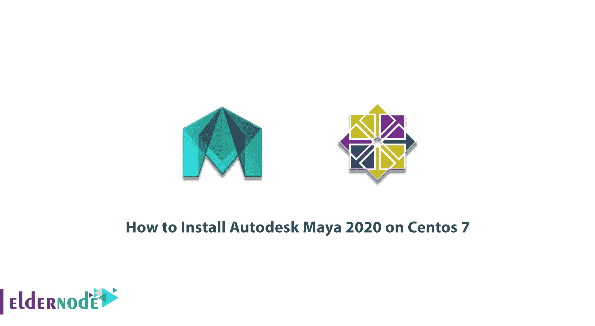

# 如何在 CentOS 7 - Eldernode 博客上安装 Autodesk Maya 2020

> 原文：<https://blog.eldernode.com/install-autodesk-maya-2020-on-centos-7/>



Autodesk Maya，也称为 Maya，是一款 3D 计算机图形软件，可以在 Windows、OS X 和 Linux 操作系统上运行。该软件最初由 Alias Systems 开发，但现在由 Autodesk 拥有和开发。Maya 软件用于创建交互式 3D 应用程序，如视频游戏、动画电影、电视剧或特殊效果。在本文中，我们尝试教您如何在 Centos 7 上安装 Autodesk Maya 2020。你可以访问 [Eldernode](https://eldernode.com/) 提供的套装来购买 [CentOS VPS](https://eldernode.com/centos-vps/) 服务器。

## **教程在 CentOS 7 上安装 Autodesk Maya 2020**

在本文的后续部分，请加入我们，了解如何在 Centos 7 上安装 Autodesk Maya 2020。

### **如何安装依赖项安装 Maya 2020**

第一步是使用以下命令安装 EPEL 存储库:

```
yum install epel-release
```

在第二步中，使用以下命令安装缺少的依赖项非常重要:

```
yum install mesa-libGLw
```

```
yum install libXp
```

```
yum install gamin
```

```
yum install audiofile
```

```
yum install audiofile-devel
```

```
yum install xorg-x11-fonts-ISO8859-1-100dpi
```

```
yum install xorg-x11-fonts-ISO8859-1-75dpi
```

```
yum install compat-openssl10
```

```
yum install libpng15
```

```
yum install libnsl
```

```
yum install python2
```

### 了解如何在 CentOS 7 上下载 Autodesk Maya

由于 Centos 7 上默认不安装 Python 2.7，因此您必须使用以下命令创建从 Python 到 Python 2.7 的站点链接:

```
sudo ln -s /usr/bin/python2.7 /usr/bin/python
```

现在您需要下载最新版本的 [Autodesk 许可服务包](https://knowledge.autodesk.com/search-result/caas/downloads/content/autodesk-licensing-service-download.html?_ga=2.94060122.615941238.1608659744-148105039.1608540818)并安装以下命令。请记住，您应该获得最新版本。

```
yum install adlmapps23-23.0.21-0.x86_64.rpm
```

```
yum install adsklicensing10.2.0.4231-0-0.x86_64.rpm
```

```
yum install adlmflexnetserverIPV6-23.0.21-0.x86_64.rpm
```

```
yum install adlmflexnetclient-23.0.21-0.x86_64.rpm
```

您应该检查授权服务是否处于活动状态(正在运行)。如果它未处于活动状态，您必须使用以下命令来执行此操作:

```
sudo systemctl status adsklicensing
```

## **在 CentOS 7 或** **CentOS 8** 上安装 Autodesk Maya 2020

做好必要的准备后，我们现在开始安装 Maya 2020。要在 Centos 7 上安装 Maya 2020，必须首先运行以下命令:

```
yum install Maya2020_64-2020.0-235.x86_64.rpm
```

现在我们到了必须向**广告许可服务**注册 Maya 的部分:

```
sudo /opt/Autodesk/AdskLicensing/10.2.0.4231/helper/AdskLicensingInstHelper register -pk 657L1 -pv 2020.0.0.F -el EN_US -cf /var/opt/Autodesk/Adlm/Maya2020/MayaConfig.pit
```

您可以通过运行以下命令来安装 **Bifrost** 2020:

```
yum install Bifrost2020-2.0.3.0-1.x86_64.rpm
```

您也可以使用以下命令在 Maya 2020 中安装**物质**:

```
yum install Substance_in_Maya-2020-2.0.3-1.el7.x86_64.rpm
```

注意，你必须[下载用于 Maya 2020 的 Arnold](https://www.arnoldrenderer.com/arnold/download/) ，然后安装它。也有必要使。运行可执行文件。

```
sudo ./MtoA-4.0.4.2-linux-2020.run
```

完成上述所有操作后，您将看到 Maya 2020 将启动，您可以登录。

## 结论

Autodesk Maya 软件用于创建 3D 主题，用于电影、电视、游戏开发和建筑。Maya 软件使用节点图形结构。场景是基于节点的，每个节点都有自己的特征和定制。因此，场景的视觉表示完全基于相互依赖彼此信息的互连节点网络。由于该软件的高人气，我们决定在本文中教你如何在 Centos 7 上安装 Autodesk Maya 2020。