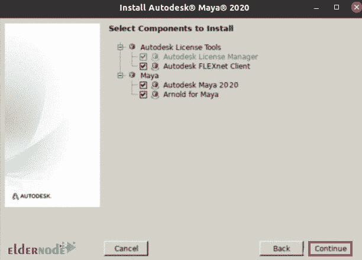

# 如何在 Ubuntu 20.04 上安装 Autodesk Maya 2020-elder node 博客

> 原文：<https://blog.eldernode.com/install-autodesk-maya-2020-on-ubuntu-20-04/>


Maya 2020 是 Autodesk 的一款功能强大的产品，是使用最广泛、最专业的动画软件和 3D 建模软件之一。Maya 是一个全面的软件，分为不同的部分。这些部分中的每一个都负责编辑和创建动画步骤之一，并最大限度地减少用户对额外软件的需求。该软件的另一个独特之处是用户可以开发软件。用户可以通过 C++、MEL 和 Python 编程语言开发软件，并添加软件中以前不存在的工具和功能。在本文中，我们试图向您学习如何在 Ubuntu 20.04 上安装 Autodesk Maya 2020。你可以在 [Eldernode](https://eldernode.com/) 看到购买 [Ubuntu VPS](https://eldernode.com/ubuntu-vps/) 服务器的套餐。

## **教程在 Linux Ubuntu 20.04 服务器上安装 Maya 2020**

该版本软件中添加的新功能包括时间编辑器，这是一个用于创建和编辑非线性和基于剪辑的动画的综合工具。同样，软件渲染系统和复杂序列的管理也变得简单多了。此外，通过改进 XGen 引擎，软件中增加了面部组件的高级设计和建模的可能性。

关注本文，了解如何在 [Ubuntu](https://blog.eldernode.com/tag/ubuntu/) 20.04 上安装 Autodesk Maya 2020。

### **如何安装依赖项安装 Maya 2020**

由于 Autodesk Maya 依赖于某些包和库，因此您需要按照以下步骤安装必要的依赖项。由于 Autodesk Maya 依赖于某些包和库，因此必须按照以下步骤安装必要的依赖项。此外，因为一些必需的库在 Ubuntu 20.04 存储库中不可用，所以有必要添加它们。

第一步是使用以下命令将 Ubuntu 16.04 存储库添加到 Ubuntu 20.04 存储库中:

```
$ echo 'deb http://archive.ubuntu.com/ubuntu xenial main restricted universe multiverse' | sudo tee /etc/apt/sources.list.d/xenial.list
```

将新的存储库添加到 Ubuntu 20.04 后，您需要更新它:

```
$ sudo apt update
```

此时，可以使用以下命令安装库了:

```
$ sudo apt install -y libtbb-dev libtiff5-dev libssl-dev libpng12-dev libssl1.1 gcc libjpeg62 libcurl4
```

在下一步中，您必须使用以下命令安装多媒体库文件:

```
$ sudo apt-get install -y libaudiofile-dev libgstreamer-plugins-base0.10-0
```

现在，您需要通过执行以下命令来安装图形库文件:

```
$ sudo apt install -y libglw1-mesa libglw1-mesa-dev mesa-utils
```

在这个阶段，是时候安装主要的 Microsoft True Type 字体了:

```
$ sudo apt install -y xfonts-100dpi xfonts-75dpi ttf-mscorefonts-installer fonts-liberation
```

出现以下屏幕后，使用**选项卡**键选择确定。然后你必须按下**回车**。


在下一个窗口中，您必须使用**选项卡**键，然后按**回车**接受最终用户许可协议。


现在，您需要使用以下命令安装其他必需的软件包:

```
$ sudo apt install -y csh tcsh libfam0 libfam-dev xfstt
```

由于 Ubuntu 存储库上没有 **libxp6 包**，您必须通过运行以下命令来下载所需的文件:

```
$ cd /tmp    $ wget http://launchpadlibrarian.net/183708483/libxp6_1.0.2-2_amd64.deb
```

现在您需要借助以下命令安装 **libxp6** :

```
$ sudo dpkg -i libxp6_1.0.2-2_amd64.deb
```

你应该知道 Maya 安装包在。rpm 格式，您应该将它们转换为。deb 格式。要安装外来程序，您必须在终端中运行以下命令:

```
$ sudo apt install -y alien elfutils
```

### **了解如何在 Ubuntu 20.04 上下载 Autodesk Maya**

要下载 Maya，必须遵循以下步骤:

```
$ cd ~/Downloads
```

将上述命令运行到所需目录后，您现在必须使用以下命令下载 **Autodesk Maya 安装程序**:

```
$ wget http://edutrial.autodesk.com/NET17SWDLD/2017/MAYA/ESD/Autodesk_Maya_2017_EN  _JP_ZH_Linux_64bit.tgz
```

下载 Autodesk Maya 安装程序后，您需要创建一个名为 **maya** 的目录来提取下载的安装文件:

```
$ mkdir maya
```

将 Maya 安装程序提取到新创建的文件夹中:

```
$ tar xvzf Autodesk_Maya_2017_EN_JP_ZH_Linux_64bit.tgz -C maya
```

在这一步中，要转换 Maya **。rpm** 安装文件到**。deb** ，你必须通过执行以下命令进入 **maya** 列表:

```
$ cd maya/
```

现在，您需要使用 Alien 程序将 Maya 安装程序文件转换为。deb 格式化并使用以下命令:

```
$ sudo alien –cv *.rpm
```

## **在 Ubuntu 20.04 上安装 Autodesk Maya 2020 LTS**

在做好准备工作后，我们现在已经到了主要阶段，即在 Ubunt 20.04 上安装 Autodesk Maya 2020。第一步是运行以下命令来安装我们在上一步中转换的文件:

```
$ sudo dpkg -i *.deb
```

然后，您需要在下一步中创建源文件:

```
$ echo "int main (void) {return 0;}" > mayainstall.c
```

现在，您需要通过运行以下命令来编译它:

```
$ gcc mayainstall.c
```

使用以下命令备份 **/usr/bin/rpm** 非常重要:

```
$ sudo mv -v /usr/bin/rpm /usr/bin/rpm.backup
```

备份后，现在需要运行以下二进制命令到/usr/bin/rpm:

```
$ sudo cp -v a.out /usr/bin/rpm
```

在此步骤中，必须运行以下命令来创建指向 Autodesk Maya 所依赖的所有必需库文件的符号链接:

```
$ sudo ln -s /usr/lib/x86_64-linux-gnu/libtbb.so /usr/lib/x86_64-linux-gnu/libtbb_preview.so.2 
```

```
$ sudo ln -s /usr/lib/x86_64-linux-gnu/libtiff.so /usr/lib/libtiff.so.3 
```

```
$ sudo ln -s /usr/lib/x86_64-linux-gnu/libssl.so /usr/autodesk/maya2017/lib/libssl.so.10 
```

```
$ sudo ln -s /usr/lib/x86_64-linux-gnu/libcrypto.so /usr/autodesk/maya2017/lib/libcrypto.so.10
```

到目前为止做得很好。现在，您可以使用以下命令轻松运行启动文件:

```
$ chmod +x setup
```

然后你需要**运行**Maya 安装程序:

```
$ sudo ./setup
```

通过执行上述命令，将出现安装窗口，您应该通过单击**继续**继续:


在**许可协议**窗口，您必须先选择您的**国家或地区**，接受协议后，点击**继续**:


在下一步中，选择许可证类型后，输入相关信息并点击**继续**:


下一个窗口的名称是**选择要安装的组件**。选择想要的组件，点击**继续**到达最后一步。



几分钟后，安装完成，点击**完成**，安装过程成功完成。

## 结论

Autodesk Maya 是一款专业软件，用于创建 3D 图像和动画、特效、电脑游戏和后期制作项目。凭借其用于动态模拟、动画和渲染的强大的新工具，该套件为您提供了新水平的创造力，因此您可以轻松地处理复杂的项目。在本文中，我们试图一步一步地教你如何在 Ubuntu 20.04 上安装 Autodesk Maya 2020。