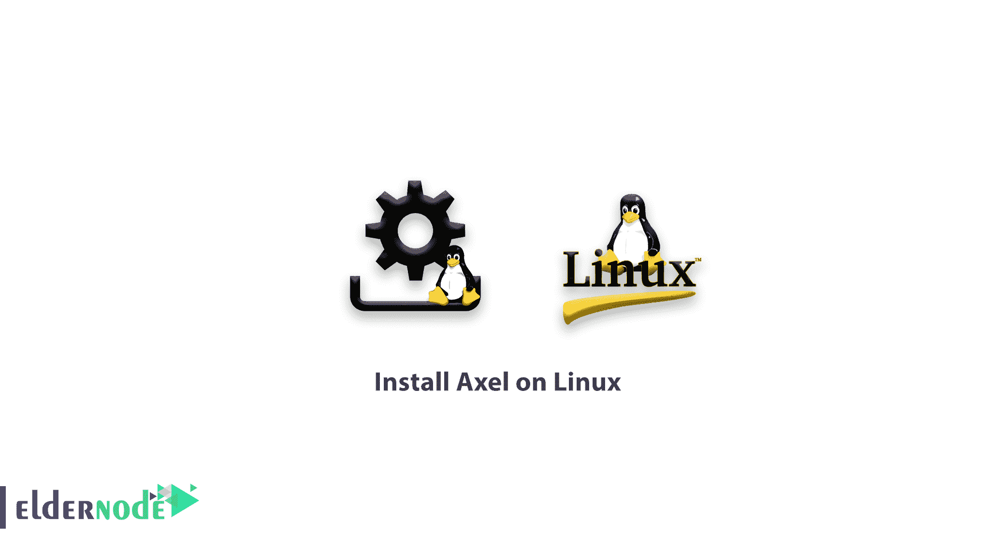

# 如何在 Linux 上安装 Axel-Linux 下载管理器工具

> 原文：<https://blog.eldernode.com/install-axel-on-linux/>



如果你喜欢下载和试用各种 Linux 发行版，请和我们一起学习如何在 Linux 上安装 Axel。 [Axel](https://github.com/axel-download-accelerator/axel) 是一个有趣的命令行下载管理器，它为你带来了许多功能。你会看到如何容易安装是这种轻而易举的工具。在本教程中，我们将向您展示如何在 **CentOS 6** 和 **7** 、 **Debian 7** 和 **8、**和 **Ubuntu 14** 和 **16** 上安装 Axel。一般来说，用亚历克斯代替 WGET 是个好主意。

## 如何在 Linux 上安装 Axel

注意:我们假设你有 root 权限，否则你可以用“ sudo 启动命令。

**1-** 如果你使用的是 **Debian** 或者 **Ubuntu** 发行版，你可以使用下面的命令来安装 Axel。

```
Apt-get install axel
```

你用上面的 **Axel 命令**和所有安装先决条件安装它。

**2-** 要在 CentOS 6/7 发行版上安装 Axel，可以添加 **Epel** 库并安装。

```
Yum install epel-release  Yum install axel
```

**注意** :您可以使用 **RPM 包**安装 Axel，如下所示。

```
**rpm -ivh ftp://fr2.rpmfind.net/linux/dag/redhat/el6/en/x86_64/dag/RPMS/axel-2.4-1.el6.rf.x86_64.rpm**
```

### 

[购买 CentOS 虚拟专用服务器](https://eldernode.com/centos-vps/)

### 阿克塞尔检测

要用**轴**测试下载速度，以这种方式使用以下测试的下载链接。

```
axel http://cachefly.cachefly.net/100mb.test
```

**注意** :您可以使用以下命令了解更多关于 Axel 的功能。

```
axel --help
```

输出命令:

```
Usage: axel [options] url1 [url2] [url...]    --max-speed=x -s x Specify maximum speed (bytes per second)  --num-connections=x -n x Specify maximum number of connections  --output=f -o f Specify local output file  --search[=x] -S [x] Search for mirrors and download from x servers  --header=x -H x Add header string  --user-agent=x -U x Set user agent  --no-proxy -N Just don't use any proxy server  --quiet -q Leave stdout alone  --verbose -v More status information  --alternate -a Alternate progress indicator  --help -h This information  --version -V Version information
```

**还有** 在 Axel 中，可以停止下载并恢复下载。要停止下载，可以使用 **Ctrl + C** 键，要重新开始下载，必须**重新运行**命令。这样文件将从停止的地方继续下载，而不是重新开始下载。

替换阿克塞尔而不是 **WGET。**

#### 如果你习惯于使用“ **WGET** ”进行下载，那么使用别名来启动 Axel 下载会更方便。您需要使用 Wget 命令启动 Axel 下载。**第一，**开**。bashrc** 文件。

将以下命令添加到文件的**结尾**。

```
Nano .bashrc
```

**使用 **Ctrl + o** 和 **Ctrl + x** 键保存** 的更改，并退出文件。

```
'alias wget='axel
```

**注意** :如果想让**别名**被其他用户使用，必须对每个用户做以上步骤。

**最后** ，需要使用下面的命令对其进行修改。bashrc 文件应用。

来源~。/bashrc

**现在**你可以使用 Axel 的 **WGET** 命令下载你的文件。

亲爱的用户，我们希望这篇教程能对你有所帮助，如果你有任何问题或想查看我们的用户关于这篇文章的对话，请访问[提问页面](https://eldernode.com/ask)。也为了提高你的知识，有这么多有用的教程为[老年节点培训](https://eldernode.com/blog/)准备。

**也，见**

##### **[在 Linux 上安装 ClamAV 杀毒](https://eldernode.com/install-clamav-antivirus-on-ubuntu/)**

**[如何修复 CentOS 7 的 EPEL 库错误](https://eldernode.com/how-fix-epel-repository-error-centos-7/)**

**[如何在 CentOS 6 Linux 上安装 Webmin](https://eldernode.com/install-webmin-centos-6/)**

**[How to install Webmin on CentOS 6 Linux](https://eldernode.com/install-webmin-centos-6/)**