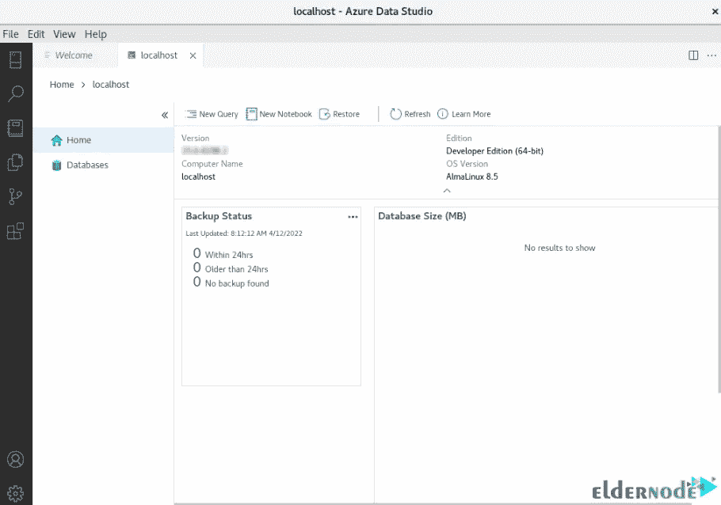

# 如何在 AlmaLinux 8 - Eldernode 博客上安装 Azure Data Studio

> 原文：<https://blog.eldernode.com/install-azure-data-studio-on-almalinux-8/>


SQL Operations Studio 由微软推出，用于连接数据库和编写查询等功能。这个工具的新版本是 Azure Data Studio，这是一个用于编写和编辑数据库查询的轻量级环境。本文将教你如何在 AlmaLinux 8 上安装 Azure Data Studio。如果你想购买的话，可以在 [Eldernode](https://eldernode.com/) 网站上查看 [**Linux VPS**](https://eldernode.com/linux-vps/) 服务。

## **教程在 AlmaLinux 8 上安装 Azure Data Studio**

### **什么是 Azure Data Studio？**

Azure Data Studio 是一个免费的、轻量级的、跨平台的数据库工具，用于处理 SQL Server 实例。它最初被称为 SQL Operations Studio，包括一个集成的 T-SQL 编辑器、服务器连接管理器、内部终端、版本控制支持等等。该软件旨在使日常数据库开发、查询和任务管理比 Microsoft SQL Server Management Studio 软件更容易，并且具有内置的查询结果集图表和可自定义的仪表板。Azure Data Studio 提供了一个具有智能感知、代码片段、源代码控制集成和集成终端的现代编辑器。

### **蔚蓝数据工作室特色**

–集成终端

–可定制的服务器和数据库仪表盘

–带智能感知的 SQL 代码编辑器

–智能 SQL 代码片段

–可扩展性和扩展创作

–连接管理

## **在 AlmaLinux 8 上安装 Azure Data Studio**

### **如何在 AlmaLinux 8 上使用 Azure Data Studio**

有两种方法可以启动 Azure Data Studio。您可以使用以下命令或从**应用程序菜单**:

```
azuredatastudio
```

它将如下开始。现在您需要连接到一个 **SQL 服务器**。如果你没有，使用我们的教程[在 AlmaLinux](https://blog.eldernode.com/install-and-use-sql-server-on-almalinux/) 上安装 SQL Server。您可以通过点击**创建连接**来连接到数据库:


然后提供您的 SQL server 详细信息，并点击**连接**:


然后，您应该会看到以下关于成功身份验证的页面:



如果你想**创建一个数据库**，只需在服务器上点击右键，选择**新建查询**:


并输入以下命令，点击**运行**:

```
USE master  GO  IF NOT EXISTS (   SELECT name   FROM sys.databases   WHERE name = N'TestDB'  )   CREATE DATABASE [TestDB];  GO  IF SERVERPROPERTY('ProductVersion') > '12'   ALTER DATABASE [TestDB] SET QUERY_STORE=ON;  GO
```

然后刷新数据库到**见数据库**:


您应该**在 TestDB** 中为连接的数据库或 master 创建一个表。为此，转到创建的 TestDB 上下文并运行以下命令:

```
-- Create a new table called 'Customers' in schema 'dbo'  -- Drop the table if it already exists  IF OBJECT_ID('dbo.Customers', 'U') IS NOT NULL   DROP TABLE dbo.Customers;  GO  -- Create the table in the specified schema  CREATE TABLE dbo.Customers  (   CustomerId int NOT NULL PRIMARY KEY, -- primary key column   Name nvarchar(50) NOT NULL,   Location nvarchar(50) NOT NULL,   Email nvarchar(50) NOT NULL  );  GO
```

运行该命令后，**右键单击表格上的**，用**刷新**:


您可以通过运行以下查询在上面创建的表中**插入行:**

```
-- Insert rows into table 'Customers'  INSERT INTO dbo.Customers   ([CustomerId], [Name], [Location], [Email])  VALUES   ( 1, N'your_customer_name', N'your_customer_location', N''),   ( 2, N'your_customer_name', N'your_customer_location', N'your_customer_Email_Address'),   ( 3, N'your_customer_name', N'your_customer_location', N'your_customer_Email_Address'),   ( 4, N'your_customer_name', N'your_customer_location', N'your_customer_Email_Address')  GO
```

现在，您应该运行以下查询:

```
-- Select rows from table 'Customers'  SELECT * FROM dbo.Customers;
```

输出应该如下所示:


就是这样！

结论

## Azure Data Studio 是为现代软件工程师或数据分析师构建的，允许您管理基于云的和本地的数据库服务器。您可以将它用于基于云的数据库和本地数据库。本文以视频的形式教你如何在 AlmaLinux 8 上安装 Azure Data Studio。我希望这篇教程对你有用。

Azure Data Studio is built for the modern-day software engineer or data analyst and allows you to manage your cloud-based and local database servers. You can use it for both cloud-based and on-prem databases. This article taught you How to Install Azure Data Studio on AlmaLinux 8 As a video. I hope this tutorial was useful for you.