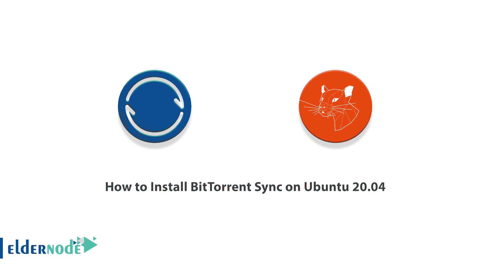

# 如何在 Ubuntu 20.04 - Eldernode 博客上安装 BitTorrent Sync

> 原文：<https://blog.eldernode.com/install-bittorrent-sync-on-ubuntu/>



随着移动设备和永久连接的出现，云中的数据使用量增加了。不受你有效控制的数据。该住宅由私人公司控制，其安全性和隐私一直受到质疑。Dropbox、Google Drive、SkyDrive 或 iCloud 等操作系统是当前最广泛使用的数据共享方法。然而，所有这些都是由不保证这些数据准确性的公司控制的。如果你不希望技术的进步以牺牲你的隐私为代价，优先考虑的是寻找能给你完全控制和隐私的选项。BitTorrent 似乎已经找到了一种方法来提供专有云的替代方案。在本文中，我们将教你如何在 Ubuntu 20.04 上安装 BitTorrent Sync。如果你想买一个 [Ubuntu VPS](https://eldernode.com/ubuntu-vps/) 服务器，你可以在 [Eldernode](https://eldernode.com/) 看到可用的包。请加入我们。

## **如何在 Ubuntu 20.04 上安装 BitTorrent Sync**

BitTorrent Sync 是一款非常棒的工具，可用于共享文件夹、同步文件夹、通过互联网在多个设备之间传输大文件。也适合组织数据支持版本。在下一节中，我们将向您介绍 BitTorrent Sync 及其工作原理。然后，在介绍完所需的先决条件后，我们将一步步教你如何在 [Ubuntu](https://blog.eldernode.com/tag/ubuntu/) 20.04 上安装 BitTorrent Sync。最后，我们将解释如何设置和运行 BitTorrent 同步。请继续关注本文的其余部分。

### **什么是 BitTorrent Sync，它有什么作用？**

**BitTorrent Sync** 使用 P2P 协议同步文件。当两台设备配置为同步时，它们使用 UDP、NAT 和 UPnP 直接相互连接。因此，它不依赖于必须将文件存储在云中的第三方。如果网络上的两个设备都在同一个位置，BitTorrent Sync 会使用该网络更快地进行同步。

BitTorrent 同步从一个简单的前提开始:没有专有接口或云的共享和同步文件。与 Dropbox 不同，这些文件不会通过我们无法控制的内存。

它目前在大多数流行的操作系统上非常流行，包括 [Windows](https://blog.eldernode.com/tag/windows/) 、OSX、 [Linux](https://blog.eldernode.com/tag/linux/) ，有一个专门针对 NAT 服务器的版本，特别是针对公司的。

在使用方面，BitTorrent Sync 与你所熟悉的程序和服务非常相似。文件可以共享，没有大小和速度的限制。依赖 P2P 协议是我们唯一的带宽限制。这些文件是用私人加密代码生成的，随机分布在网络上，只有你可以访问它们。

### **要求在 Ubuntu 20.04 上安装 BitTorrent Sync**

在我们教你如何在 Ubuntu 20.04 上安装 BitTorrent Sync 之前，你需要提供必要的先决条件。这些先决条件是:

_ 访问 **Ubuntu VPS 服务器**

_ [Putty SSH 客户端](https://www.chiark.greenend.org.uk/~sgtatham/putty/latest.html)

## **在 Ubuntu 20.04 上安装 BitTorrent Sync**

在这一节，我们想教你如何一步一步地在 Ubuntu 20.04 上安装 BitTorrent Sync。第一步是使用 Putty SSH 客户端登录到您的 Ubuntu VPS 服务器。

登录到服务器后，您必须首先使用以下命令**安装 Python 特性**:

```
apt-get -y install python-software-properties
```

在下一步中，您需要使用以下命令**添加 BitTorrent 同步存储库**:

```
add-apt-repository ppa:tuxpoldo/btsync
```

现在，您需要通过执行以下命令来应用您所做的更改，从而更新包:

```
apt-get update
```

最后，您可以使用以下命令轻松地**安装 BitTorrent Sync** :

```
apt-get -y install btsync
```

### **如何在 Ubuntu 20.04 上设置 BitTorrent 同步**

要在 Ubuntu 20.04 上启动 BitTorrent Sync，您需要安装菜单。为此，只需遵循以下步骤:

1_ 第一步，您必须从列表中选择“ **btsync** ”用户。

2_ 然后，您必须在下一步中为同步守护程序组选择“**默认**”。

3_ 在第三部分，你必须将 niceness 设置为 0。

***注意:*** 如果你的样本中有额外的 IP，打回车到“ **0.0.0.0** 就好了。

4_ 第四步，你要设置端口监听。请注意，默认情况下，此端口为 8888。

我们建议回答问题“【BitTorrent 同步只允许 SSL 吗？选择**没有>没有**。

有趣的是，你可以创建一个目录来存储你的同步文件。如下例所示，使用了 **/btsync** :

```
mkdir /btsync
```

您还可以使用以下命令为 **btsync 用户**配置所有权:

```
chown btsync /btsync
```

最后可以通过 **http://(服务器** **IP** **地址):8888** 访问控制面板。

## 结论

BitTorrent Sync 尚未提供与 Dropbox 等服务的集成，但在共享和同步文件时效果非常好。用移动设备实现可以将这种新的服务带到竞争水平，具有很强的独立性和安全性。在这篇文章中，我们试图教你如何在 Ubuntu 20.04 上安装 BitTorrent Sync。

[yasr _ visitor _ votes size = " medium "]