# 如何在 Windows RDP - Eldernode 博客上安装 Bitwarden

> 原文：<https://blog.eldernode.com/install-bitwarden-on-windows-rdp/>

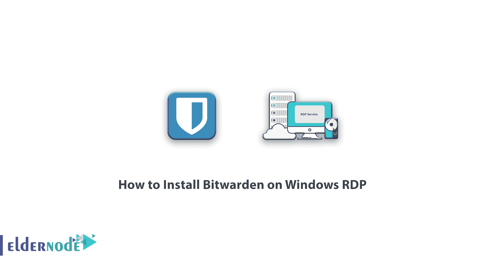

了解如何在 Windows RDP 上安装 Bitwarden。如今在网络空间，密码盗窃已经成为一个严重的问题。因此您使用的网站和应用程序每天都会受到攻击。在此类攻击之后，可能会出现安全漏洞，您的密码可能会被窃取。现在，如果你对不同的账户使用相同的密码，黑客将很容易进入你的电子邮件、银行账户和其他重要账户。在本文中，我们试图向您介绍 Bitwarden，并教您**如何在 Windows RDP** 上安装 Bitwarden。如果你需要购买 [RDP 管理](https://eldernode.com/buy-rdp/)服务器，你也可以在 [Eldernode](https://eldernode.com/) 看到可用的包。

## 教程在 Windows RDP 上安装 Bitwarden

### bit warden 及其特性介绍

如今，随着对互联网用户帐户攻击的增加，安全专家建议用户为他们的在线帐户使用不同的随机密码。但问题是，这些不同的密码是怎么记住的？BitWarden 是一个免费的开源工具，用来修复这类问题。换句话说，Bitwarden 可以帮助你生成和管理安全的密码。在下文中，我们将向您介绍 BitWarden 软件的一些最重要的功能。

#### 1。同步所有设备

通过名为云同步的安全工具，Bitwarden 允许用户从任何设备访问他们的数据，如笔记本电脑、手机或平板电脑。事实上，所有用户信息在从用户设备发送之前都是加密的，只有用户可以访问这些信息。正因如此，即使 Bitwarden 团队想要，他们也将无法查看用户信息。在 Bitwarden 中，用户的信息用强大的算法加密。

#### 2。Bitwarden 的访问和使用

如果一个密码管理软件不容易获得，它就没有用。因此，Bitwarden 为用户提供了各种访问其软件的方法。开始使用 Bitwarden 的第一步是创建一个帐户。要在 [Windows](https://blog.eldernode.com/tag/windows/) 、Mac 和 [Linux](https://blog.eldernode.com/tag/linux/) 操作系统上使用 Bitwarden，您可以在每个操作系统上使用桌面应用程序。Bitwarden 有一个几乎适用于所有浏览器的特殊插件，用户可以在浏览器中安装和使用它，使他们的浏览更加安全。

***注:*** 当用户无法访问自己的任何个人设备，而正在使用他人的个人电脑时，他们可以通过网络访问自己的 Bitwarden，无需任何应用程序或插件。

#### 3。开源免费

Bitwarden 团队认为，Bitwarden 最重要的特点之一就是开源。所以源代码透明对于像 Bitwarden 这样的软件是绝对必要的。因此，BitWarden 是完全开源的软件，其源代码在 [GitHub](https://github.com/bitwarden) 上，每个人都可以查看、修改并参与其开发。

下面列出的主要 Bitwarden 功能可供用户免费使用:

**–**访问并安装所有 Bitwarden 应用程序

**–**在所有用户的设备上无限制同步

**–**无限储存物品

**–**添加登录、密件和银行卡项目

**–**两步认证

**–**安全强密码随机生成器

**–**定制您的个人服务器以使用 Bitwarden 功能

## 如何在 Windows RDP 上安装和配置 Bitwarden

在本节中，我们将教你如何在 Windows RDP 上安装 Bitwarden。要安装 Bitwarden，你首先需要去 Bitwarden 网站**创建一个账户**。第一步，点击**创建你的免费账户**。

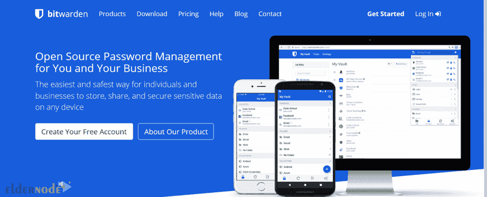

在打开的页面中，填写要求的字段。然后通过选中此框选中**…**选项，并点击**提交**创建您的帐户。

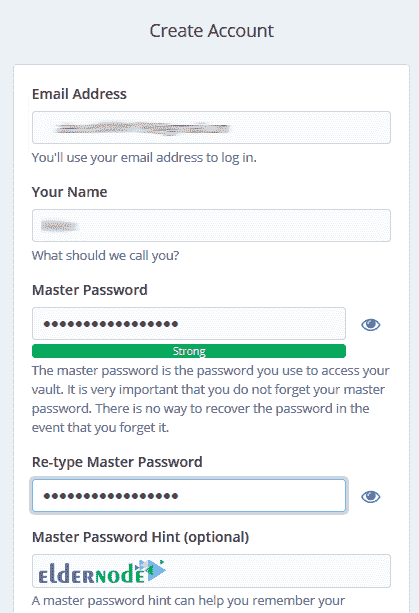

*

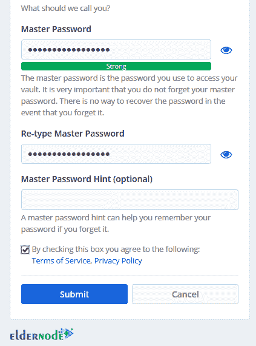

在下一步中，您将进入以下页面。输入**邮箱**和**主密码**后，点击**登录**进入你的仪表盘。

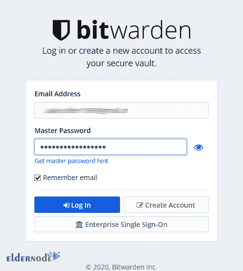

*

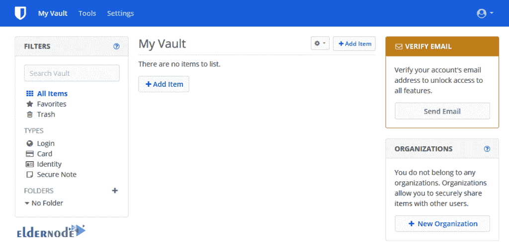

现在你已经创建了你的用户账户，你可以在 **Windows** 、 **macOS、**和 **Linux** 上安装 Bitwarden。也可以在自己喜欢的浏览器上安装 Bitwarden 扩展。为此，请访问 Bitwarden 网站并选择**下载**选项卡。

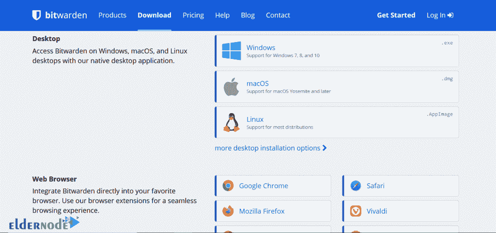

接下来，我们将教你如何在谷歌 Chrome 浏览器中安装 Bitwarden 扩展。为此，在**网络浏览器**部分点击**谷歌浏览器**。

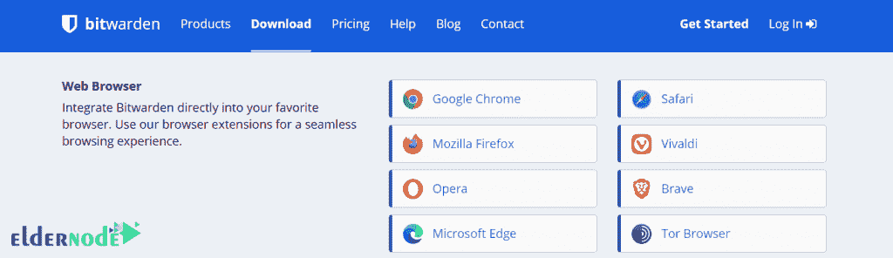

在下一个屏幕上，点击**添加到 Chrome** 。

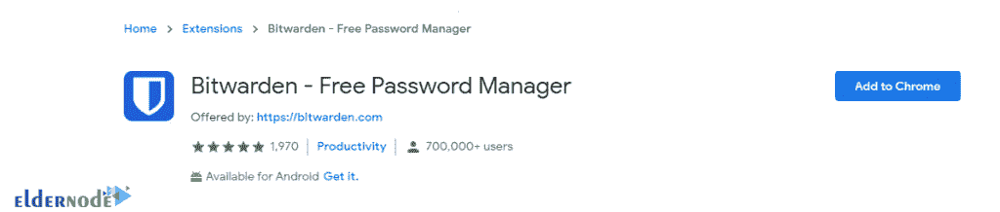

然后点击**添加分机**。

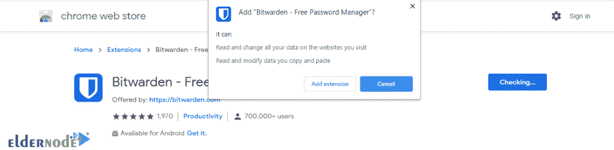

您将会看到 Bitwarden 图标出现在右上角。但是现在已经关了。

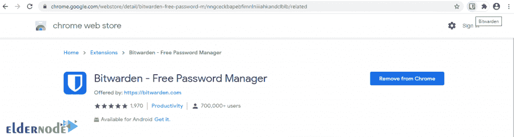

要激活它，您必须登录您的帐户。点击 **Bitwarden 图标**登录您的账户。在打开的窗口中，点击**登录**。

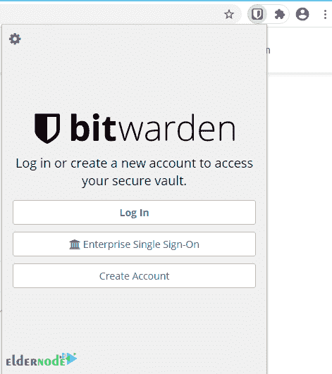

要进入，输入电子邮件和主密码，点击**登录**。

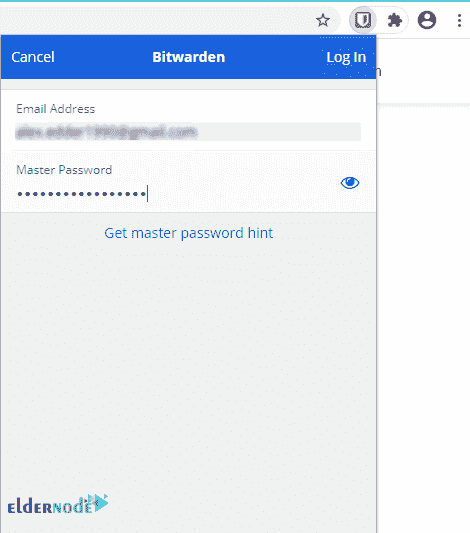

当图标变成蓝色时，你可以看到 Bitwarden 扩展已经被成功安装了。

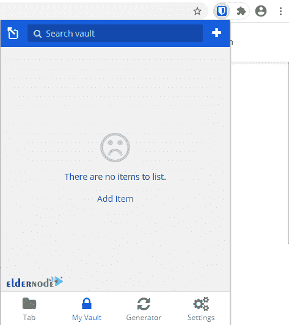

## 结论

Bitwarden 是最简单的密码管理应用程序之一。这个应用程序是免费的，是密码管理的好选择。高级用户喜欢阅读代码，甚至可以在他们的服务器上托管应用程序。在本文中，我们首先尝试向您介绍 Bitwarden 密码管理程序。还教了如何在 Windows RDP 上安装 Bitwarden 和在 Chrome 浏览器上安装它的扩展。