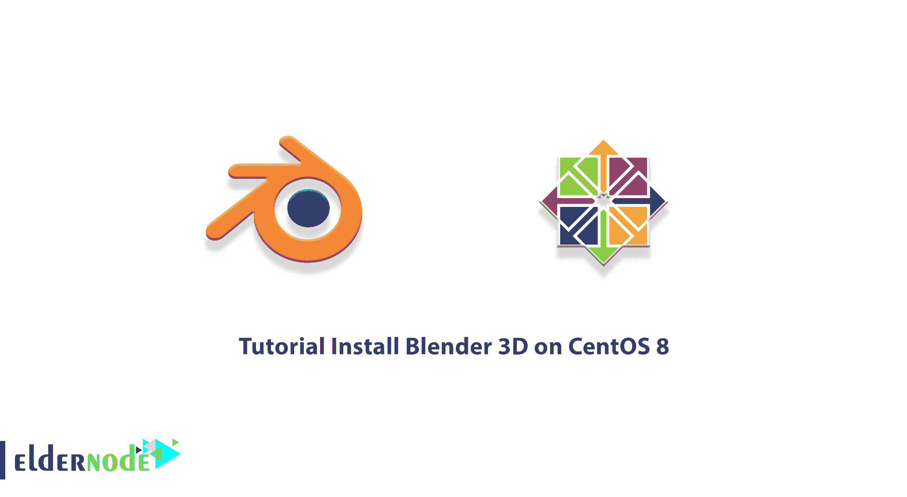
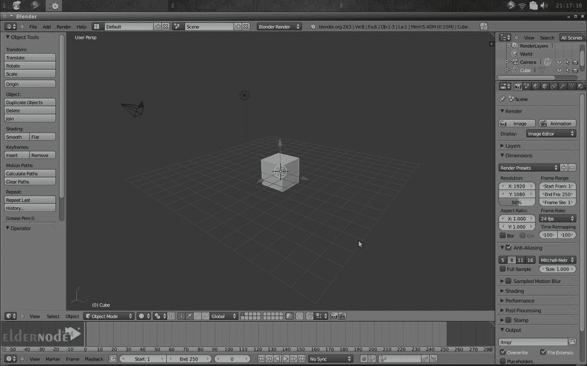

# 教程在 CentOS 8 - Eldernode 博客上安装 Blender 3D

> 原文：<https://blog.eldernode.com/install-blender-3d-on-centos-8/>



Blender 是一个计算机图形程序，允许您使用 3D 几何图形制作高质量的图像和动画。3D 计算机图形无处不在。几乎每部主要的电影或电视节目都包含某种 3D 电脑图形和动画。甚至体育赛事！密切关注显示分数或玩家姓名的动画。而且不仅仅是电影电视。3D 图形在视频游戏、工业设计、科学可视化和建筑中发挥着重要作用。Blender 是这些流行的 3D 图形软件之一，可以用来做所有这些事情。在这篇文章中，我们将一步一步地教你关于**教程在 CentOS 8** 上安装 Blender 3D。如果你想购买一台 [CentOS VPS](https://eldernode.com/centos-vps/) 服务器，你可以访问 [Eldernode](https://eldernode.com/) 中提供的软件包。

## **如何在 CentOS 8 上安装 Blender 3D**

Blender 有一些令人惊叹的功能，比如生成 3D 内容。该软件提供了广泛的基本工具，包括建模、渲染、动画和锻造、视频编辑、VFX、合成、文本创建和许多其他模拟形式。混音器工具是一个跨平台工具，与所有主要操作系统的无缝 OpenGL GUI 结合使用。它还可以使用 [Python](https://blog.eldernode.com/python-3-9-on-eldernode-linux/) 脚本进行定制，并具有高质量的 3D 架构，允许快速高效地创建工作流。

Blender 区别于其他类似 3D 软件的一点是它是免费的，并且是开源的。免费和开源意味着你不仅可以去 Blender 网站免费下载整个程序，还可以免费下载源代码。

对于大多数应用程序，源代码是一个完全受保护的秘密，只有某些人可以看到和修改。但是 Blender 是开源的，所以任何人都可以看到程序的源代码并对其进行修改。好处是不用有程序后面的程序和密钥，Blender 可以被全世界的程序员(甚至非程序员)改进！

在这篇文章的续篇中，加入我们来教你如何在 [CentOS](https://blog.eldernode.com/tag/centos/) 8 上安装 Blender 3D。

### **什么是搅拌机 3D**

Blender software 是一个免费的开源 3D 计算机图形软件集合。该软件用于创建动画电影、视觉效果、艺术、3D 打印模型、运动图形、3D 交互式应用程序、虚拟现实和计算机游戏。

Blender 的功能包括 3D 建模、UV 展开、纹理、光栅图形编辑、流体和烟雾模拟、粒子模拟、软体模拟、雕刻、动画、种族转换、渲染、运动图形、电影编辑和合成注释。

Blender 是用 C，C ++，Python 写的。应该注意的是，该软件还允许用户用任何编程语言为 Blender 编写自定义扩展。

在下一节中，我们将向您介绍 Blender 软件的一些基本功能。请加入我们。

### **Blender 3D 应用**

有很多免费的 3D 软件可以下载。Blender 在 3D 电影和动画领域有很多应用。以下是搅拌机的一些惊人用途:

**1。渲染**

使用这个软件，你可以创建图像。但是请注意，在这个程序中有一个称为 cycles 的特性，您可以使用它在屏幕上创建渲染。该选项有助于获得更真实的图像。

**2。液体模拟**

您可以模拟液体飞溅、巧克力倾倒和牙膏溢出。流体构成物理混合器系统的一部分，并通过创建曲面网格来帮助模拟流体。你也可以在这个软件中模拟烟雾(香烟)。

**3。视频编辑**

Blender 是一个非线性视频编辑器。blender 可以让你正常编辑视频。允许您将剪辑或照片添加到时间线、剪切部分、创建帧等等。

**4。组合**

在“合成器”区域，可以访问不同的渲染层。然后把它们结合起来，你就可以对元素有更多的控制。您可以添加有趣的颜色，给图像添加火焰和亮度，添加模糊运动等等。

**5。控制摄像机并跟踪运动**

搅拌器帮助你为你的图像创建一条运动线，并创建一种运动图像。当然这个功能在搅拌机里不是很强很专业，但是很大程度上可以满足你的欲望。

**6。建造海洋**

你可以用胡迪尼海洋工具包创造一个海洋。还要控制波的大小和频率，功率，风速，然后在搅拌机里运转。在搅拌机中，你可以调整每个波浪上的泡沫量，也可以通过添加其他地图来为你的海洋添加更多细节。

## **在 CentOS 8 |** **CentOS 7** 上安装 Blender 3D

在你通过前面的步骤完全熟悉 Blender 之后，现在我们要教你如何在 CentOS 8 上安装 Blender 3D。您可以按照以下步骤在 CentOS 8 上轻松安装 Blender 3D。

在第一步中，您需要使用以下命令**安装 Epel** :

```
sudo yum install epel-release
```

然后，您可以使用以下命令安装 Snapd:

```
sudo yum install snapd
```

现在，需要使用以下命令来启用管理主 snap 通信套接字的 systemd 单元:

```
sudo systemctl enable --now snapd.socket
```

您可以输入以下命令来启用 snap 支持，以便在 **/var/lib/snapd /snap** 和 **/snap** 之间创建符号链接:

```
sudo ln -s /var/lib/snapd/snap /snap
```

您必须**重启**系统一次，您所做的更改才会生效。

最后，您可以通过运行以下命令在您的系统上安装 Blender :

```
sudo snap install blender --classic
```

### **如何在 CentOS 8 上使用 Blender 3D**

在 CentOS 系统上成功安装 Blender 3D 后，在本节中，我们将向您介绍该软件的环境。



正如你在上面的图像中看到的，这个软件在左右两边有一个工具栏，文件操作在顶部，时间线在底部，3D 视图在中间。

在该软件中，您可以按住鼠标中键并移动鼠标来旋转 3D 视图。也可以按住 Shift +鼠标中键上下移动或向后移动鼠标。另一件事是使用滚轮来放大和缩小。

当你想选择一个对象时，你必须右击它。也可以在对象外单击鼠标右键取消选择。要选择多个对象，请按住“SHIFT”并选择对象。

请注意，如果您按下“A ”,将会选择和取消选择所有项目。需要注意的是，当你选择某样东西时，它会以橙色高亮显示。

## 结论

Blender 拥有广泛的资源，这使得它非常适合几乎任何类型的媒体输出。由世界各地的个人和工作室用于业余项目、商业广告和电影。在本文中，我们试图一步一步地教你如何在 CentOS 8 上安装 Blender 3D。如果你愿意，你可以参考文章如何在 Windows 10 RDP 上安装 Blender 3D。