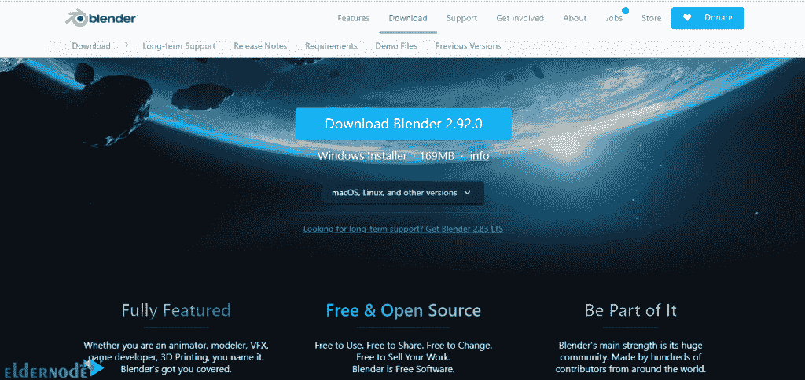

# 如何在 Windows 10 上安装 Blender 3D RDP-elder node 博客

> 原文：<https://blog.eldernode.com/install-blender-3d-on-windows-10/>

Blender 是一个跨平台软件，可以在 Windows、Linux 和 macOS 操作系统上运行。与其他 3D 设计套件和模型相比，它还具有相对少量的内存和所需的驱动器。它的界面使用 OpenGL 在所有支持的硬件和平台上提供一致的体验。作为一个在 GNU 通用公共(GPL)许可下的基于社区的项目，普通公众能够对其基础代码进行大小更改，从而带来新的特性、错误修复和更好的功能。因此，您可以帮助开发一个强大的协作工具。在这篇文章中，我们将教你如何在 Windows 10 RDP 上安装 Blender 3D。需要注意的是，如果你想购买一台 [Windows VPS](https://eldernode.com/windows-vps/) 服务器，你可以访问 [Eldernode](https://eldernode.com/) 中提供的软件包。

## **教程在 Windows 10 上安装 Blender 3D RDP**

Blender 有各种各样的工具，适用于几乎任何类型的媒体制作。世界各地的人们和电影公司用它来制作娱乐项目、商业和特别电影。

此外，如果你打算做一个游戏，Blender 是一个很好的选择。对于游戏或原型的最初开发，Blender 有一个内部游戏引擎。就学习速度而言，你可能在 Blender 中比在其他 3D 程序中移动得更快，但它也有一个可比的学习曲线。

在下一节中，我们将讨论 Blender 的特性。然后，我们将教你如何一步一步地安装搅拌机 3D 的 [Windows](https://blog.eldernode.com/tag/windows/) 10 RDP。请加入我们。

### **什么是 Blender 3D？**

Blender 是一款免费的开源 3D 计算机图形软件，用于制作动画、视觉效果、3D 打印、动画、动态 3D 应用程序、虚拟现实和视频游戏。Blender 得到了世界各地大量接受过广泛培训的志愿者的支持。

除了这些，它的建模和雕刻工具，以及它强大的渲染引擎，假装这个软件是定制软件，一家大公司为其开发付费。一个简单且高度可定制的用户界面是 Blender 优于其他软件的优势之一。这个软件与游戏引擎也有很好的关系，你可以很容易地从游戏引擎中输出你的模型。

### **Blender 3D 功能**

Blender 是一款应用软件，允许您创建各种 2D 和 3D 内容。它还提供了广泛的文本纹理建模，照明，动画，视频和后期制作。通过开放式架构，Blender 支持跨平台协作、可伸缩性和集成的工作流。

Blender 是全球最受欢迎的 3D 开源图形应用之一。在这一部分，我们想介绍一些 Blender 的特性。这些功能包括:

1-创建完全集成的集合

2-易于分发的小可执行文件

3-高质量的 3D 架构可创建快速高效的工作流程

4-跨平台，所有平台都有相同的 OpenGL 接口

5-为 3D 内容制作提供一系列基本工具，包括建模、UV 映射、纹理、外壳、动画和粒子

6-装饰、脚本、呈现、组合、后期制作和创建游戏

7-完全免费

在下一节中，加入我们，用图片一步步教你如何安装 Blender 3D。

## **在 Windows 10 上安装 Blender 3D RDP**

在这一节中，我们想向您介绍如何在 Windows 10 RDP 上安装 Blender 3D。为此，只需遵循以下步骤。第一步是访问 [Blender 网站](https://www.blender.org/download/)。然后点击下载搅拌机如下图所示，开始下载。

转到下载文件的位置。然后双击它。在打开的窗口中，点击**运行**开始安装过程:

现在，你要点击下一个的**。**

下一步是确认许可协议，选中**我接受..**。的。然后点击**下一个**。

在下一个页面，即安装功能的定制页面，再次点击 **Next** 。您也可以在此部分指定安装位置。

点击**安装**开始安装搅拌机。

*

最后，点击**完成**。

### **如何在 Windows 10 上使用 Blender 3D**

一旦你成功安装了 3D Blender，你现在可以轻松地运行它。在下图中，您可以看到 Blender 3D 软件环境:

可以看到，这个软件左右各有一个**工具栏**，顶部有**文件操作**，底部有**时间线**，中间有 **3D 视图**。

要了解一些关于使用 Blender 3D 的一般信息，您可以阅读以下内容:

1.要**旋转 3D 视图**，按住鼠标中键并移动鼠标。

2.要上下移动**或向后移动**，按住 Shift +鼠标中键并移动鼠标。

3.使用滚轮来放大和缩小。

4.要**选择**一个对象，必须右击它。也可以从对象上右键单击**取消选择**。

5.要选择**多个对象**，按住 **SHIFT** 并选择对象。

6.按下 **A** ，选择和取消选择所有项目。

***提示:*** 当你选择某样东西时，它会以橙色高亮显示。

## 结论

Blender 软件是一款容量极低、性能极高的软件。因此，如果你完全掌握了这个软件，你可以很容易地在这个强大的软件中执行建模，纹理和动画活动。创建一些特殊效果，如在 Blender 软件中创建和制作液体动画，比其他 3D 软件更容易和更快。在这篇文章中，我们试图教你如何在 Windows 10 RDP 上安装 Blender 3D。如果你愿意，可以参考文章[如何在 Windows 10 RDP](https://blog.eldernode.com/install-sketchup-3d-on-windows-10-rdp/) 上安装 Sketchup 3D。