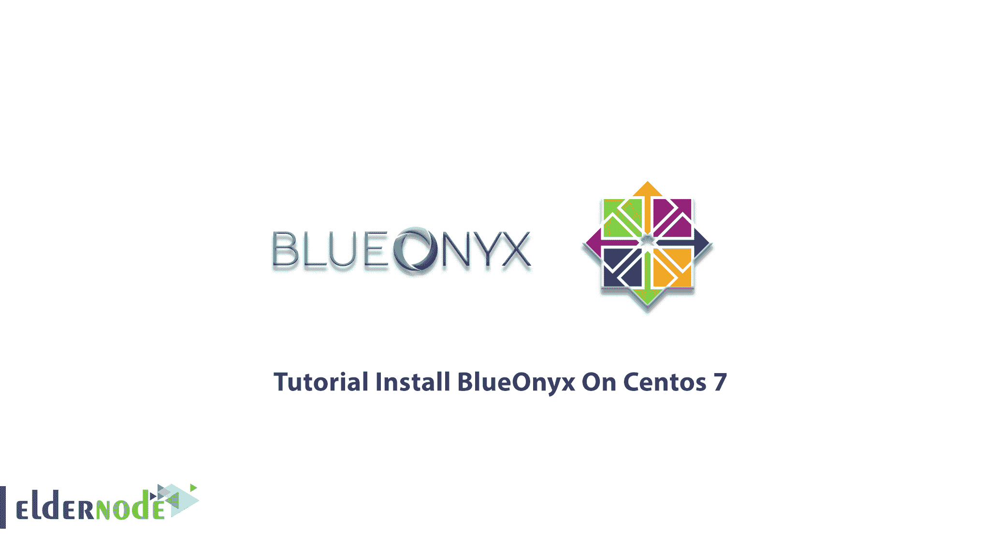
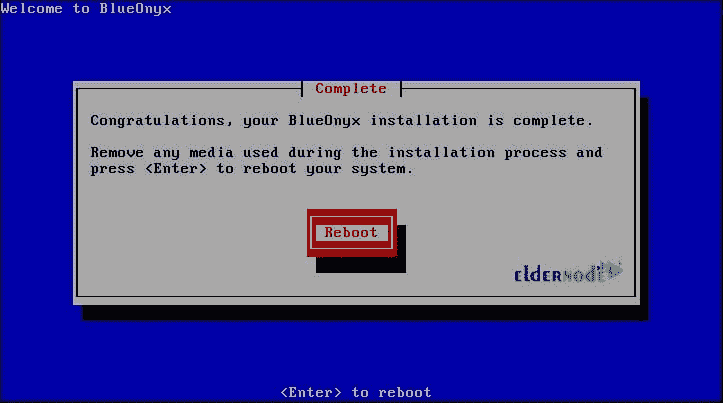
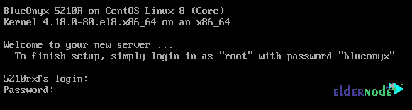

# 教程在 Centos 7 - Eldernode 博客上安装 BlueOnyx

> 原文：<https://blog.eldernode.com/install-blueonyx-on-centos-7/>



当您准备虚拟服务器以使用其功能时，您需要一个 internet 托管平台。BlueOnyx 是一个基于 CentOS 的开源服务器发行版，允许您免费下载、安装和使用。BlueOnyx 的完全集成平台包括 web、电子邮件、DNS 和文件传输服务。您可以轻松地在商用硬件或 VPS 上安装，因为它使用基于 web 的界面，用户友好且简单。在本文中，您将了解教程**在 Centos 7** 上安装 BlueOnyx。购买你自己的 [Linux VPS](https://eldernode.com/linux-vps/) ，同时开始安装步骤。检查可用的软件包 [Eldernode](https://eldernode.com/) ，因为你需要预装 CentOS 7。

## **教程在 Linux Centos 上安装 BlueOnyx**

为了让本教程更好地发挥作用，请考虑以下**先决条件**:

拥有 sudo 权限的非 root 用户。

应该设置一个单独的家庭分区。

## **如何在 Centos 上安装 blue onyx**

2015 年 2 月，为 CentOS 7 发布了 BlueOnyx。BlueOnyx 试图通过不断发展来完成自己的使命。增强功能包括管理经销商、管理 SSH 密钥/证书、内置电子邮件统计、Jv Servlet 分页等等。BlueOnyx 有一个控制面板，可以让您轻松管理虚拟主机帐户的功能。作为站点管理员，您需要此控制面板来设置站点内的用户、电子邮件选项和更改密码。通过提供的 ISO 映像很容易安装 BlueOnyx。让我们开始并完成以下步骤，将它安装到您的 CentOs 7 上。

## **在 Centos 7 和 Centos 8**T3 上安装 BlueOnyx

**首先**，[禁用 SELinux](https://blog.eldernode.com/disable-selinux-temporarily-permanently/)(/etc/SELinux/config，SELINUX=disabled)，否则安装程序会将其关闭。

要安装 BluOnyx 5210 YUM 配置文件，请使用以下命令:

```
rpm -hUv http://devel.blueonyx.it/pub/5209R.rpm
```

然后，使用以下命令安装 BlueOnyx 5210R 及其所有依赖项:

```
yum groupinstall blueonyx
```

根据您的基本安装，等待一段时间后，直到它结束。大概在 800-1200 转左右。

安装 RPMs 后，请确保立即运行以下命令:

```
# /usr/sausalito/scripts/initServices.sh
```



*注意* **:** **运行脚本后绝不跳过**系统的重启请求。为什么我们要求你重启系统？该脚本将 Grub 配置配置为使用网络接口。在重新启动期间，将创建用户“admin”。您需要该用户能够登录到 **G** 图形 **U** ser **I** 界面。GUI 帮助您修改 SSHd 设置，生成和管理 SSH 密钥和证书。完成后，通过控制台登录。此外，如果网络没有丢失网络配置，您可以通过 SSH 登录，并且在重新启动期间第一次启动 CCED。

如果您通过控制台登录，将显示以下屏幕。



作为“根”用户，您可以使用“blueonyx”作为您的密码。然后您会看到脚本/root/network-settings.sh 自动运行。

*注意*:如果你需要以非特权用户的身份登录，密码可以是“BlueOnyx:rocks”

但是如果 **CCED 结构**没有完成初始运行，将显示以下屏幕。

支持 IPv4、IPv6 和双栈是 BlueOnyx (5209R 或更新版本)的特性。因此，您将被询问是否要配置 IPv4 网络设置。如果是，请确认“是”。然后，您将能够指定服务器 IPv4 IP 地址、网络掩码、网关和它必须使用的 DNS 服务器。同样，它会问你是否愿意配置 IPv6。同样，你需要选择“是”或“否”。查看网络详细信息后，将应用网络设置。其他所需的服务重新启动将自动完成，随着最后一个屏幕，你意识到你的 BlueOnyx 5210R 安装成功，并准备使用。

## 结论

在本文中，您阅读了在 Centos 7 上安装 BlueOnyx 的教程。你会发现它功能强大且易于使用。为了扩展特性和增强功能，BlueOnyx 允许供应商在 BlueOnyx 商店中提供商业插件。此外，MySQL 数据库是由 BlueOnyx 创建的，用户界面在虚拟网站上。