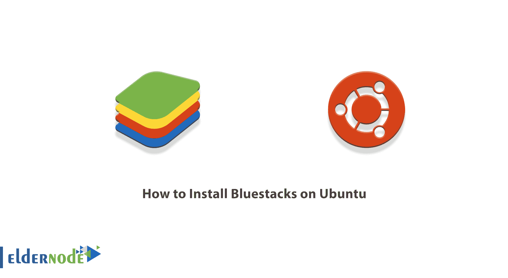
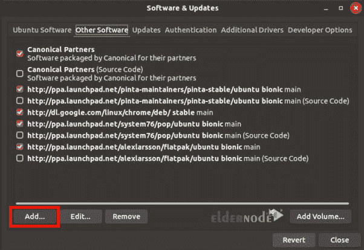
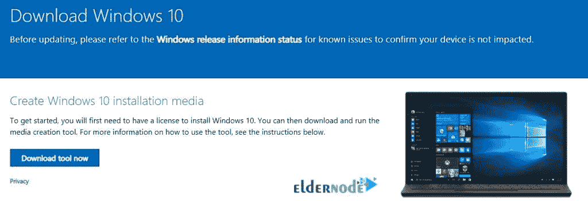
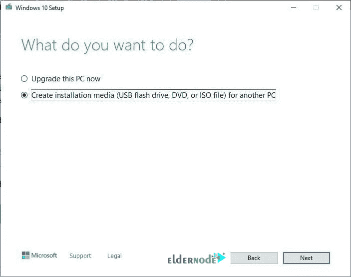
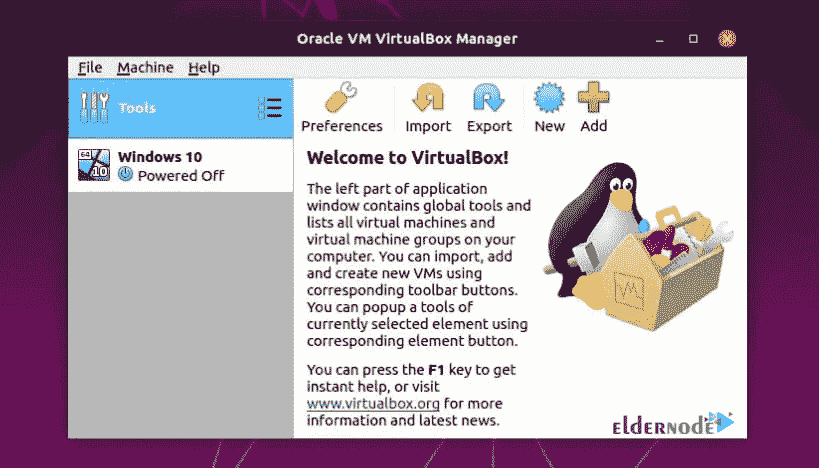
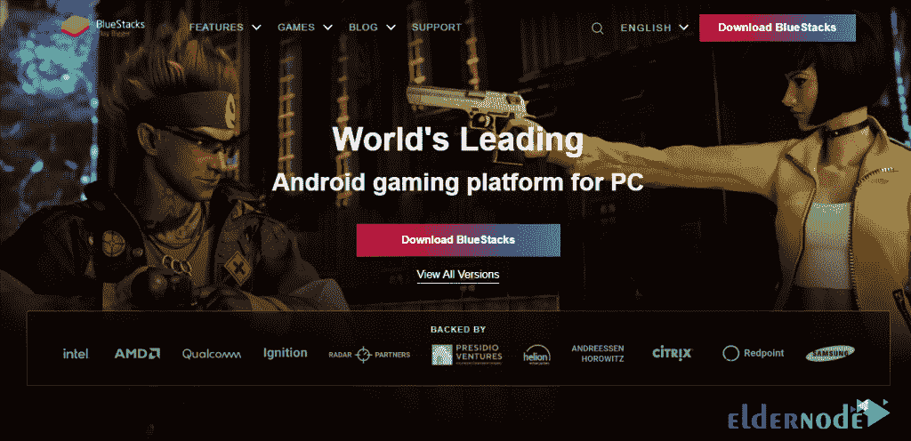
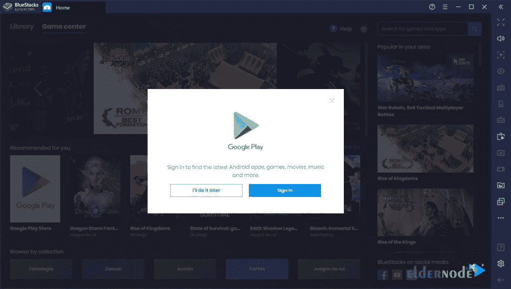

# 如何在 Ubuntu - Eldernode 博客上安装 Bluestacks

> 原文：<https://blog.eldernode.com/install-bluestacks-on-ubuntu/>



假设有一款你很喜欢的手机游戏，你想在一台屏幕和界面都很大的电脑上轻松玩。你可能习惯于使用一些 Android 应用程序来管理待办事项和日历事件，你可能也想在你的电脑上拥有这一功能。这个问题的解决方案之一是 BlueStacks，你可以很容易地免费使用它。在这篇文章中，我们将教你如何在 Ubuntu 上安装 Bluestacks。如果你想购买一台 [**Ubuntu VPS**](https://eldernode.com/ubuntu-vps/) 服务器，你可以访问 [Eldernode](https://eldernode.com/) 中提供的软件包。

## **教程在 Ubuntu 上安装 blue stacks**

### **蓝石简介**

BlueStacks 软件是一款与 Android 相关的应用。简单来说，使用 BlueStacks 软件，你可以在你的电脑上拥有一个 Android 操作系统的副本。同样，在电脑上运行安卓软件。BlueStacks 是一个独立的虚拟机，设计用于在 Windows 或 Mac 电脑上运行 Android。当您安装该软件时，您会注意到 Play Store 会自动安装在该软件上。

[Bluestacks VPS](https://eldernode.com/bluestacks-vps/) 的一些特点:

**1-奇妙的用户界面:**

这个程序的用户界面是这样的，鼠标，键盘，甚至麦克风都可以很好地兼容各种程序和游戏。这样你就可以充分利用你电脑上的安卓应用。例如，Pubg Mobile 是一款来自腾讯的游戏，已经针对 Android 和 iOS 平台发布。但得益于 BlueStacks 技术，你可以在一台配有鼠标和键盘的电脑上体验这款游戏的专业性能。

**2-对程序员有用**

如果你是一个 Android 开发者，你想在 Android 的模式和不同版本上测试你的应用程序，摆在你面前的最佳选择之一肯定是 BlueStacks。

**3-更好的游戏体验**

这款游戏的创意界面让游戏玩家有了更好的体验。当然，游戏模式功能并不仅限于此。你可以在 Twitch 和脸书上完全在线直播你的游戏，而不需要任何中介程序。

**4-持续更新**

在每一次更新中，BlueStacks 都试图融入新的功能，并兼容更多的程序和游戏。

**5-最大相似度**

该程序的所有列表和页面都设计得非常优雅，与 Android 设备有着最大的相似性。你可以在里面体验一个安卓设备的所有感觉。

### **在 Ubuntu 上安装 Bluestacks 的先决条件**

BlueStacks 是一个 Android 模拟器，官方没有提供给 [Linux](https://blog.eldernode.com/tag/linux/) 。但是你可以按照这篇文章在 [Ubuntu](https://blog.eldernode.com/tag/ubuntu/) 发行版中安装它。因此，首先您必须提供以下先决条件:

a)使用 VirtualBox 在 Ubuntu 上安装 Windows 10

b)将 VirtualBox 添加到 Ubuntu 存储库中

c)下载 Oracle 签名

d)安装 VirtualBox

e)下载 Windows 10 ISO 映像并在 VirtualBox 上进行配置

### **如何用 VirtualBox 在 Ubuntu 上安装 Windows 10**

要使用 BlueStacks，您必须首先使用 VirtualBox 在 Linux 上安装 Windows。然后，您可以在 Windows 上安装 BlueStacks。

**注意！**如果你的电脑硬件足够强大，可以按照下面的步骤操作。否则，你的努力就白费了。

第一步是将 **VIRTUALBOX** 添加到 **UBUNTU 库**中。为此，你必须先去**开始**。然后点击**软件&更新**，再点击**其他软件**，最后点击“**添加…** ”按钮。



现在，您需要在输入框中输入以下命令。请注意，您必须用 **< mydist >** 替换**您的发行版名称**:

```
deb https://download.virtualbox.org/virtualbox/debian <mydist> contrib
```

最后，输入密码，然后关闭对话框。

安装 Bluestacks 之前必须安装的另一个先决条件是 Oracle。在本节中，您必须[下载 apt-secure 的 Oracle 公钥](https://www.virtualbox.org/download/oracle_vbox_2016.asc)。你可以通过在页面上点击鼠标右键并选择“**另存为**”来完成。

请注意，您必须**应用 Oracle 签名**。为此，您可以在终端中输入以下命令:

```
sudo apt-key add oracle_vbox_2016.asc
```

要**安装 VirtualBox** ，请进入终端并执行以下命令:

```
sudo apt-get update
```

```
sudo apt-get install virtualbox-5.2
```

### **如何下载 Windows 10 ISO 镜像**

由于 Windows 10 对于在 Ubuntu 上安装 Bluestacks 至关重要，我们打算在这一节教你如何下载 Windows 10。所以你需要下载[微软媒体创作工具](https://www.microsoft.com/en-us/software-download/windows10)。



下载 Microsoft Media Creation Tool 后，运行它。第一步，你必须**接受条款和条件**。

接下来，您需要选择“**为另一台 PC** 创建安装介质(USB 闪存驱动器、DVD 或 ISO 文件)”。完成后，点击**下一个**。

选择你想要的**语言**、**架构、**和**版本**，进入下一步。当询问使用哪种介质时，选择“ **ISO 文件**”。

在最后一部分，当提示将 ISO 刻录到 CD 时，单击**完成**。创建完“ **Windows.iso** ”文件后，你需要用 USB 存储卡把它传输到你的 Ubuntu 上。

现在，要配置 Windows 10，您可以转到开始，然后单击 **Oracle VM VirtualBox** 来启动它。



点击**新建**。指定您的操作系统的名称，并选择其**版本**。接下来，您可以设置**的内存大小**。另外，你可以**创建一个虚拟硬盘**。

注意，您必须选择一种类型的硬盘文件，并选择“**动态专用**”。接受文件位置和大小以返回主页。

要继续配置，选择**操作系统**并点击**设置**。然后选择**存储**选项，在此删除光驱。

在下一步中，您需要点击“**添加新的存储附件**”。另外，点击**添加光驱**。然后点击**选择磁盘**，最后选择 **ISO 文件**。

现在你可以从 **VirtualBox** 中选择 **Windows 10** ，点击**开始**。在这里，您必须选择**高级**选项来安装 Windows，并按照屏幕上的说明进行操作。在下一节，我们将解释如何在 Ubuntu 上安装 Bluestacks。



## **在 Ubuntu 上安装 blue stacks**

正如你在前面几节看到的，我们在 Ubuntu 上推出了 VirtualBox。然后我们在 VirtualBox 上安装并运行了 Windows 10。现在我们想安装 BlueStacks。

第一步是在 Windows 上运行你想要的**浏览器**。然后进入 [**蓝皮书网站**](https://www.bluestacks.com/) ，点击**下载蓝皮书**按钮。



一旦 Bluestacks 下载完成，您必须点击它并运行。您可以按照屏幕上的说明轻松安装 Bluestacks。成功安装 Bluestacks 后，您就可以运行它了。在下图中，您可以看到 Bluestacks 环境。



正如你在上面的图片中看到的，你将被要求链接到一个**谷歌账户**以在你的 PC 上开始手机游戏。

## 结论

如前所述，Bluestacks 并不正式适用于 Linux。该程序仅在 Windows 和 Mac 的官方网站上提供。所以，正如你在本教程中看到的，要在 Ubuntu 上安装 Bluestacks，必须先安装 VirtualBox，然后再安装 Windows 10。最后，你可以在 Ubuntu 上安装 Bluestacks。在这篇文章中，我们试图教你如何在 Ubuntu 上安装 Bluestacks。