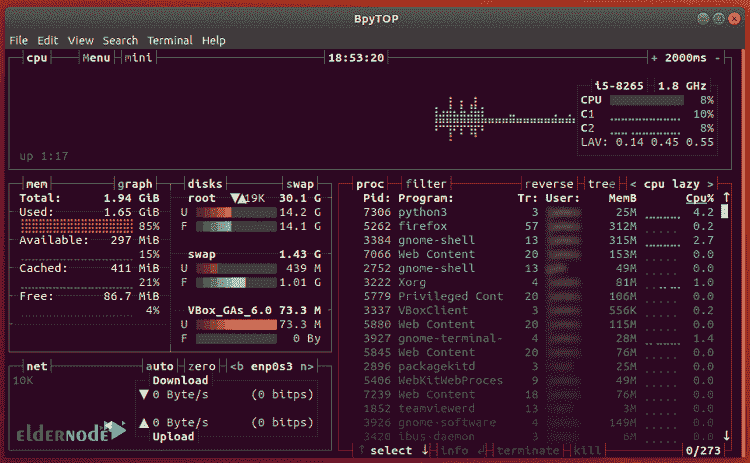

# 教程在 Ubuntu / Centos / Debian - Eldernode 博客上安装 BpyTop

> 原文：<https://blog.eldernode.com/install-bpytop-on-ubuntu-centos-debian/>


BpyTop 是一个用于资源监控的 Linux 命令行实用程序。它显示处理器、内存、磁盘、网络和进程的使用情况和统计数据。因此，如果您喜欢使用“终端”,监控系统资源的使用情况会很有用。BpyTop 是 bashtop 的 python 版本，在 Apache License 2.0 下获得许可。使用该实用程序，您可以获得正在运行的系统的动态实时视图。加入我们这篇文章来回顾一下**教程在 Ubuntu / Centos / Debian Linux 上安装 BpyTop**。Eldernode 上有各种完美的 [VPS 托管](https://eldernode.com/vps-hosting/)包。你可以购买你自己的 [Ubuntu VPS](https://eldernode.com/ubuntu-vps/) 、 [CentOS VPS](https://eldernode.com/centos-vps/) ，或者 Debian VPS，尽情享受你的选择。

为了让本教程更好地发挥作用，请考虑以下**先决条件**:

–拥有 Sudo 权限的非 root 用户。

–要进行设置，请遵循我们在 [Ubuntu 20.04](https://blog.eldernode.com/initial-server-setup-on-ubuntu-20/) 、 [CentOs 8](https://blog.eldernode.com/initial-set-up-centos-8/) 和 [Debian 10](https://blog.eldernode.com/initial-setup-with-debian-10/) 上的初始服务器设置。

–[python 3](https://blog.eldernode.com/python-3-9-on-eldernode-linux/)，3.6+版本

–可通过"**python 3-m pip install Psutil**"命令安装的 Psutil 模块。

## **在 Ubuntu / Centos / Debian Linux 上安装 BpyTop**

BpyTop 可用于各种 Linux 发行版和 macOS。您将能够通过两种方法安装 Bpytop:从源代码安装和使用包管理器从系统存储库安装。通过这篇文章，我们来回顾一下安装 BpyTop 的两种方式。

### **如何使用 PIP 包管理器设置 BpyTop**

首先，要检查您的 Linux 发行版上运行的 Python 版本，请键入:

```
python3 --version
```

然后，使用以下命令检查是否安装了 python 包管理器 pip

#### **在 Debian 和 Ubuntu 上安装 python 3:**

```
sudo apt install python3-pip
```

#### **在 CentOS 上安装 python 3:**

```
sudo yum install python-pip
```

这样，你所有的依赖项都被满足安装 **BpyTop** 。所以，运行:

#### **在 Ubuntu 和 Debian 上安装 bpytop:**

```
sudo pip3 install bpytop
```

#### 学习在 Centos 上安装 bpytop:

```
yum pip3 install bpytop
```

### **如何从源码设置 Bpytop(手动安装)**

您必须确保您的机器上安装了 git，因为您需要从 GitHub 克隆这个包。要手动安装 Bpytop，请执行以下操作:

#### **在 Debian 和 Ubuntu 上安装 git:**

```
sudo apt-get install git
```

#### **在 CentOS 上安装 git:**

```
sudo yum install git
```

现在，您可以从 GitHub 克隆存储库。

```
git clone https://github.com/aristocratos/bpytop.git
```

导航到克隆的目录，从源代码进行编译。

```
cd bpytop
```

然后，运行下面的命令:

```
sudo make install
```

### **如何用 Bpytop** 监控系统资源

BpyTop 监控系统资源并显示 CPU、内存、磁盘、进程和网络的状态。

您可以运行 Bpytop 来开始监控您的 Linux 系统资源并启动它。

```
bpytop
```

您应该得到显示系统资源统计数据的 UI。



如您所见，上面的输出中显示了以下内容:

*   CPU 使用图表
*   处理器时钟速度
*   总 CPU 使用率
*   每个 CPU 内核的使用情况
*   总内存
*   已用内存
*   自由内存
*   高速缓冲存储器
*   可用高速缓存
*   交换使用(已用和免费)
*   磁盘的当前读写速度

### 如何卸载 BpyTop:

您可以使用下面的命令从目录中卸载 Bpytop。

```
sudo make uninstallou learned
```

## 结论

在本文中，您了解了如何在 Ubuntu / Centos / Debian 上安装 BpyTop。您可以使用它的出色功能。开始玩 BpyTop，并将您的反馈发送给 [Eldernode Community](https://community.eldernode.com/) 上的朋友。如果你愿意，可以参考文章[net data Monitoring System for Linux](https://blog.eldernode.com/netdata-monitoring-system-for-linux/)。