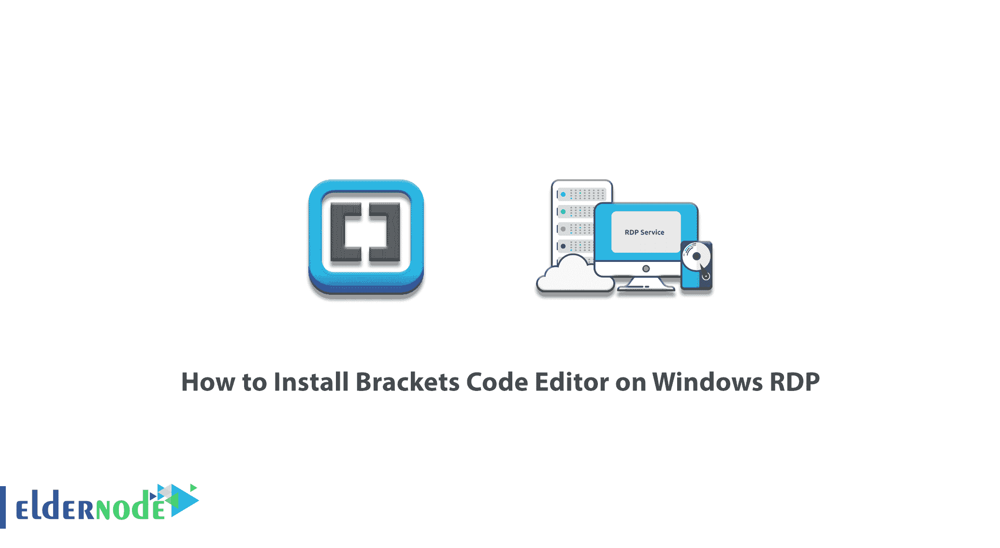
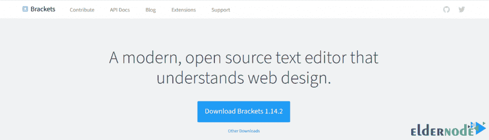
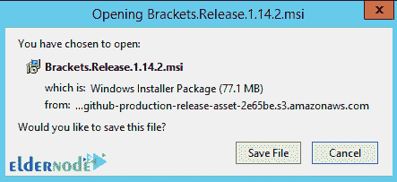
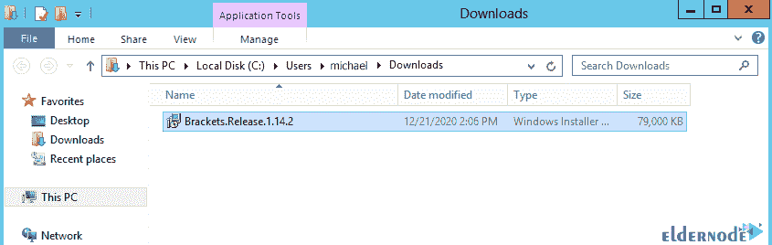
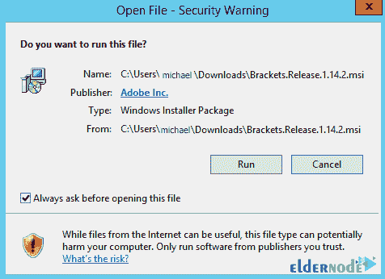
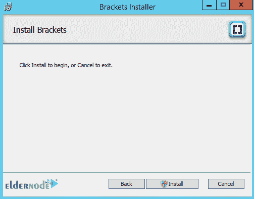
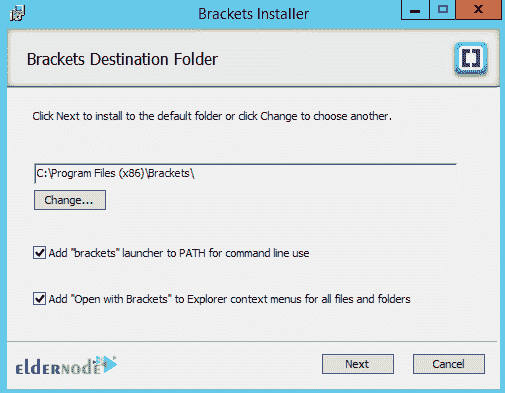
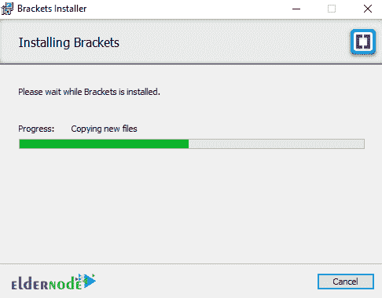
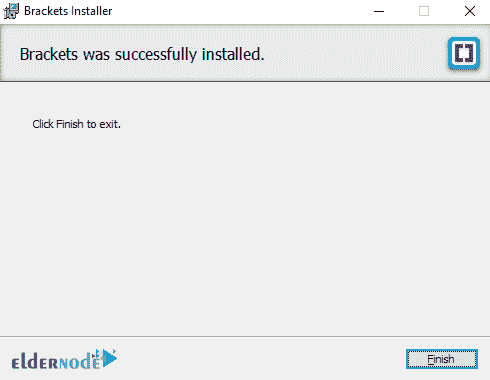
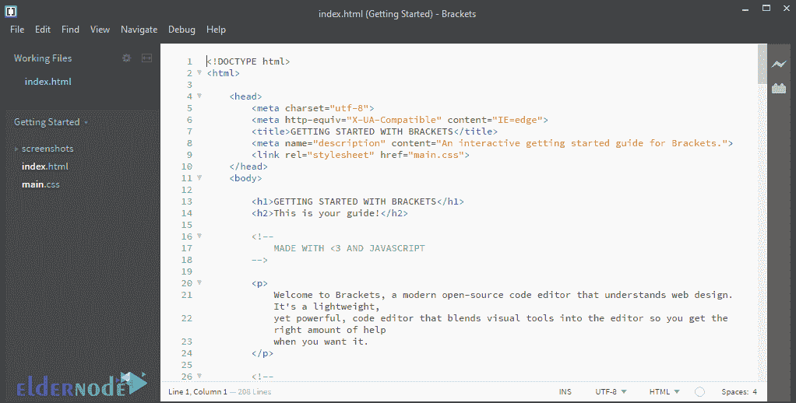

# 如何在 Windows RDP - Eldernode 博客上安装括号代码编辑器

> 原文：<https://blog.eldernode.com/install-brackets-code-editor-on-windows-rdp/>

使用括号代码编辑器，用户可以编辑不同的网页，更改程序源代码，定制自己的软件。还有就是可以为这个程序编写插件，把这个程序的世界扩展到了所有 web 程序员的程度。这个程序是用新的网络技术和 HTML、CSS、javascript 语言编写的，并且是开源和免费的。它还有其他几个重要的特性，比如快速更新、许多扩展，以及在 Windows、Linux 和 Mac 上运行的能力。在这篇文章中，我们试着向你学习如何在 RDP 上安装括号代码编辑器。你可以访问 [Eldernode](https://eldernode.com/) 提供的包来购买 [Admin RDP](https://eldernode.com/buy-rdp/) 服务器。

## **教程在 Windows RDP 上安装括号代码编辑器**

这个软件容量很小，可以很容易地下载和安装。使用这个软件工作的速度非常快，而且这个软件有新的独特的功能可以提高你的工作速度。在这篇文章的后续部分，和我们一起学习如何在 RDP 的 Windows 上安装括号代码编辑器。

## **在 Windows RDP 上安装括号代码编辑器**

安装括号代码编辑器的第一步是去[括号网站](http://brackets.io/)。然后在出现的页面中你可以看到这个程序的最新版本。所以点击**下载括号**开始下载这个软件。

然后在打开的窗口中，点击**保存文件**开始下载支架:

转到下载文件的下载位置，双击它开始安装过程:

在打开的窗口中，点击**运行**:

现在，在下一个窗口中，点击**安装**:

在下一步中，您需要在所需位置指定括号的目标文件夹，然后单击**下一步**:

您必须等待安装完成:

最后，点击**完成**。

括号代码编辑器现已成功安装。你可以在下图中看到这个程序的环境。

结论

## 你可以看到，括号软件的启动时间很短，你可以很容易地安装它。这个程序有一个吸引人的用户界面，并支持语法高亮显示。应该注意，括号具有智能代码补充的特征。在这篇文章中，我们试图教你如何在 Windows RDP 上安装括号代码编辑器。

As you can see, the launch time of Brackets software is very short and you can easily install it. This program has an attractive user interface and supports Syntax Highlighting. It should be note that Brackets have the feature of intelligent code complement. In this article, we tried to teach you How to Install Brackets Code Editor on Windows RDP.