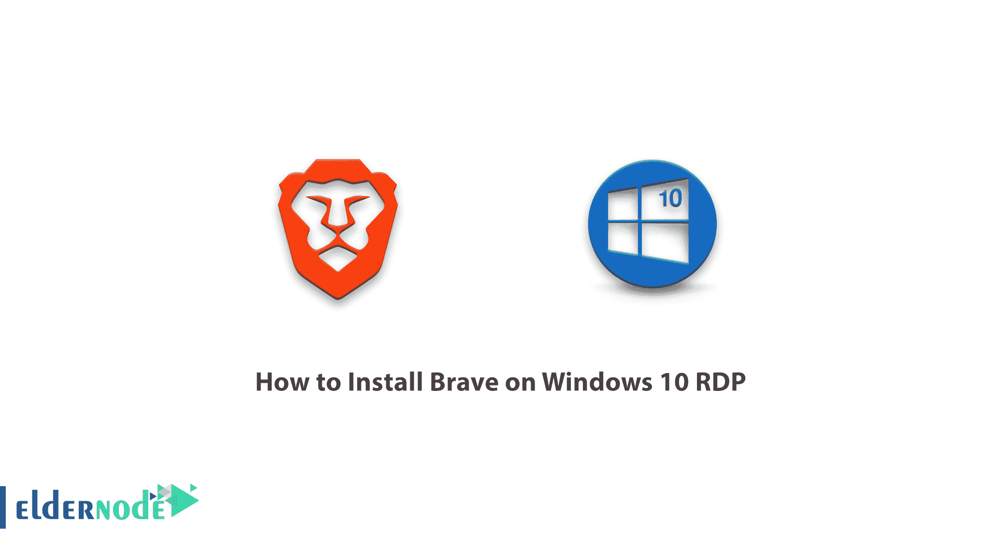
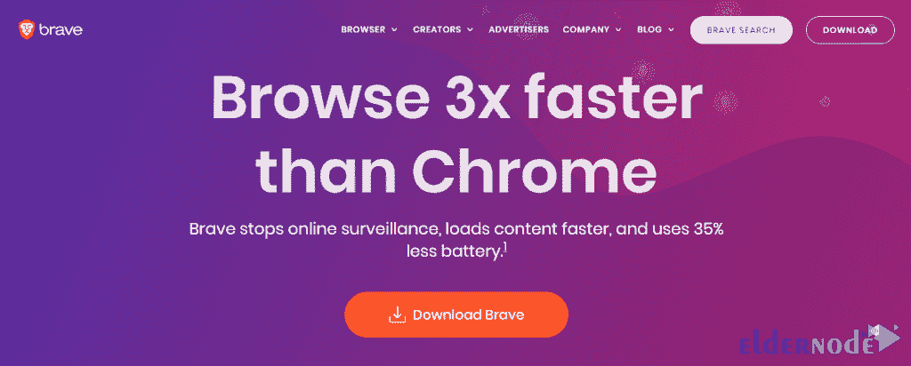
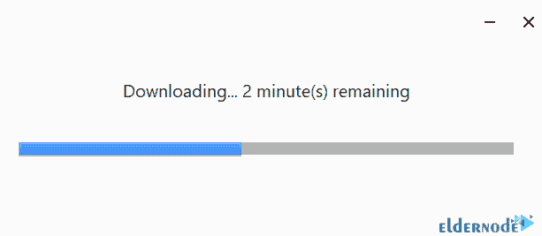
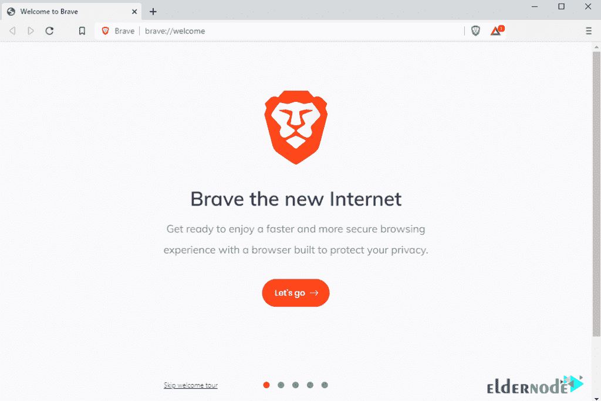
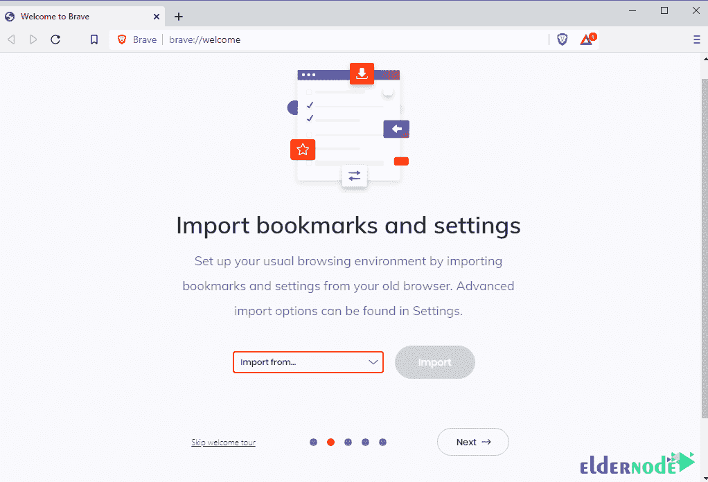
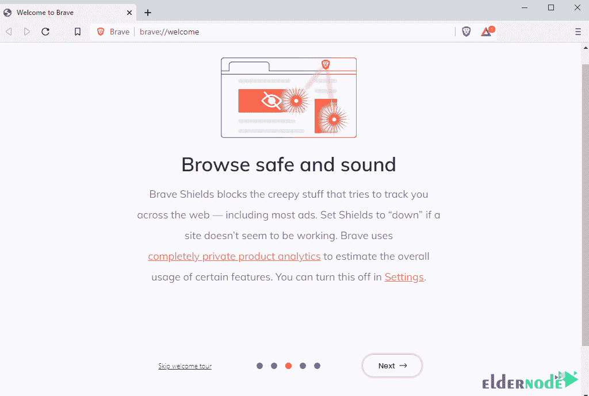
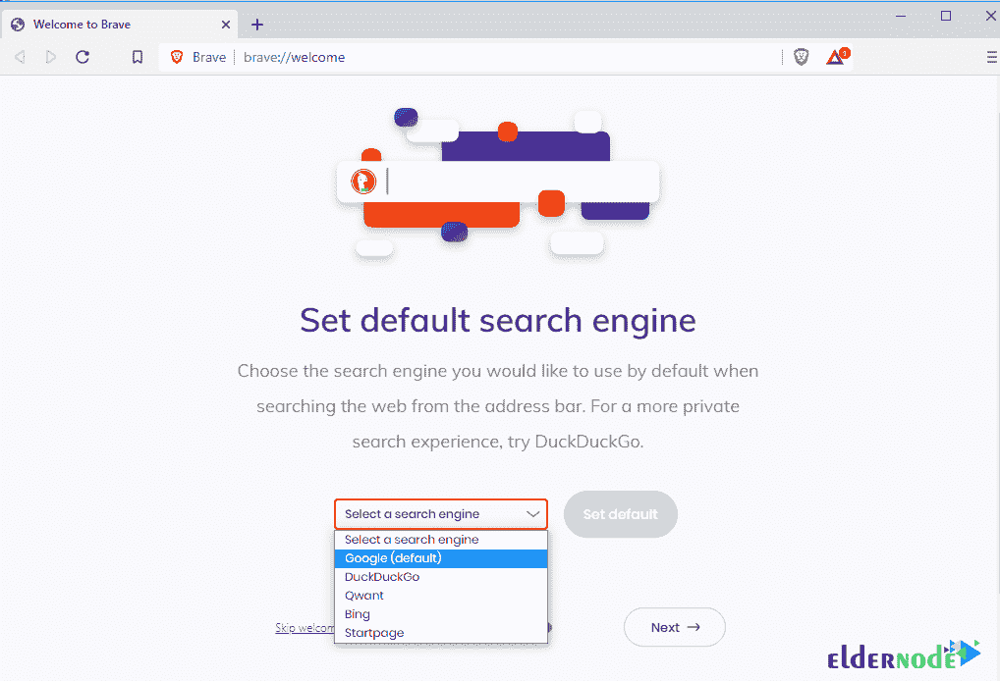
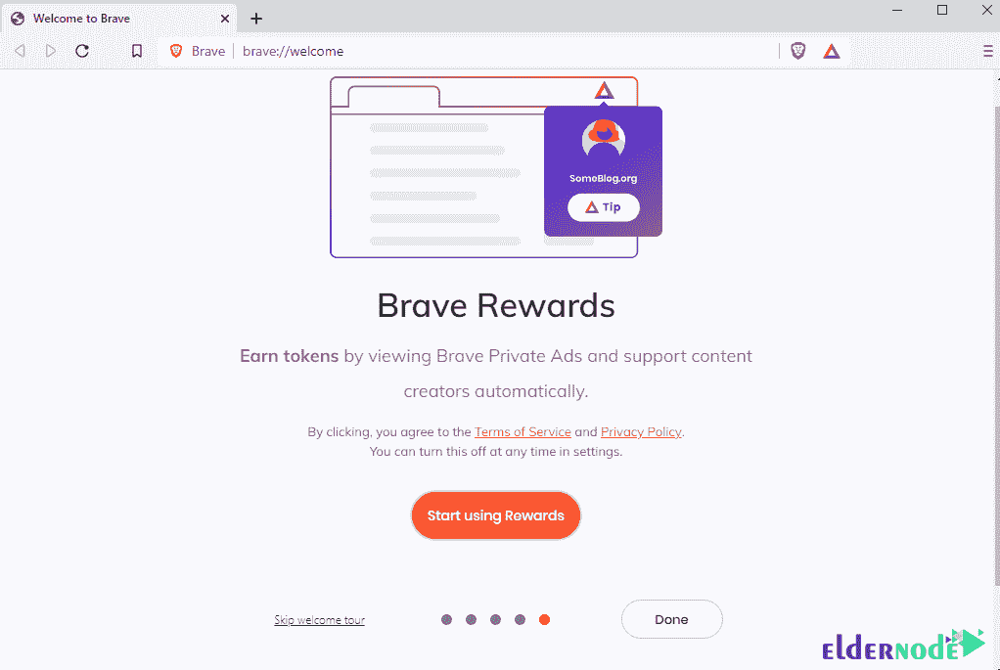
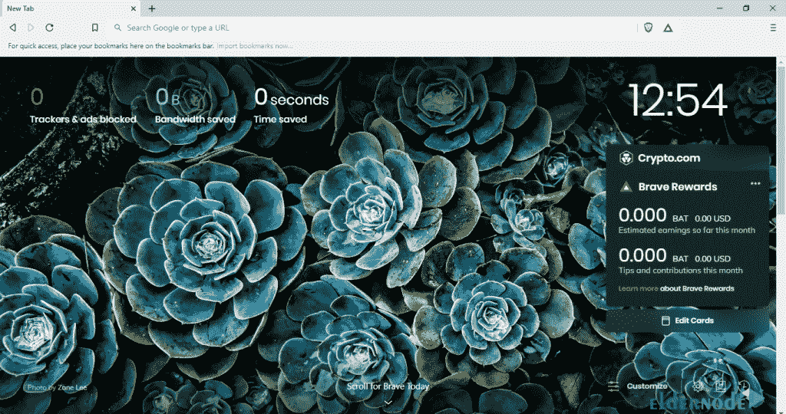

# 如何在 Windows 10 上安装 Brave RDP-elder node 博客

> 原文：<https://blog.eldernode.com/install-brave-on-windows-10/>

Brave 是一款基于 Chromium 的免费开源网络浏览器。这个浏览器的一个有趣的特点是它的反广告和不可检测性。从你下载安装 Brave 的那一刻起，你就不会看到任何广告，除非你愿意。有人认为 Brave 是一款屏蔽广告的浏览器。但是要细看的话，不得不说，Brave 很看重你的隐私。如果你想看广告，没有问题。如果你讨厌广告，没关系，关掉它。请注意，如果您想要阻止所有脚本和 cookies，您可以自由地这样做。在这篇文章中，我们将教你如何在 Windows 10 RDP 上安装 Brave。需要注意的是，你可以访问 [Eldernode](https://eldernode.com/) 中可用的包来购买一台 **[Windows VPS](https://eldernode.com/windows-vps/)** 服务器。

## **教程在 Windows 10 上安装勇者 RDP 循序渐进**

勇敢开发团队的目标是防止当前系统中的广告骗局和滥用。速度和安全性是 Brave 的两个独特和积极的特点，它们是浏览器广告控制策略的结果。

在桌面版中，Brave 比 [Chrome](https://blog.eldernode.com/install-google-chrome-on-rdp-admin/) 和 [Firefox](https://blog.eldernode.com/install-firefox-on-rdp-admin/) 快一倍。同样在移动版本中，它的速度几乎是竞争对手的 8 倍。由于删除了广告和在线追踪器，Brave 下载的内容和信息比其他浏览器少得多，这个过程证明了它的速度。此外，禁用在线跟踪会阻止广告商访问用户身份，并为其用户提供一个安全的空间。

Chrome 和 Firefox 等知名浏览器允许谷歌搜索引擎通过跟踪和监控用户的活动并分析他们的行为来检测广告的合适时间和条件。这样，他们通过这些广告赚了很多钱。

该浏览器由 Brendan Eich 于 2015 年创立的 Brave Software 开发。在下一节中，我们将讨论 Brave 浏览器的功能，然后我们将一步一步地教你如何在 [Windows](https://blog.eldernode.com/tag/windows/) 10 RDP 上安装 Brave。

### **勇敢浏览器功能**

在本节中，我们将介绍 Brave browser 的一些功能。这些功能包括:

1-阻止包含在此计划核心内容中的广告

2-非常快速和安全的浏览器

3-高速加载页面

4-在笔记本电脑和手机上使用浏览器时电池消耗低

5-高安全性和防止恶意代码和病毒

6 .信息传递和交流的高度安全性

7-防止执行弹出代码

8-阻止 cookies

RAM 和 CPU 资源使用量低，系统挂起少

10-适合在线浏览 Instagram、Telegram、Twitter 等社交网络。

11-为普通互联网用户赚钱

为 YouTube、Twitter 等网站的站长和频道所有者赚钱。

### **在 Windows 10 上安装 Brave RDP 管理员**

第一步，访问[勇敢者网站](https://brave.com/)。然后点击**下载**开始勇敢下载。

去你下载勇者的地方。右键点击下载的文件，点击**以管理员身份运行**。这样做将在您的系统上启动 Brave 安装过程。

只需点击**我们走**。

下一步，您可以点击**从…** 导入，将您最喜欢的浏览器的信息传输到 Brave

在下一步中再次点击**下一步**。

下一步，你可以默认设置你想要的搜索引擎，点击**设置默认**。

最后，点击**完成**。

勇敢现在可以使用，你可以享受它。

## 结论

就测试而言，勇敢浏览器是目前最快、最安全的浏览器。这款浏览器最大的好处之一就是可以屏蔽所有烦人的广告和弹出窗口。在这篇文章中，我们试图让你熟悉如何在 Windows 10 RDP 上安装 Brave。