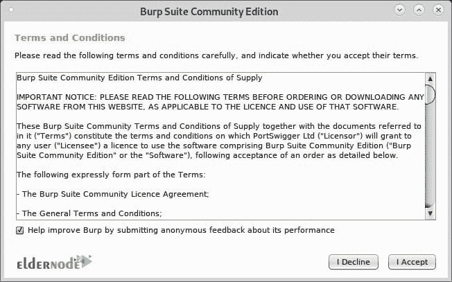
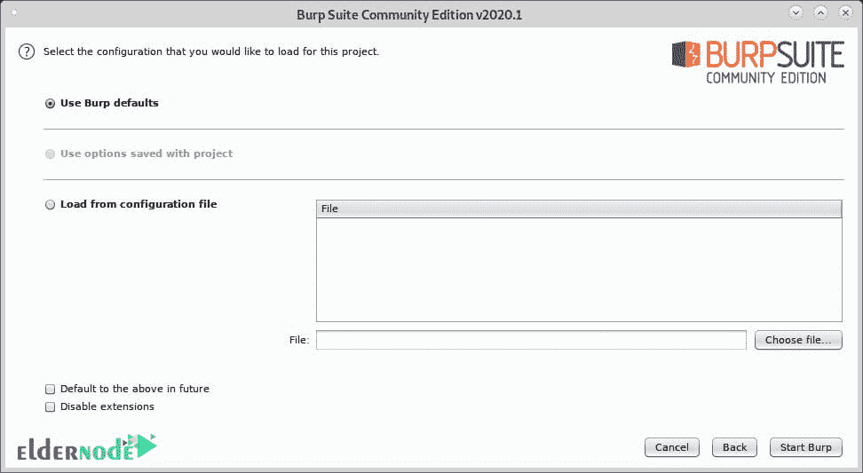
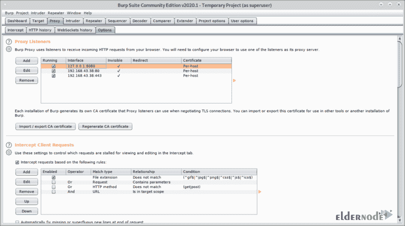

# 如何在 Debian 10 - Eldernode 上安装 Burp 套件

> 原文：<https://blog.eldernode.com/install-burp-suite-on-debian/>


了解**如何在 Debian 10** Linux 上一步步安装 Burp Suite。让我们了解一下用于 web 应用程序渗透测试的最流行的工具。要在你的服务器上安装这个工具，首先，你需要选择并购买你的 [Linux VPS](https://eldernode.com/linux-vps/) 包。Burp 有助于您将所有工具整合在一套工具中，并且可以通过安装称为 BApps 的附加组件来增强其功能。因为它很容易使用，你可以用它作为一个合适的选择。

### 打嗝套件系统要求

至少 8 GB 内存(如果您执行大量工作，可能需要更多内存)

**2-** 两个 CPU 内核

### 为什么打嗝组曲

以下是 Burp suite 工具中 8 个最好、最有用的功能:

**1-** 使用目标站点**地图**功能

**2-** 用打嗝爬一个 web 应用**蜘蛛**

**3-** 用打嗝启动自动扫描**扫描仪**

**4-** 通过打嗝自动定制攻击**入侵者**

**5-** 用打嗝**中继器**操纵和迭代 web 请求

**6-** 用打嗝**测序仪**分析应用数据的随机性

**7-** 用打嗝解码和编码数据**解码器**

**8-** **对比**现场地图

## 教程如何在 Debian 10 上安装 Burp 套件

加入我们这个指南，学习如何在 Debian 10 上安装 Burp 套件。但是首先，看一下下面的初始安装和配置步骤，这有助于您准备好启动和运行 BurpSuite:

### 1-下载并安装 Burp 套件

您可以安装**打嗝套件专业版**或**打嗝套件社区版**。任何人都有不同的过程。当您验证了最近的方法后，您可以运行安装程序并在安装向导中选择所需的选项。

### 2-启动打嗝套件并选择启动选项

单击已安装的应用程序快捷方式启动 Burp Suite。在 **Linux** 上，快捷方式位于您在安装过程中选择的路径上。如果您从命令行启动 Burp Suite，您将能够更好地控制它的执行。

### 如何设置向导

启动 Burp 后，启动向导将打开并引导您完成以下步骤:

**1-** 激活您的 Burp 许可证

**2-** 选择项目

**3-** 选择配置

**4-** 检查您的显示器设置

**注意**:其中一些只需要在你第一次启动一个新的 Burp 安装时执行。

### 3-使用 Burp 的预配置浏览器开始测试

1-使用 Burp 的**嵌入式浏览器**，无需额外配置。

2- **使用您选择的外部浏览器**。出于各种原因，您可能不想使用 Burp 的嵌入式浏览器。

### 4-针对非生产系统配置 Burp 套件(可选)

请注意，您应该完全熟悉 Burp 套件的功能和设置，因为它可能会在某些应用程序中产生意想不到的效果。因此，在此之前，您应该只对非生产系统使用 Burp Suite。

## 教程如何在 Debian 上安装 burp suite

请继续关注我们，看看如何在 Debian 上安装 BurpSuite 以及如何设置您的浏览器。

**注意**:全新安装需要验证是否安装了 [Java](https://blog.eldernode.com/install-java-apt-debian-10/) 8。为此，请执行以下命令:

```
java -version
```

如果没有，请安装它:

```
sudo apt-get install openjdk-8-jre
```

接下来，要开始安装 BurpSuite，请访问免费下载 BurpSuite

[Get Community option](https://portswigger.net/burp/communitydownload)

并选择第三个。

要继续，请单击橙色的“下载最新版本”按钮。


现在，点击绿色的下载按钮。


然后，您应该保存。sh 脚本，并使用下面的命令赋予它执行权限:

并运行以下命令来执行脚本:

```
chmod +x <package.sh>
```

如您所见，GUI 安装程序将会提示，因此请按 Next 继续。

```
./burpsuite_community_linux_v2020_1.sh
```


除非您需要不同的位置，否则保留默认安装目录(/opt/burpsuiteconomy ),并按“下一步”继续。


选择“创建符号链接”并离开默认目录，然后按下**下一个**。


这样，安装过程将如下所示开始:


该过程结束时，单击“完成”。


然后，从 X-Window 管理器应用程序菜单中选择 BurpSuite。(它可能存在于“其他”类别中)


是时候决定你是否愿意分享你的 BurpSuite 体验了，点击我拒绝，或者我接受继续。



然后，离开临时项目，按下一步。


要启动该程序，您应该离开使用打嗝默认设置，然后按开始打嗝。



这是 BurpSuite 的主屏幕:


打开 firefox 后，在右上角点击 CA Certificate。


现在，您可以下载并保存证书。


在 Firefox 菜单上点击首选项，然后点击隐私和安全并向下滚动，直到您找到证书部分，然后点击查看证书，如下所示:


然后，您需要单击导入。


选择您之前获得的证书，然后按“打开”:


单击“信任此 CA 来识别网站”然后按确定。


尽管如此，在 Firefox 的首选项菜单中，点击左侧菜单中的常规，向下滚动直到到达网络设置，然后点击设置。


现在，选择手动代理配置，并在 HTTP 代理字段中设置 IP 127.0.0.1，选中“对所有协议使用此代理服务器”，然后单击确定。


现在，BurpSuite 已经准备好展示当它被定义为代理时，如何拦截通过它的流量。在 BurpSuite 上，点击代理选项卡，然后点击拦截子选项卡，确保拦截处于打开状态，并从 firefox 浏览器访问任何网站。

浏览器和被访问网站之间的请求将通过 Burpsuite，允许您像中间人攻击一样修改数据包。


此外，您可以使用 DNS 和不可见代理功能来捕获来自我们无法配置代理的系统的流量。

在基于 Debian 和 Linux 的系统上，要开始运行 Arpspoof，你可以通过 apt install dsniff 来安装。安装 arpspoof 后，要在控制台上捕获从目标到路由器的数据包，请运行:

然后捕获从路由器到目标运行的第二个终端中的数据包:

```
sudo arpspoof -i <Interface-Device> -t <Target-IP> <Router-IP>
```

然后启用 IP 转发以防止阻止受害者:

```
sudo arpspoof -i <Interface-Device> -t  <Router-IP> <Target-IP>
```

接下来，通过运行以下命令，使用 iptables 将端口 80 和 443 的所有流量重定向到您的设备:

```
echo 1 > /proc/sys/net/ipv4/ip_forward
```

请注意，您应该以 [root](https://blog.eldernode.com/initial-setup-with-debian-10/) 的身份运行 BurpSuite，否则一些步骤(如在特定端口上启用新代理)将不起作用:

```
sudo iptables -t nat -A PREROUTING -p tcp --dport 80 -j DNAT --to-destination  192.168.43.38  # sudo iptables -t nat -A PREROUTING -p tcp --dport 443 -j DNAT --to-destination  192.168.43.38
```

查看以下警告后，请按“确定”继续。

```
java -jar -Xmx4g /opt/BurpSuiteCommunity/burpsuite_community.jar 
```


然后在打开 BurpSuite 后点击 Proxy>Options，并点击 Add 按钮。


现在，您需要选择 80，并在特定地址上选择您的本地网络 IP 地址:


单击请求处理选项卡，选中支持不可见代理(仅在需要时启用)，然后按确定。


现在对端口 443 重复上述步骤，单击添加。


然后设置端口 443，并再次选择您的本地网络 IP 地址。


在此步骤中，单击请求处理，选中不可见代理的支持，然后按确定。


接下来，您需要将所有代理标记为运行和不可见。



最后，从目标设备访问网站，截取选项卡将显示捕获:


这样，您就可以在没有目标浏览器上的代理配置的情况下捕获数据包。

结论(Debian 上的打嗝套件)

## 在本文中，您了解了如何在 Debian 10 上安装 Burp Suite。在使用 Burp Suite 时，您会意识到您可以使用它做各种各样的事情。如果你有兴趣了解更多关于 Debian 的知识，可以找到我们的文章[如何在 Debian 10 [Z shell]](https://blog.eldernode.com/install-and-use-zsh-on-debian-10/) 上安装和使用 ZSH。

In this article, you learned How To Install Burp Suite On Debian 10\. While working with Burp Suite, you would realize that there is a wide variety of things that you can do with it. In case you are interested to learn more about Debian, find our article on [How To Install And Use ZSH On Debian 10 [Z shell]](https://blog.eldernode.com/install-and-use-zsh-on-debian-10/).